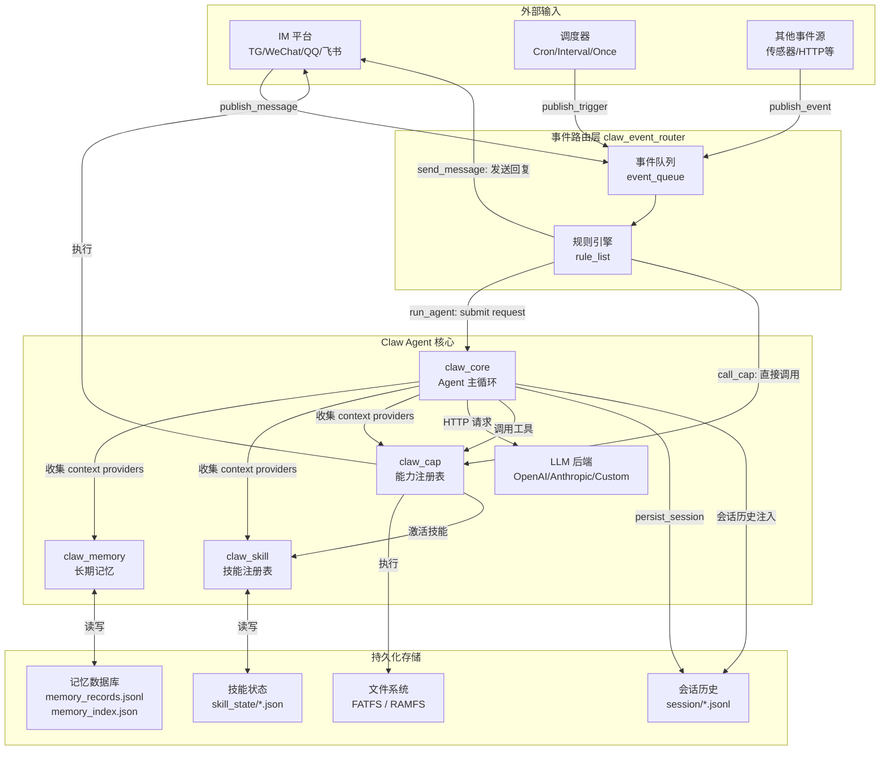
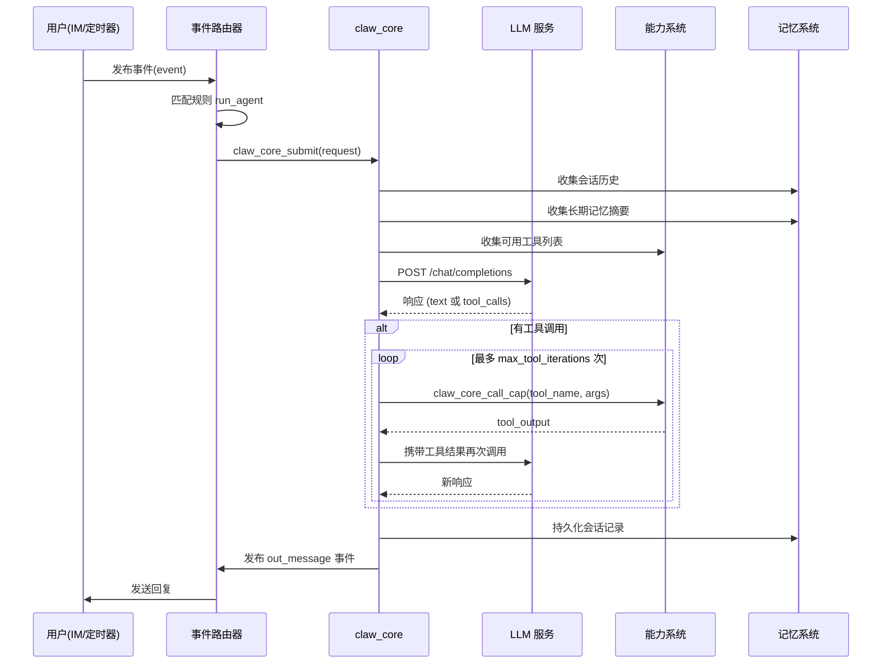
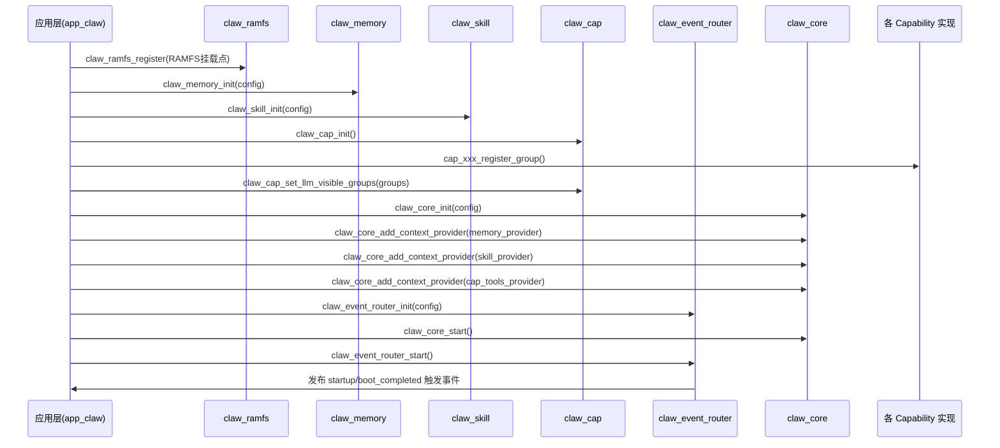
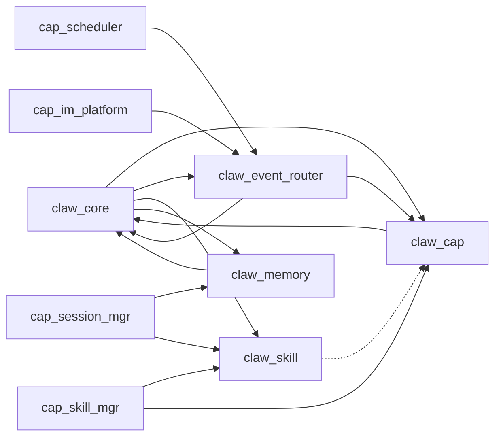

# 01 系统架构总览

## 1.1 设计目标

Claw Agent 是一个运行在资源受限嵌入式设备（ESP32）上的 AI Agent 框架，其核心设计目标：

1. **以 LLM 为决策中枢**：所有智能逻辑由 LLM 推理，框架只负责上下文组装、工具路由和结果传递。
2. **可插拔能力（Capability）体系**：任何功能以"能力"形式注册，LLM 可选择性地调用。
3. **基于事件的外部输入**：IM 消息、定时触发、传感器事件通过统一的事件路由层进入系统。
4. **持久化记忆**：跨会话的长期记忆，支持结构化存储、摘要索引和自动提取。
5. **技能（Skill）动态激活**：能力集合可以按会话级别动态启用/禁用，通过技能文档描述元数据。

---

## 1.2 宏观架构图

---

## 1.3 核心数据流

### 1.3.1 外部消息 → Agent 响应

### 1.3.2 系统初始化序列

---

## 1.4 分层架构

| 层次 | 组件 | 职责 |
|------|------|------|
| **应用层** | app_claw | 配置、初始化、连接所有组件 |
| **协调层** | claw_event_router | 事件分发、规则匹配、行为编排 |
| **Agent 层** | claw_core | LLM 调用主循环、上下文构建、工具调度 |
| **能力层** | claw_cap | 工具注册、分组管理、LLM 可见性控制 |
| **认知层** | claw_memory | 长期记忆存储、检索、自动提取 |
| **技能层** | claw_skill | 技能文档目录、会话级能力激活 |
| **LLM 适配层** | claw_core/llm/ | 多后端抽象、HTTP 传输、媒体处理 |
| **基础设施层** | claw_ramfs | RAM 文件系统（移植时替换） |

---

## 1.5 关键设计约束

### 单线程 Agent 主循环
- `claw_core` 有且仅有一个工作任务（`claw_core_task`）。
- 同一时刻只能处理一个请求（串行执行）。
- 请求通过 FreeRTOS 队列排队，顺序处理。

### 用户中断机制（User Interrupt）
- 当 Agent 正在处理请求时，同一会话（同 session_id）的新消息可以通过 `CLAW_CORE_REQUEST_FLAG_USER_INTERRUPT` 标志"插入"（Insert Queue）。
- 如果 LLM HTTP 请求正在进行，会触发 HTTP 中止（abort），然后将新消息注入当前消息链重新推理。

### 工具迭代上限
- 每个请求的工具调用轮次有上限 `max_tool_iterations`（默认 10）。
- 超过上限时返回错误"cap tool iteration limit reached"。

### 上下文提供者（Context Provider）机制
- Agent 不直接持有所有上下文，而是通过注册的 `context_provider` 函数在每轮推理前动态收集。
- `REQUEST_START_ONLY` 标志的 provider 只在请求开始时收集一次并缓存，避免会话历史在每轮工具调用中重复加载。

### 能力可见性分层
- 全局可见性：`claw_cap_set_llm_visible_groups()` 设置所有会话默认可见的能力组。
- 会话级可见性：`claw_cap_set_session_llm_visible_groups()` 覆盖特定会话的可见能力组。
- Skill 激活：通过 `cap_skill_mgr` 为特定会话激活 Skill，间接解锁对应的能力组。

---

## 1.6 模块依赖关系

依赖说明：
- `→` 表示强依赖（编译时链接）
- `-.→` 表示逻辑依赖（运行时知道 group_id）
