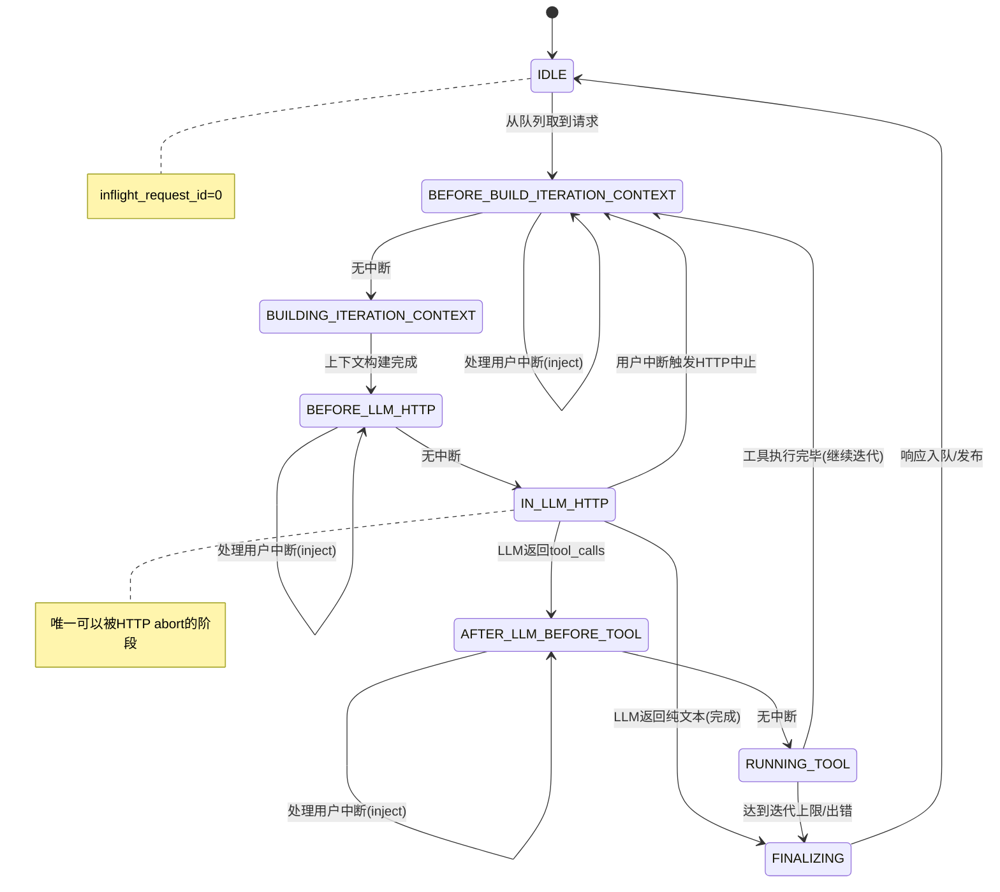
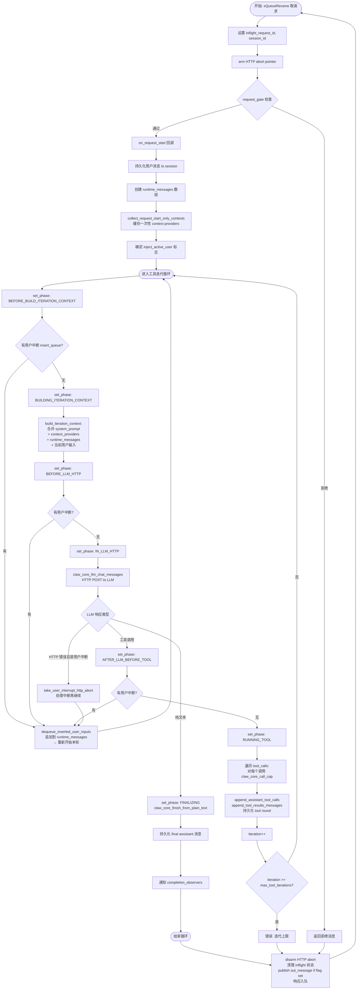
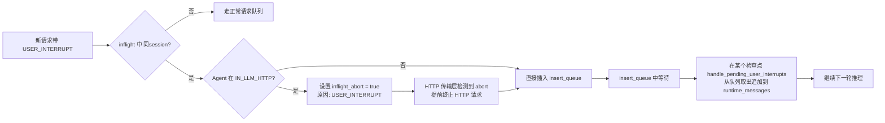

# 02 核心 Agent 循环

## 2.1 概述

`claw_core` 是整个系统的推理引擎。它在一个独立的 FreeRTOS 任务中运行，从请求队列中取出请求，驱动 LLM 推理，处理工具调用，直到 LLM 给出最终文本答案或达到错误条件。

---

## 2.2 Agent 循环阶段状态机



**阶段枚举值（`claw_core_agent_loop_phase_t`）：**

| 枚举值 | 含义 |
|--------|------|
| `IDLE` | 空闲，等待请求 |
| `BEFORE_BUILD_ITERATION_CONTEXT` | 准备构建本轮上下文（检查用户中断） |
| `BUILDING_ITERATION_CONTEXT` | 正在调用各 context_provider 收集上下文 |
| `BEFORE_LLM_HTTP` | 上下文就绪，即将发起 HTTP 请求（检查用户中断） |
| `IN_LLM_HTTP` | 正在等待 LLM HTTP 响应（可被中止） |
| `AFTER_LLM_BEFORE_TOOL` | LLM 返回工具调用，即将执行（检查用户中断） |
| `RUNNING_TOOL` | 正在执行工具调用 |
| `FINALIZING` | 收尾，准备生成响应 |

---

## 2.3 主循环完整流程图



---

## 2.4 上下文构建算法（`build_iteration_context`）

每一轮 LLM 调用前，核心需要组装完整的请求体，包含三部分：

```
system_prompt  = base_system_prompt
               + [provider_1.content as section]   ← 例如: Long-term Memory
               + [provider_2.content as section]   ← 例如: Session History
               + [provider_3.content as section]   ← 例如: Skills List
               + "## Core Request\n- source_cap: ...\n- source_channel: ...\n..."

messages (JSON array) = [provider_messages...]    ← 例如: Session History messages
                      + [runtime_messages...]      ← tool 调用历史(本轮)
                      + [user_message]             ← 当前用户输入(若未通过历史注入)

tools (JSON array)   = [provider_tools...]         ← 例如: LLM-visible capabilities
```

**`REQUEST_START_ONLY` Provider 缓存策略：**

某些 provider（如会话历史）在请求开始时执行一次，其结果被缓存（`request_start_contexts`）。在后续每轮工具迭代中直接使用缓存值，避免重复读取磁盘。

判断逻辑（`inject_active_user`）：
- 如果会话历史 provider 提供了 messages（包含用户消息），且该用户消息已持久化，则 `inject_active_user = false`，不重复追加用户消息到 messages。
- 否则 `inject_active_user = true`，在 messages 末尾追加用户输入。

---

## 2.5 用户中断（User Interrupt）机制

用户中断允许用户在 Agent 处理中途发送新消息，新消息被融入当前推理轮次，而不是排队等待。

### 触发条件
- 新请求携带 `CLAW_CORE_REQUEST_FLAG_USER_INTERRUPT` 标志。
- 新请求的 `session_id` 与当前 inflight 请求的 `session_id` 一致。
- 当前 Agent 处于可插入阶段（不是 IDLE 也不是 FINALIZING）。

### 处理流程



**检查点位置（4 个）：**
1. `before_build_iteration_context`
2. `before_llm_http`
3. `in_llm_http_abort`（HTTP 中止后）
4. `after_llm_before_tool`

### Insert Queue 约束
- 容量：`CLAW_CORE_INSERT_QUEUE_LEN = 4`
- 只存储与当前 inflight session 相同的请求
- 请求 finalizing 时自动清空

---

## 2.6 请求结构（`claw_core_request_t`）

```c
typedef struct {
    uint32_t request_id;          // 唯一 ID，由调用方生成
    uint32_t flags;               // 位标志
    const char *session_id;       // 会话标识符（NULL = 无记忆会话）
    const char *user_text;        // 用户输入文本（必填）
    const char *source_channel;   // 来源通道（如 "telegram", "wechat"）
    const char *source_chat_id;   // 来源聊天 ID
    const char *source_sender_id; // 发送者 ID
    const char *source_message_id;// 来源消息 ID（用于关联响应）
    const char *source_cap;       // 发起能力名称
    const char *target_channel;   // 指定回复通道（NULL = 回复来源通道）
    const char *target_chat_id;   // 指定回复聊天 ID
} claw_core_request_t;
```

**flags 含义：**

| Flag | 含义 |
|------|------|
| `PUBLISH_OUT_MESSAGE` | 完成后将响应发布为 `out_message` 事件（发给事件路由器） |
| `SKIP_RESPONSE_QUEUE` | 不将响应放入响应队列（适用于纯事件驱动场景） |
| `USER_INTERRUPT` | 本请求应尝试中断当前正在处理的同会话请求 |

---

## 2.7 会话持久化（Session Persistence）

Agent 核心通过 `persist_session` 回调（由 `claw_memory` 实现）在以下时机将会话记录写入磁盘：

| 持久化时机 | 记录类型 | 说明 |
|------------|----------|------|
| 请求开始 | `CLAW_SESSION_RECORD_USER` | 用户输入 |
| 工具调用轮次 | `CLAW_SESSION_RECORD_ASSISTANT_TOOL` | LLM 发出的工具调用消息 |
| 工具调用轮次 | `CLAW_SESSION_RECORD_TOOL_RESULT` | 工具执行结果 |
| 推理完成 | `CLAW_SESSION_RECORD_ASSISTANT_FINAL` | LLM 最终答复 |
| 推理失败 | `CLAW_SESSION_RECORD_ASSISTANT_FINAL` | 失败记录（包含失败原因和工具摘要） |

### 失败恢复追踪

若请求失败，会构建 `session_failure_trace` 注入会话历史：

```
Session note: the previous request failed before producing a final answer.
Reason: <error_message>
[tool_calls]
- tool_name_1: ok/failed
- tool_name_2: ok/failed
```

这允许下一轮对话中 LLM 了解上一轮的失败情况。

---

## 2.8 完成观察者（Completion Observer）

最多可注册 4 个观察者（`CLAW_CORE_MAX_COMPLETION_OBSERVERS`）。每次请求成功完成时，按注册顺序依次调用：

```c
typedef void (*claw_core_completion_observer_fn)(
    const claw_core_completion_summary_t *summary, void *user_ctx);

typedef struct {
    uint32_t request_id;
    const char *session_id;
    const char *final_text;
    const char *context_providers_csv; // 本轮注入了内容的 provider 列表
    const char *tool_calls_csv;        // 本轮调用过的工具列表
} claw_core_completion_summary_t;
```

`claw_memory` 使用此机制触发长期记忆的自动提取。

---

## 2.9 取消请求（Cancel）

```c
esp_err_t claw_core_cancel_request(uint32_t request_id);
```

- `request_id = 0` 取消任意当前 inflight 请求。
- 通过设置 `inflight_abort = true`（原因：`CANCEL`）让 HTTP 传输层中止。
- 取消后的响应 `error_message` 会被替换为 `"request cancelled"`。

---

## 2.10 Stage 事件（推理进度通知）

```c
esp_err_t claw_core_publish_stage_text(const claw_core_request_t *request, const char *text);
```

- 发布 `agent_stage` 类型的事件，允许应用层实时显示推理进度。
- 当编译选项 `CONFIG_CLAW_CORE_STAGE_VERBOSITY_VERBOSE` 开启时，每轮工具调用前发布工具名称列表，以及 `collect_stage_note` 回调返回的状态注记。

---

## 2.11 并发与线程安全

| 资源 | 保护机制 |
|------|----------|
| `inflight_request_id/session_id/phase/abort` | `inflight_lock` 互斥量 |
| `insert_queue` | `inflight_lock` 互斥量 |
| `pending_head/tail`（待收取的响应链表） | `response_lock` 互斥量 |
| `request_queue` | FreeRTOS 队列（已内置线程安全） |
| `response_queue` | FreeRTOS 队列（已内置线程安全） |

`claw_core_receive_for(request_id)` 用于按 request_id 等待特定响应；若收到其他响应先入队列，则暂存到 `pending_head` 链表，直到目标响应到达。
