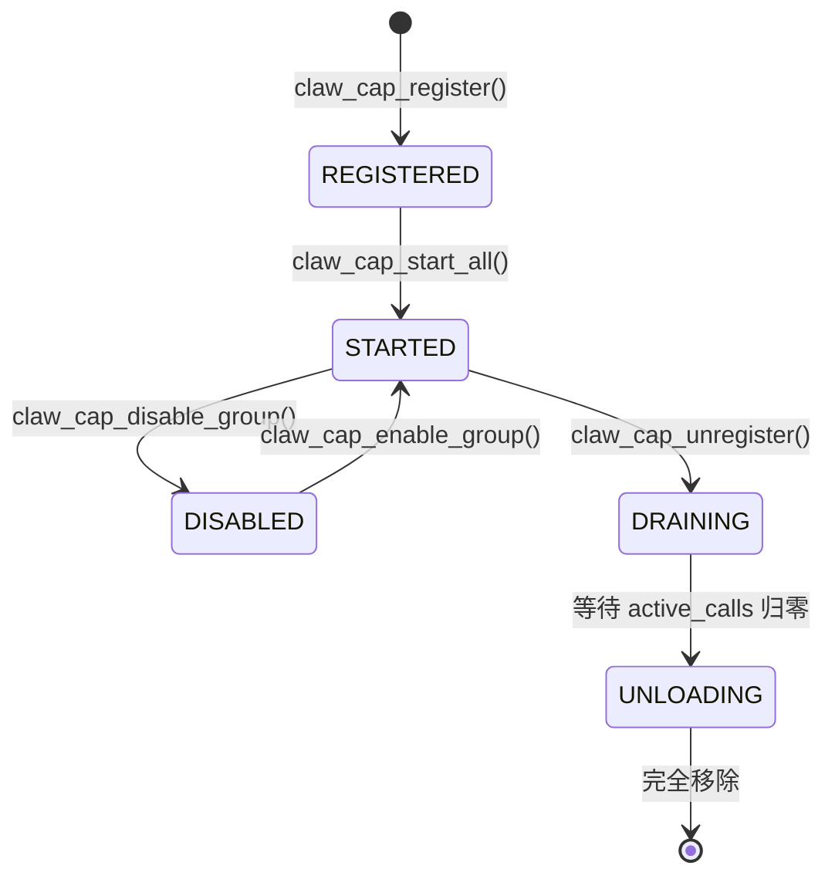
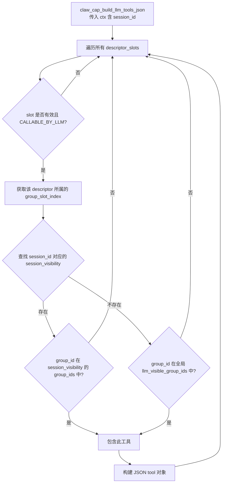
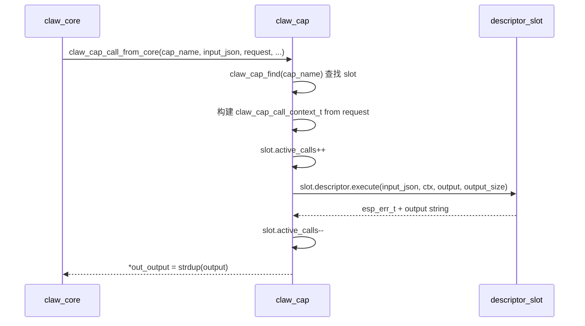
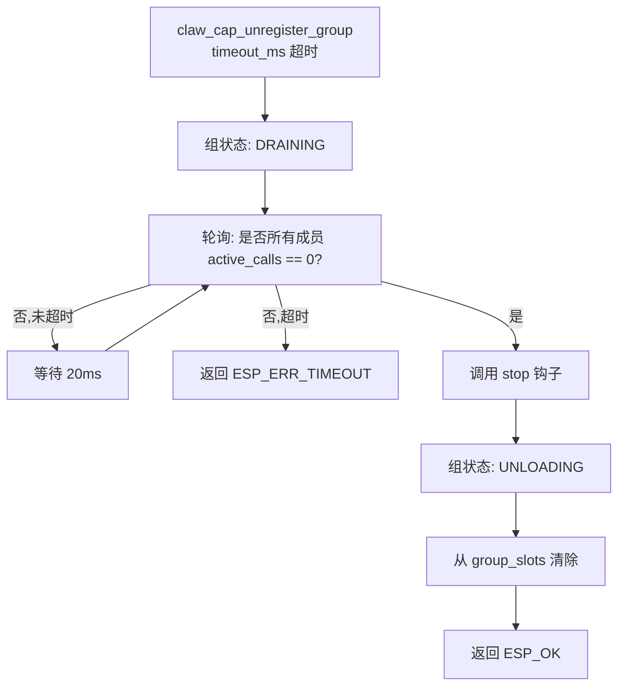

# 03 能力系统设计（Capability System）

## 3.1 概述

`claw_cap` 是 Claw Agent 的工具注册表和调度中心。它管理所有可被 LLM 调用的能力（工具），负责控制哪些能力对 LLM 可见，并负责将 LLM 的工具调用路由到对应的执行函数。

---

## 3.2 能力分类

### 3.2.1 能力种类（`claw_cap_kind_t`）

| 枚举值 | 含义 |
|--------|------|
| `CALLABLE` | 纯可调用工具，由 LLM 或系统调用 |
| `EVENT_SOURCE` | 事件源，自主产生事件推送到路由器 |
| `HYBRID` | 既可被调用，又产生事件 |

### 3.2.2 能力标志（`claw_cap_flags_t`）

| 标志 | 含义 |
|------|------|
| `CALLABLE_BY_LLM` | 该能力可以被 LLM 看到并调用 |
| `EMITS_EVENTS` | 该能力会主动发布事件 |
| `SUPPORTS_LIFECYCLE` | 有 init/start/stop 生命周期钩子 |
| `RESTRICTED` | 受限访问（如需要特定权限才可调用） |

### 3.2.3 能力状态（`claw_cap_state_t`）



---

## 3.3 能力组（Capability Group）

能力以"组"为单位注册，每个组包含一或多个能力描述符。

```c
typedef struct {
    const char *group_id;              // 组 ID，例如 "cap_time"
    const char *plugin_name;           // 插件名称
    const char *version;               // 版本号
    const claw_cap_descriptor_t *descriptors; // 组内能力列表
    size_t descriptor_count;           // 能力数量
    void *plugin_ctx;                  // 组级别上下文（传递给生命周期钩子）
    claw_cap_lifecycle_fn group_init;  // 组初始化
    claw_cap_lifecycle_fn group_start; // 组启动
    claw_cap_lifecycle_fn group_stop;  // 组停止
} claw_cap_group_t;
```

### 生命周期调用顺序

```
claw_cap_register_group()   → 状态: REGISTERED
  └─ [group_init 被调用]    （注册时立即）

claw_cap_start_all()        → 状态: STARTED
  └─ [group_start 被调用]
  └─ [各 descriptor.init 被调用]
  └─ [各 descriptor.start 被调用]

claw_cap_stop_all()
  └─ [各 descriptor.stop 被调用]
  └─ [group_stop 被调用]
```

---

## 3.4 能力描述符（`claw_cap_descriptor_t`）

```c
typedef struct {
    const char *id;                 // 唯一 ID（LLM 用此 ID 调用）
    const char *name;               // 显示名称
    const char *family;             // 能力族（用于分组显示）
    const char *description;        // 功能描述（注入 LLM 提示词）
    claw_cap_kind_t kind;           // 种类
    uint32_t cap_flags;             // 标志位
    const char *input_schema_json;  // JSON Schema 定义（LLM 工具调用参数结构）
    claw_cap_lifecycle_fn init;     // 单能力初始化
    claw_cap_lifecycle_fn start;    // 单能力启动
    claw_cap_lifecycle_fn stop;     // 单能力停止
    claw_cap_execute_fn execute;    // 执行函数
} claw_cap_descriptor_t;
```

### 执行函数签名

```c
typedef esp_err_t (*claw_cap_execute_fn)(
    const char *input_json,           // LLM 传入的参数 JSON
    const claw_cap_call_context_t *ctx, // 调用上下文
    char *output,                     // 输出缓冲区
    size_t output_size                // 缓冲区大小
);
```

**调用上下文（`claw_cap_call_context_t`）：**

```c
typedef struct {
    uint32_t request_id;    // 当前 Agent 请求 ID
    const char *session_id; // 当前会话 ID
    const char *channel;    // 回复通道
    const char *chat_id;    // 回复聊天 ID
    const char *source_cap; // 调用方能力名
    const char *correlation_id; // 关联 ID（源消息 ID）
    claw_cap_caller_t caller;   // 调用方类型
} claw_cap_call_context_t;
```

**调用方类型（`claw_cap_caller_t`）：**

| 枚举值 | 含义 |
|--------|------|
| `CALLER_SYSTEM` | 系统自动调用（如事件路由器） |
| `CALLER_AGENT` | LLM Agent 调用 |
| `CALLER_CONSOLE` | 控制台命令调用 |

---

## 3.5 LLM 工具可见性控制

这是 Claw 中最核心的能力管理机制之一。

### 3.5.1 全局可见性

```c
esp_err_t claw_cap_set_llm_visible_groups(const char *const *group_ids, size_t count);
```

设置在所有会话中默认对 LLM 可见的能力组列表。只有在此列表中的组，其包含的 `CALLABLE_BY_LLM` 能力才会出现在工具列表中。

### 3.5.2 会话级可见性覆盖

```c
esp_err_t claw_cap_set_session_llm_visible_groups(
    const char *session_id,
    const char *const *group_ids,
    size_t count);
```

为特定会话设置独立的可见组列表，完全覆盖（非叠加）全局列表。

### 3.5.3 可见性判断逻辑



### 3.5.4 工具 JSON 格式

```json
{
  "type": "function",
  "function": {
    "name": "<capability_id>",
    "description": "<description>",
    "parameters": { ...input_schema_json... }
  }
}
```

---

## 3.6 能力调用链



**从 Core 调用的适配器：**
```c
esp_err_t claw_cap_call_from_core(
    const char *cap_name,
    const char *input_json,
    const claw_core_request_t *request,
    char **out_output,
    void *user_ctx);
```

此函数将 `claw_core_request_t` 转换为 `claw_cap_call_context_t` 后调用 `claw_cap_call()`。

---

## 3.7 能力卸载（优雅停止）



`CLAW_CAP_UNLOAD_POLL_MS = 20ms` 是轮询间隔。

---

## 3.8 能力目录（Catalog）

```c
char *claw_cap_build_catalog(void);
```

返回所有已注册能力的 JSON 目录，供调试和文档生成使用。格式：

```json
[
  {
    "id": "memory_recall",
    "name": "Recall Memory",
    "group_id": "cap_memory",
    "state": "started",
    "flags": ["callable_by_llm"],
    "description": "..."
  },
  ...
]
```

---

## 3.9 `claw_cap_tools_provider`（Context Provider 实现）

```c
extern const claw_core_context_provider_t claw_cap_tools_provider;
```

这是一个 `claw_core_context_provider_t`，在每轮推理前被调用，将当前会话可见的工具列表注入 context kind `TOOLS`（最终成为 LLM 请求的 `tools` 字段）。

---

## 3.10 内存布局与容量

- `descriptor_slots`：动态扩容的数组，每次扩容追加 `CLAW_CAP_DEFAULT_MAX_CAPABILITIES = 4` 个槽位。
- `group_slots`：动态扩容的数组，每次扩容追加 `CLAW_CAP_DEFAULT_MAX_GROUPS = 4` 个槽位。
- `session_visibility`：动态数组，按需扩容。

所有操作均持有 `s_runtime.mutex` 互斥量。

---

## 3.11 内置 Capability 能力组总览

| 组 ID | 主要能力 | 可被 LLM 调用 |
|-------|----------|---------------|
| `cap_memory` | memory_store, recall, update, forget, list | ✓ |
| `cap_skill_mgr` | list_skills, activate_skill, deactivate_skill | ✓ |
| `cap_router_mgr` | list/get/add/update/delete_router_rule | ✓ |
| `cap_scheduler` | scheduler_list/add/update/remove/enable/etc. | ✓ |
| `cap_session_mgr` | new_chat_session, delete_session | ✓ |
| `cap_time` | get_current_time | ✓ |
| `cap_web_search` | web_search | ✓ |
| `cap_http_request` | http_request | ✓ |
| `cap_files` | read_file, write_file, list_dir | ✓ |
| `cap_lua` | run_lua_script | ✓ |
| `cap_llm_inspect` | inspect_image | ✓ |
| `cap_mcp_client` | MCP 协议工具代理 | ✓ |
| `cap_mcp_server` | 暴露自身为 MCP 服务端 | — |
| `cap_im_platform` | 发送 IM 消息 | 部分 |
| `cap_cli` | 控制台命令 | — |
