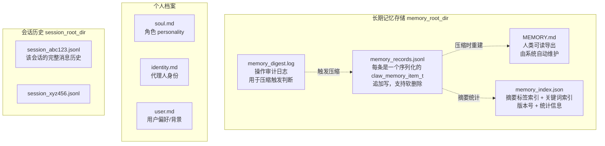
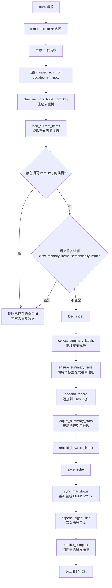
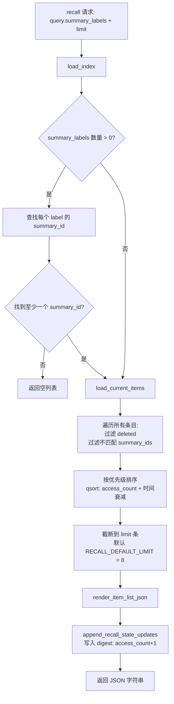
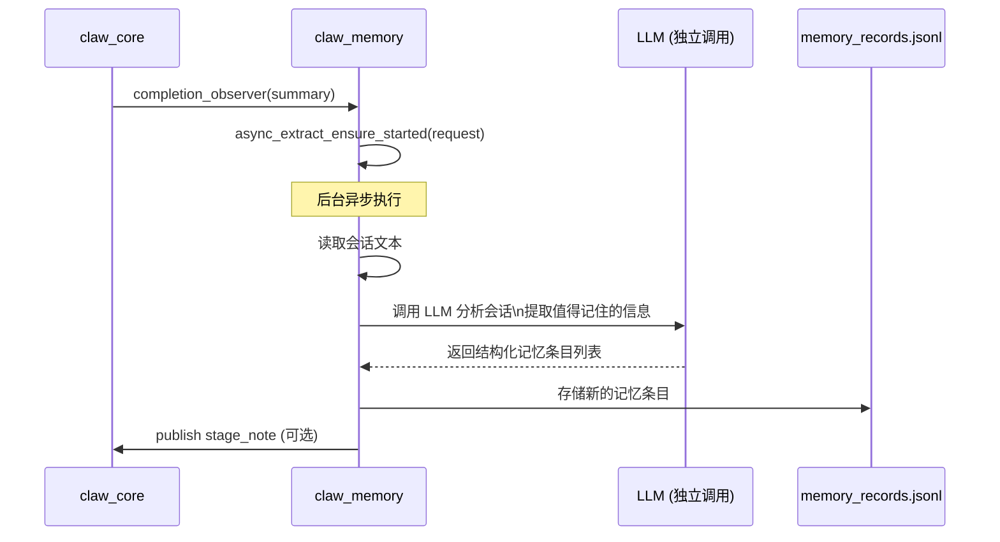

# 04 内存系统设计（Memory System）

## 4.1 概述

`claw_memory` 提供多层次的记忆机制：
- **长期记忆（Long-term Memory）**：跨会话持久化的结构化知识
- **会话历史（Session History）**：当前及历史对话记录（按会话分文件）
- **个人档案（Profile）**：用户身份和偏好的专用记忆（soul/identity/user）

---

## 4.2 存储架构



---

## 4.3 记忆条目结构（`claw_memory_item_t`）

```c
typedef struct {
    char id[40];            // 唯一 ID（UUID-like）
    char source[16];        // 来源标签，如 "manual", "auto", "session"
    char content[256];      // 记忆内容正文（UTF-8）
    uint16_t summary_ids[3];// 对应的摘要标签 ID（最多 3 个）
    uint8_t summary_id_count; // 实际使用的摘要 ID 数量
    char tags[96];          // 自由标签（逗号分隔）
    char keywords[128];     // 关键词（逗号分隔，用于搜索）
    uint32_t created_at;    // 创建时间（Unix 秒）
    uint32_t updated_at;    // 更新时间（Unix 秒）
    uint16_t access_count;  // 被 recall 访问的次数（影响优先级排序）
    uint8_t deleted;        // 软删除标志（0=正常, 1=已删除）
} claw_memory_item_t;
```

**大小限制一览：**

| 字段 | 最大长度 |
|------|----------|
| id | 40 字节 |
| source | 16 字节 |
| content | 256 字节 |
| tags | 96 字节 |
| keywords | 128 字节 |
| 摘要 ID 数 | 3 个 |
| 系统最大条目数 | 128 (`CLAW_MEMORY_MAX_ACTIVE_ITEMS`) |

---

## 4.4 摘要标签系统（Summary Label System）

摘要标签是长期记忆的核心索引机制，用于在不暴露全部内容的情况下让 LLM 知道"记忆里有什么话题"。

### 4.4.1 索引结构（memory_index.json）

```json
{
  "version": 3,
  "next_summary_id": 42,
  "last_compact_digest_size": 1024,
  "summaries": [
    {
      "summary_id": 1,
      "label": "food_pref",
      "ref_count": 3
    },
    {
      "summary_id": 2,
      "label": "work_schedule",
      "ref_count": 1
    }
  ],
  "keyword_index": {
    "spicy": [1, 5, 12],
    "python": [7, 8]
  }
}
```

- `label`：最多 `CLAW_MEMORY_MAX_LABEL_CHARS = 8` 个字符（ASCII 标签）
- `ref_count`：引用该摘要的条目数量，清零后移除摘要
- `keyword_index`：关键词 → 条目 ID 列表的映射

### 4.4.2 摘要标签生成算法

摘要标签从 `claw_memory_item_t.keywords` 字段提取（通过 LLM 推理或手动设置）。每条记忆最多有 `CLAW_MEMORY_MAX_SUMMARIES = 3` 个关联摘要。

---

## 4.5 存储操作算法

### 4.5.1 `claw_memory_store`（存储记忆）



### 4.5.2 `claw_memory_recall`（检索记忆）



### 4.5.3 `claw_memory_forget`（删除记忆）

- 将条目的 `deleted = 1` 并追加一条新记录到 `.jsonl`（软删除）。
- 更新索引：减少摘要引用计数，移除引用为 0 的摘要，重建关键词索引。
- 重新生成 `MEMORY.md`。

### 4.5.4 `claw_memory_update`（更新记忆）

Update = Store(新) + Forget(旧)，两步原子操作：
1. 用 `ignore_existing_id` 参数调用 `store_prepared_item_internal`（存新版本）。
2. 调用 `forget_with_result(old_id)`（软删除旧版本）。
3. 记录 `update` 审计日志。

---

## 4.6 压缩策略（Compaction）

**触发条件（满足任一即触发）：**
- `write_changes_since_compact >= COMPACT_CHANGE_THRESHOLD = 5`
- 记录文件大小 `>= COMPACT_SIZE_THRESHOLD = 32KB`

**压缩流程：**
```
compact_internal():
    1. load_current_items()  ← 读取全量记录，应用软删除过滤
    2. 重写 records.jsonl    ← 只保留未删除的条目（去除已删条目）
    3. sync_markdown()       ← 重新生成 MEMORY.md
    4. reset write_changes_since_compact = 0
```

压缩减少文件大小，使后续的 `load_current_items` 更快。

---

## 4.7 会话历史管理

### 4.7.1 持久化回调

```c
esp_err_t claw_memory_persist_session_callback(
    const claw_session_persist_batch_t *batch,
    void *user_ctx);
```

此函数是注册给 `claw_core` 的 `persist_session` 回调。接收一批会话记录，追加到对应会话的 `.jsonl` 文件中。

### 4.7.2 会话历史 Context Provider

```c
extern const claw_core_context_provider_t claw_memory_session_history_provider;
```

每次请求开始时（`REQUEST_START_ONLY`），读取该会话的 `.jsonl` 文件，将消息历史注入 `MESSAGES` 类型上下文。

**会话大小限制：** `CLAW_MEMORY_SESSION_SIZE_LIMIT = 150KB`

超过限制时，从最旧的记录开始截断，保留最新的历史。

### 4.7.3 会话文件路径格式

```
<session_root_dir>/session_<sanitized_session_id>_<fnv32_hash>.jsonl
```

- `sanitized_session_id`：将非字母数字字符替换为 `_`，最长 24 字符
- `fnv32_hash`：完整 session_id 的 FNV-1a 32位哈希（防止路径冲突）

---

## 4.8 个人档案（Profile Memory）

三个特殊 Markdown 文件，以不同粒度描述用户信息：

| 文件 | Context Provider | 用途 |
|------|-----------------|------|
| `soul.md` | `claw_memory_profile_provider` | Agent 角色/个性设定 |
| `identity.md` | `claw_memory_profile_provider` | Agent 身份描述 |
| `user.md` | `claw_memory_profile_provider` | 用户基本信息和偏好 |

这些文件的内容作为 `SYSTEM_PROMPT` 类型上下文注入，在每次请求时动态加载。

---

## 4.9 自动记忆提取（Auto Extract）

当 `claw_core` 成功完成一次推理后，会触发 `completion_observer`，由 `claw_memory` 启动一个**异步**的记忆提取流程：



**提取模式控制：**
- `enable_async_extract_stage_note`：是否在提取时发布进度通知
- `claw_memory_request_mark_manual_write(request_id)`：标记某次请求为"手动写入"，跳过自动提取

---

## 4.10 请求门控（Request Gate）

```c
esp_err_t claw_memory_request_gate_callback(
    const claw_core_request_t *request,
    char *reject_message,
    size_t reject_message_size,
    void *user_ctx);
```

可以用于检查用户是否被允许访问系统（例如，白名单检查）。如果 `reject_message` 非空，该文字将作为回复发给用户，请求不会进入推理。

---

## 4.11 长期记忆 Context Provider

```c
extern const claw_core_context_provider_t claw_memory_long_term_provider;
extern const claw_core_context_provider_t claw_memory_long_term_lightweight_provider;
```

**`long_term_provider`** 注入摘要标签目录，并给出使用指导：
```
The auto-injected long-term memory context only contains summary labels, not full memory bodies.
Use exact summary labels with memory_recall when you need detailed long-term memory.
Summary label catalog:
- food_pref
- work_schedule
- ...
```

**`long_term_lightweight_provider`** 是轻量版，内容更精简，适合上下文窗口较小的模型。

---

## 4.12 排序与优先级

`claw_memory_sort_by_priority_desc` 的排序依据：

1. `access_count`（越高优先级越高）
2. `updated_at`（越新优先级越高）
3. `created_at`（越新优先级越高）

这确保了常用的和新近的记忆更容易被检索到。
