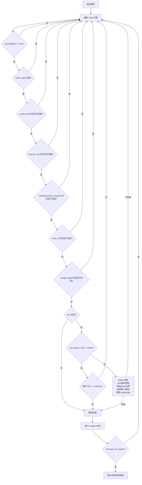
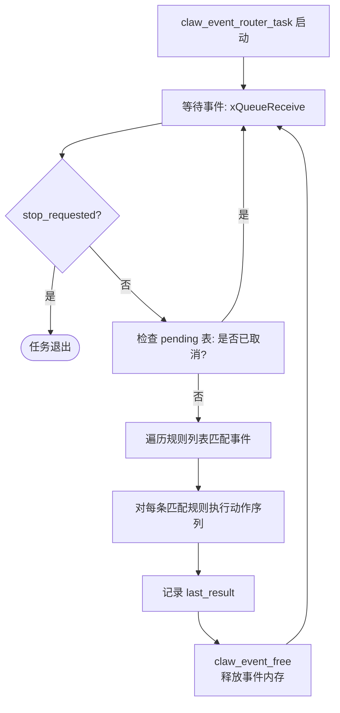
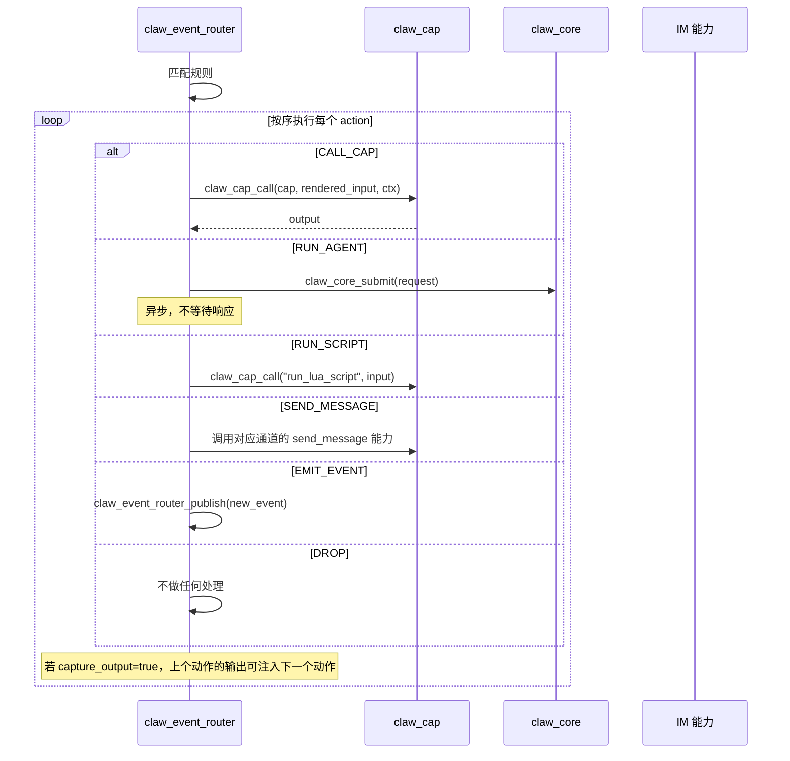

# 05 事件路由系统（Event Router）

## 5.1 概述

`claw_event_router` 是系统的神经中枢，连接所有外部输入源（IM 平台、调度器、传感器等）与内部处理逻辑（Agent、能力调用、消息发送）。它基于规则引擎，将到来的事件匹配到预定义的规则，并执行对应的动作序列。

---

## 5.2 事件结构（`claw_event_t`）

```c
typedef struct {
    char event_id[48];           // 唯一事件 ID
    char source_cap[32];         // 产生该事件的能力 ID
    char event_type[32];         // 事件类型（如 "message", "trigger", "schedule"）
    char source_channel[16];     // 来源通道（如 "telegram", "wechat", "time"）
    char target_channel[16];     // 目标通道（可为空）
    char source_endpoint[64];    // 来源端点（更精细的来源标识）
    char target_endpoint[96];    // 目标端点
    char chat_id[96];            // 聊天/群组 ID
    char sender_id[96];          // 发送者 ID
    char message_id[96];         // 消息 ID
    char correlation_id[96];     // 关联 ID（用于响应追踪）
    char content_type[24];       // 内容类型（"text", "image", "trigger"等）
    int64_t timestamp_ms;        // 时间戳（毫秒）
    claw_event_session_policy_t session_policy; // 会话策略
    char *text;                  // 文本内容（堆分配，可为 NULL）
    char *payload_json;          // 结构化负载（堆分配，可为 NULL）
} claw_event_t;
```

### 会话策略（`claw_event_session_policy_t`）

| 枚举值 | 含义 | Session ID 生成规则 |
|--------|------|---------------------|
| `CHAT` | 普通聊天会话 | `channel:chat_id` |
| `TRIGGER` | 触发器事件 | `trigger:event_key` |
| `GLOBAL` | 全局单一会话 | `"global"` |
| `EPHEMERAL` | 临时会话（不持久化） | `ephemeral:uuid` |
| `NOSAVE` | 不保存历史 | `nosave:channel:chat_id` |

---

## 5.3 规则结构（`claw_event_router_rule_t`）

```c
typedef struct {
    bool enabled;               // 是否启用
    bool consume_on_match;      // 匹配后是否消费事件（不继续匹配后续规则）
    char id[64];                // 规则 ID（唯一）
    char description[160];      // 描述
    char ack[256];              // 匹配成功时的日志确认消息
    char *vars_json;            // 规则级变量（JSON 对象）
    claw_event_router_match_t match;       // 匹配条件
    claw_event_router_action_t *actions;   // 动作序列
    size_t action_count;        // 动作数量
} claw_event_router_rule_t;
```

### 匹配条件（`claw_event_router_match_t`）

| 字段 | 含义 | 为空时 |
|------|------|--------|
| `event_type` | 事件类型（**必填**） | 不允许空 |
| `event_key` | 事件关键字 | 不过滤 |
| `source_cap` | 来源能力 | 不过滤 |
| `channel` / `source_channel` | 来源通道 | 不过滤 |
| `chat_id` | 聊天 ID | 不过滤 |
| `content_type` | 内容类型 | 不过滤 |
| `text` | 文本内容（精确或前缀匹配） | 不过滤 |
| `text_match_rule` | 文本匹配模式（`exact`/`prefix`） | 默认 `exact` |

---

## 5.4 规则匹配算法



### 前缀（Prefix）匹配规则

前缀匹配 (`text_match_rule = "prefix"`) 的语义：
1. 去除文本前导空格
2. 文本必须以 `match.text` 开头
3. 匹配后的字符必须是空格、制表符或字符串结束（token 边界）
4. **拒绝**"嵌入散文"，例如 `"please /run"` 不匹配 `/run`
5. 匹配后，`match.text` 之后的内容作为 `{{match.remainder}}` 暴露给动作模板

---

## 5.5 动作类型（`claw_event_router_action_kind_t`）

| 类型 | 说明 |
|------|------|
| `CALL_CAP` | 直接调用一个 Capability |
| `RUN_AGENT` | 向 claw_core 提交 Agent 请求 |
| `RUN_SCRIPT` | 执行 Lua 脚本 |
| `SEND_MESSAGE` | 通过 IM 能力发送消息 |
| `EMIT_EVENT` | 发布新的事件到路由器（事件链）|
| `DROP` | 丢弃事件，不做任何处理 |

### 动作结构（`claw_event_router_action_t`）

```c
typedef struct {
    claw_event_router_action_kind_t kind;
    char cap[64];          // CALL_CAP: 能力 ID
    char *input_json;      // 动作输入（模板渲染前）
    claw_cap_caller_t caller; // 调用方标识
    bool capture_output;   // 是否捕获输出（传递给下一个动作）
    bool fail_open;        // 失败时继续（不中断动作链）
} claw_event_router_action_t;
```

---

## 5.6 模板渲染系统

动作的 `input_json` 在执行前会进行模板变量替换，支持以下变量：

### 事件上下文变量

| 变量 | 含义 |
|------|------|
| `{{event.event_type}}` | 事件类型 |
| `{{event.event_key}}` | 事件关键字 |
| `{{event.source_cap}}` | 来源能力 |
| `{{event.channel}}` | 来源通道（别名） |
| `{{event.source_channel}}` | 来源通道 |
| `{{event.target_channel}}` | 目标通道 |
| `{{event.chat_id}}` | 聊天 ID |
| `{{event.message_id}}` | 消息 ID |
| `{{event.content_type}}` | 内容类型 |
| `{{event.session_policy}}` | 会话策略 |
| `{{event.text}}` | 事件文本 |
| `{{event.payload.<field>}}` | payload_json 中的字段 |

### 匹配上下文变量（text 匹配后可用）

| 变量 | 含义 |
|------|------|
| `{{match.text}}` | 匹配的文本 |
| `{{match.rule}}` | 匹配的规则 ID |
| `{{match.remainder}}` | 前缀匹配后的剩余文本 |

---

## 5.7 事件路由器工作任务

路由器有一个独立的 FreeRTOS 任务（`claw_event_router_task`），从事件队列中取出事件并处理。



**Pending 表（`pending`）：**
- 大小：`CLAW_EVENT_ROUTER_PENDING_TABLE_SIZE = 6`
- 用于跟踪已入队但被取消的事件，防止已取消事件被处理
- `claw_event_router_cancel_event(event_id)` 将对应条目标记为 `cancelled`

---

## 5.8 动作执行序列



---

## 5.9 出站绑定（Outbound Binding）

```c
esp_err_t claw_event_router_register_outbound_binding(
    const char *channel,
    const char *cap_name);
```

将特定通道名与发送能力绑定。当 `RUN_AGENT` 动作需要发送回复时，通过 `outbound_resolver` 确定使用哪个能力发送：

```c
typedef esp_err_t (*claw_event_router_outbound_resolver_fn)(
    const claw_event_t *event,
    const char *target_channel,
    const char *target_endpoint,
    char *cap_name,
    size_t cap_name_size,
    void *user_ctx);
```

---

## 5.10 Session ID 构建

```c
size_t claw_event_build_session_id(
    const claw_event_t *event,
    char *buf,
    size_t buf_size);
```

根据事件的 `session_policy` 生成 Session ID：

| 策略 | Session ID 格式 |
|------|-----------------|
| `CHAT` | `"<source_channel>:<chat_id>"` |
| `TRIGGER` | `"trigger:<event_key>"` |
| `GLOBAL` | `"global"` |
| `EPHEMERAL` | 随机 UUID |
| `NOSAVE` | `"nosave:<source_channel>:<chat_id>"` |

自定义 `session_builder` 可覆盖默认行为（如 `cap_session_mgr_build_session_id`）。

---

## 5.11 规则持久化

规则以 JSON 文件形式存储（`rules_path`），格式为规则对象数组。

```json
[
  {
    "id": "im_any_message_agent",
    "enabled": true,
    "consume_on_match": true,
    "match": {
      "event_type": "message",
      "event_key": "text",
      "content_type": "text"
    },
    "actions": [
      {
        "type": "run_agent",
        "input": {
          "target_channel": "{{event.source_channel}}",
          "session_policy": "chat"
        }
      }
    ]
  }
]
```

**运行时 CRUD：**
- `claw_event_router_add_rule_json(json)` → 新增规则并持久化
- `claw_event_router_update_rule_json(json)` → 更新规则并持久化
- `claw_event_router_delete_rule(id)` → 删除规则并持久化
- `claw_event_router_reload()` → 从文件重新加载（丢弃未持久化的运行时修改）

---

## 5.12 发布接口（Publisher Interface）

```c
// 发布任意事件
esp_err_t claw_event_router_publish(const claw_event_t *event);

// 便捷：发布 IM 消息事件
esp_err_t claw_event_router_publish_message(
    const char *source_cap,
    const char *channel,
    const char *chat_id,
    const char *text,
    const char *sender_id,
    const char *message_id);

// 便捷：发布触发器事件
esp_err_t claw_event_router_publish_trigger(
    const char *source_cap,
    const char *event_type,
    const char *event_key,
    const char *payload_json);
```

发布操作将事件放入路由器队列（`xQueueSend`），由路由器任务异步处理。

---

## 5.13 默认路由策略

`default_route_messages_to_agent`（配置项）：
- 若为 `true`，所有 `event_type = "message"` 且没有匹配任何规则的事件，会被自动提交给 Agent。
- 这是一个兜底策略，确保 IM 消息不被静默丢弃。
