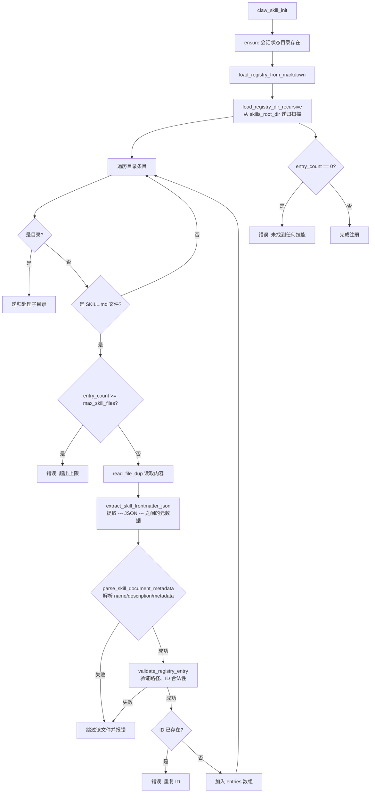
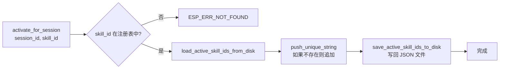
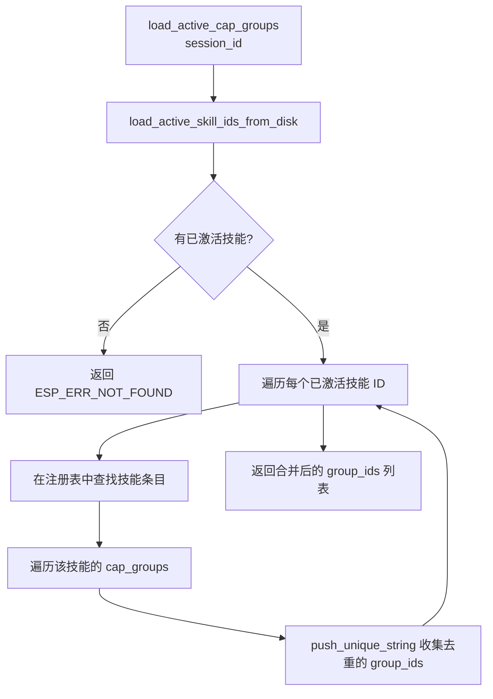
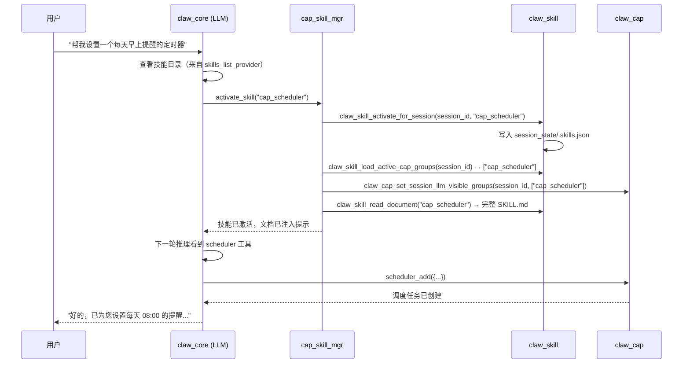

# 06 技能系统设计（Skill System）

## 6.1 概述

`claw_skill` 提供了一种将文档化的任务指导（SKILL.md）与能力组（Capability Group）绑定的机制。通过"激活技能"，特定会话可以解锁对应的能力组，同时将技能文档注入 LLM 的系统提示，指导 LLM 完成特定任务。

---

## 6.2 Skill 文档格式（SKILL.md）

每个 Skill 由一个 `SKILL.md` 文件定义，文件以 YAML-like frontmatter 开头（实际是 JSON 格式）：

```markdown
---
{
  "name": "skill_id",
  "description": "简短描述（出现在技能目录中）",
  "metadata": {
    "cap_groups": ["group_id_1", "group_id_2"],
    "manage_mode": "readonly"
  }
}
---

# 技能标题

## When to use
（何时使用本技能）

## Available capabilities
（可用能力列表和调用格式）

## Operating rules
（操作规范）

...
```

### Frontmatter 字段说明

| 字段 | 类型 | 说明 |
|------|------|------|
| `name` | string（必填） | 技能唯一 ID，也是文件路径前缀（如 `my_skill` → 文件必须在 `<skills_root>/my_skill/SKILL.md`） |
| `description` | string（必填） | 简短描述，用于技能目录 |
| `metadata.cap_groups` | string[] | 激活本技能时会解锁的能力组 ID 列表 |
| `metadata.manage_mode` | string | `"readonly"` 或 `"runtime"` |

### Manage Mode 含义

| 模式 | 含义 |
|------|------|
| `readonly` | 技能文档不可被运行时修改（只能通过文件系统管理） |
| `runtime` | 技能可以被 `cap_skill_mgr` 在运行时动态创建/修改 |

---

## 6.3 目录结构约定

```
<skills_root_dir>/
├── cap_router_mgr/
│   └── SKILL.md           ← skill id = "cap_router_mgr"
├── cap_scheduler/
│   └── SKILL.md           ← skill id = "cap_scheduler"
├── memory_ops/
│   └── SKILL.md           ← skill id = "memory_ops"
└── custom_skill/
    ├── SKILL.md            ← skill id = "custom_skill"
    └── scripts/
        └── action.lua      ← 技能脚本（由技能文档引用）
```

**约束：**
- `name`（技能 ID）不能包含路径分隔符（`/` `\`）
- 技能文件路径必须是 `<skill_id>/SKILL.md`，严格一致
- 技能 ID 全局唯一（重复会报错）

---

## 6.4 注册表加载算法



---

## 6.5 Frontmatter 解析算法

文件格式必须以 `---\n` 开头，JSON 内容结束于 `\n---`：

```
---\n
{ "name": "...", ... }\n
---\n
# 正文...
```

**步骤：**
1. 跳过可能的 UTF-8 BOM（`0xEF 0xBB 0xBF`）
2. 匹配 `---` 开头
3. 在 JSON 开始位置（`---\n` 之后）到 `\n---` 之间提取 JSON 字符串
4. 解析 JSON，提取 `name`、`description`、`metadata` 字段

**`{CUR_SKILL_DIR}` 变量展开：**

Skill 文档正文中可以使用 `{CUR_SKILL_DIR}` 占位符，在读取文档时会被自动替换为该技能目录的绝对路径：

```markdown
## Script path
`{CUR_SKILL_DIR}/scripts/action.lua`
```
展开后：
```markdown
## Script path
`/fatfs/skills/my_skill/scripts/action.lua`
```

---

## 6.6 会话-技能状态管理

每个会话拥有独立的已激活技能列表，存储在 `<session_state_root_dir>` 中。

### 会话状态文件路径格式

```
s_<sanitized_session_id>_<fnv32_hash>.skills.json
```

文件内容为技能 ID 数组：
```json
["cap_scheduler", "cap_router_mgr", "memory_ops"]
```

### 激活流程（`claw_skill_activate_for_session`）



### 能力组解锁（`claw_skill_load_active_cap_groups`）



此列表被 `cap_skill_mgr` 用来设置 `claw_cap_set_session_llm_visible_groups()`，从而让该会话看到更多工具。

---

## 6.7 技能目录 Context Provider

```c
extern const claw_core_context_provider_t claw_skill_skills_list_provider;
```

这个 Context Provider 将技能目录以系统提示形式注入，让 LLM 知道有哪些技能可以激活：

```
Available skills:
- cap_router_mgr: Manage router automation rules: list/get/add/update/delete/reload with strict rule_json format.
- cap_scheduler: Manage scheduler rules: list/get/add/update/remove/enable/disable/pause/resume/trigger/reload.
- memory_ops: Store, recall, update and forget long-term memories.
```

---

## 6.8 技能文档读取（`claw_skill_read_document`）

```c
esp_err_t claw_skill_read_document(const char *skill_id, char *buf, size_t size);
```

读取完整的 SKILL.md 文件内容（含 frontmatter）并展开 `{CUR_SKILL_DIR}` 占位符。被 `cap_skill_mgr` 在用户激活技能时调用，将完整文档注入当前推理上下文。

**大小限制：**
- `max_file_bytes`（配置项，默认 `CLAW_SKILL_DEFAULT_MAX_BYTES = 2048`）

---

## 6.9 热重载（`claw_skill_reload_registry`）

```c
esp_err_t claw_skill_reload_registry(void);
```

在不重启系统的情况下重新扫描技能目录，更新注册表：
- 先尝试加载新的注册表
- 成功后替换旧注册表（原子性）
- 失败时回滚到旧注册表

适用于运行时动态添加/修改技能文件的场景。

---

## 6.10 技能激活的完整交互流程


