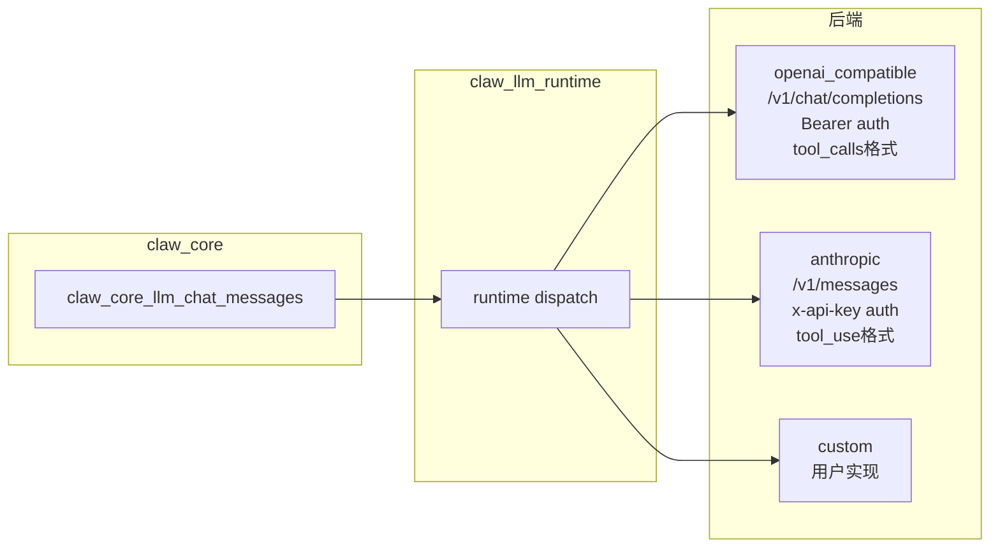

# 07 LLM 后端抽象层

## 7.1 概述

Claw 的 LLM 调用被封装在 `claw_core/src/llm/` 子目录中，通过后端 vtable（虚函数表）机制支持多个 LLM 提供商，并提供统一的 HTTP 传输层。

---

## 7.2 后端 vtable 接口

```c
typedef struct {
    const char *id;  // 后端标识符，如 "openai_compatible", "anthropic"

    esp_err_t (*init)(
        const claw_llm_runtime_config_t *config,
        const claw_llm_model_profile_t *profile,
        void **out_backend_ctx,      // 后端私有上下文
        char **out_error_message);

    esp_err_t (*chat)(
        void *backend_ctx,
        const claw_llm_model_profile_t *profile,
        const claw_llm_chat_request_t *request,
        claw_llm_response_t *out_response,
        char **out_error_message);

    esp_err_t (*infer_media)(
        void *backend_ctx,
        const claw_llm_model_profile_t *profile,
        const claw_llm_media_request_t *request,
        char **out_text,
        char **out_error_message);

    void (*deinit)(void *backend_ctx);
} claw_llm_backend_vtable_t;
```

---

## 7.3 后端注册机制

```c
typedef struct {
    const char *id;
    const claw_llm_backend_vtable_t *vtable;
    claw_llm_backend_defaults_t defaults;  // auth_type, chat_path, max_tokens_field
} claw_llm_backend_registration_t;
```

**内置后端：**

| 后端 ID | 适配范围 | 默认路径 |
|---------|---------|---------|
| `openai_compatible` | OpenAI、本地 ollama、各 OpenAI 兼容 API | `/v1/chat/completions` |
| `anthropic` | Anthropic Claude API | `/v1/messages` |
| `custom` | 用户自定义 | 用户提供 |

**自定义后端注册：**

```c
esp_err_t claw_llm_register_custom_backend(
    const claw_llm_custom_backend_registration_t *registration);
```

允许在运行时注册第三方后端，只需实现 vtable 中的 `init/chat/infer_media/deinit`。

---

## 7.4 运行时配置（`claw_llm_runtime_config_t`）

```c
typedef struct {
    const char *api_key;        // API 密钥
    const char *backend_type;   // 后端 ID 字符串
    const char *model;          // 模型名称（如 "gpt-4o", "claude-3-5-sonnet"）
    const char *base_url;       // API 基础 URL
    const char *auth_type;      // 认证方式（"bearer" 或 "x-api-key"）
    const char *max_tokens_field; // 最大 token 字段名（"max_tokens" 或 "max_completion_tokens"）
    uint32_t timeout_ms;        // HTTP 超时（毫秒）
    uint32_t max_tokens;        // 最大生成 token 数
    size_t image_max_bytes;     // 图像最大字节数（视觉模型）
    bool supports_tools;        // 是否支持工具调用
    bool supports_vision;       // 是否支持图像输入
    bool image_remote_url_only; // 图像是否只支持远程 URL（不支持 base64）
} claw_llm_runtime_config_t;
```

---

## 7.5 聊天请求/响应结构

### 请求（`claw_llm_chat_request_t`）

```c
typedef struct {
    const char *system_prompt;  // 系统提示词
    cJSON *messages;            // 消息数组（JSON）
    const char *tools_json;     // 工具定义 JSON（可为 NULL）
    bool wrap_for_responses_api; // 是否用 Responses API 格式包装
} claw_llm_chat_request_t;
```

### 响应（`claw_llm_response_t`）

```c
typedef struct {
    char *text;                        // 最终文本内容（无工具调用时）
    char *raw_message_json;            // 原始 assistant 消息 JSON
    claw_llm_tool_call_t *tool_calls;  // 工具调用列表
    size_t tool_call_count;            // 工具调用数量
} claw_llm_response_t;
```

### 工具调用（`claw_llm_tool_call_t`）

```c
typedef struct {
    char *id;               // 工具调用 ID（用于工具结果关联）
    char *name;             // 工具名称（对应 Capability ID）
    char *arguments_json;   // 参数 JSON 字符串
} claw_llm_tool_call_t;
```

---

## 7.6 HTTP 传输层（`claw_llm_http_transport`）

```c
// 发送 POST 请求并接收完整 JSON 响应
esp_err_t claw_llm_http_post_json(
    const char *url,
    const char *auth_header,
    const char *body_json,
    uint32_t timeout_ms,
    char **out_response_json,
    char **out_error_message);

// 中止当前 HTTP 请求（通过 atomic bool 指针）
void claw_llm_http_arm_abort(volatile bool *abort_flag);
void claw_llm_http_disarm_abort(void);
```

**中止机制：**

HTTP 传输层定期检查 `abort_flag` 指针。当 `claw_core` 设置 `inflight_abort = true` 时，进行中的 HTTP 请求会被提前终止，允许用户中断或取消。

---

## 7.7 OpenAI Compatible 后端协议

### 请求格式

```json
{
  "model": "gpt-4o",
  "messages": [
    {"role": "system", "content": "<system_prompt>"},
    {"role": "user", "content": "<user_text>"},
    {"role": "assistant", "tool_calls": [...], ...},
    {"role": "tool", "tool_call_id": "...", "content": "<result>"}
  ],
  "tools": [
    {
      "type": "function",
      "function": {
        "name": "memory_recall",
        "description": "...",
        "parameters": {...}
      }
    }
  ],
  "max_tokens": 4096
}
```

### 响应解析

- 解析 `choices[0].message`
- 若 `tool_calls` 非空 → 生成工具调用列表
- 若无 `tool_calls` → 取 `content` 为最终文本
- 保存 `choices[0].message` 为 `raw_message_json`（用于下一轮 assistant 历史追加）

---

## 7.8 Anthropic 后端协议

### 请求格式差异

Anthropic API 的差异处理：
- 系统提示放在独立的 `system` 字段，而非 messages 数组
- 工具定义格式与 OpenAI 略有不同
- 认证方式：`x-api-key` 请求头（而非 `Authorization: Bearer`）
- 工具调用结果包装格式不同

### 工具使用字段映射

| OpenAI 格式 | Anthropic 格式 |
|-------------|----------------|
| `tool_calls[].id` | `tool_use.id` |
| `tool_calls[].function.name` | `tool_use.name` |
| `tool_calls[].function.arguments` | `tool_use.input` (JSON对象) |
| `role: tool, tool_call_id: xxx` | `role: user, type: tool_result, tool_use_id: xxx` |

---

## 7.9 媒体处理管道（Media Pipeline）

```c
typedef struct {
    const char *system_prompt;
    const char *user_prompt;
    const char *image_path;         // 本地文件路径
    const char *image_url;          // 远程 URL
    const char *media_type;         // MIME 类型
    bool is_base64;                 // 是否 base64 编码
} claw_llm_media_request_t;
```

**处理流程：**
1. 若 `image_path` 非空，读取文件并 base64 编码（若后端不支持 URL 直接传输）
2. 若 `image_remote_url_only = true`，必须上传到远程后使用 URL
3. 构建多模态消息（content array with image and text）
4. 发送给 LLM 进行视觉推理

---

## 7.10 多后端协议对比



---

## 7.11 ESP32 特定依赖（移植关注点）

| 当前实现 | 移植到 PC 的替代 |
|---------|----------------|
| `esp_http_client` | libcurl / 标准 POSIX socket |
| `esp_tls` | OpenSSL / mbedTLS |
| `esp_heap_caps_malloc` | 标准 `malloc` |
| 流式 HTTP 响应（chunked） | 需要实现等效的非阻塞 HTTP 客户端 |

**关键：** LLM 传输层需要支持"可中止"的 HTTP 请求（通过 `abort_flag`）。在 PC 上可以通过额外线程 + `curl_easy_setopt(CURLOPT_TIMEOUT_MS)` 或 `pthread_cancel` 实现。
