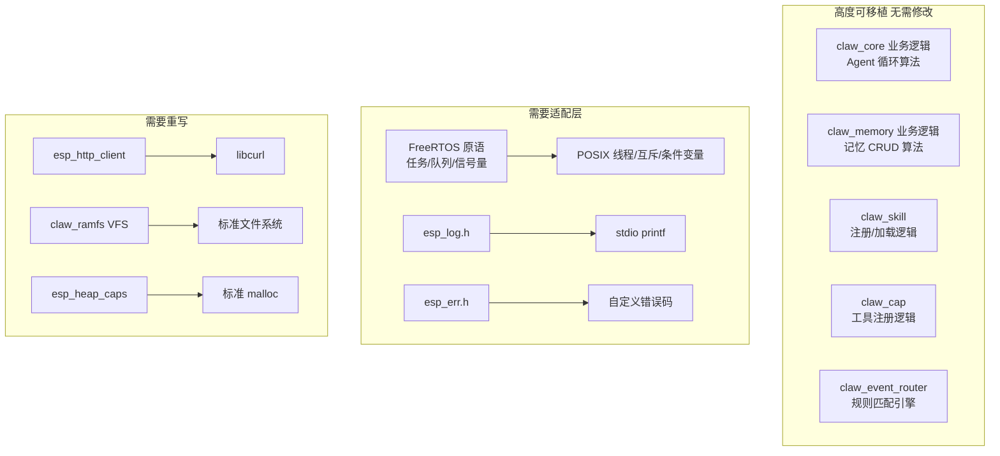

# 08 移植指南：ESP32 → PC 架构

## 8.1 移植策略概述

将 claw agent 从 ESP32（FreeRTOS）移植到 PC（Linux/macOS/Windows），需要替换的不是业务逻辑，而是**基础设施层**。所有核心算法（Agent 循环、工具路由、记忆存储、技能管理）可以原样保留，只需将依赖 FreeRTOS/ESP-IDF 的原语替换为 POSIX 等效物。

**替换原则：** 保持接口契约不变，仅替换底层实现。

---

## 8.2 主要依赖替换清单

### 8.2.1 `esp_err_t` 错误处理

**原实现：**
```c
#include "esp_err.h"
esp_err_t result = claw_xxx();
if (result != ESP_OK) { ... }
```

**PC 移植：**
```c
// 定义等效的错误码
typedef int esp_err_t;
#define ESP_OK          0
#define ESP_FAIL       -1
#define ESP_ERR_NO_MEM  0x101
#define ESP_ERR_INVALID_ARG 0x102
#define ESP_ERR_INVALID_STATE 0x103
#define ESP_ERR_NOT_FOUND 0x105
#define ESP_ERR_TIMEOUT 0x107
#define ESP_ERR_INVALID_SIZE 0x10A

static inline const char *esp_err_to_name(esp_err_t err) {
    switch (err) {
        case ESP_OK: return "ESP_OK";
        case ESP_FAIL: return "ESP_FAIL";
        case ESP_ERR_NO_MEM: return "ESP_ERR_NO_MEM";
        // ...
        default: return "ESP_ERR_UNKNOWN";
    }
}
```

---

### 8.2.2 FreeRTOS 任务 → POSIX 线程

**原实现（claw_task.h）：**
```c
// FreeRTOS 任务创建
BaseType_t claw_task_create(const claw_task_config_t *config,
                            TaskFunction_t task_func,
                            void *arg,
                            TaskHandle_t *task_handle);
void claw_task_delete(TaskHandle_t task_handle);
```

**PC 移植：**
```c
#include <pthread.h>

typedef pthread_t TaskHandle_t;
typedef void (*TaskFunction_t)(void *);
typedef int BaseType_t;
#define pdPASS 1
#define pdFAIL 0

BaseType_t claw_task_create(const claw_task_config_t *config,
                            TaskFunction_t task_func,
                            void *arg,
                            TaskHandle_t *task_handle) {
    pthread_t thread;
    pthread_attr_t attr;
    pthread_attr_init(&attr);
    // 设置栈大小
    pthread_attr_setstacksize(&attr, config->stack_size);
    int rc = pthread_create(&thread, &attr, (void*(*)(void*))task_func, arg);
    pthread_attr_destroy(&attr);
    if (rc != 0) return pdFAIL;
    if (task_handle) *task_handle = thread;
    return pdPASS;
}

void claw_task_delete(TaskHandle_t task_handle) {
    pthread_cancel(task_handle);
    pthread_join(task_handle, NULL);
}
```

---

### 8.2.3 FreeRTOS 队列 → POSIX 条件变量

**原接口：**
```c
QueueHandle_t xQueueCreate(UBaseType_t uxQueueLength, UBaseType_t uxItemSize);
BaseType_t xQueueSend(QueueHandle_t xQueue, const void *pvItemToQueue, TickType_t xTicksToWait);
BaseType_t xQueueReceive(QueueHandle_t xQueue, void *pvBuffer, TickType_t xTicksToWait);
void vQueueDelete(QueueHandle_t xQueue);
```

**PC 移植（简化实现）：**
```c
#include <pthread.h>
#include <string.h>
#include <stdlib.h>
#include <time.h>

typedef struct pc_queue {
    pthread_mutex_t mutex;
    pthread_cond_t  cond_notempty;
    pthread_cond_t  cond_notfull;
    size_t item_size;
    size_t capacity;
    size_t count;
    size_t head;
    uint8_t *data;
} *QueueHandle_t;

typedef uint32_t TickType_t;
#define portMAX_DELAY    UINT32_MAX
#define pdMS_TO_TICKS(ms) (ms)
#define pdTRUE  1
#define pdFALSE 0

QueueHandle_t xQueueCreate(size_t length, size_t item_size) {
    struct pc_queue *q = calloc(1, sizeof(*q));
    q->data = calloc(length, item_size);
    q->item_size = item_size;
    q->capacity = length;
    pthread_mutex_init(&q->mutex, NULL);
    pthread_cond_init(&q->cond_notempty, NULL);
    pthread_cond_init(&q->cond_notfull, NULL);
    return q;
}

int xQueueSend(QueueHandle_t q, const void *item, uint32_t timeout_ms) {
    pthread_mutex_lock(&q->mutex);
    while (q->count >= q->capacity) {
        if (timeout_ms == portMAX_DELAY) {
            pthread_cond_wait(&q->cond_notfull, &q->mutex);
        } else {
            struct timespec ts;
            clock_gettime(CLOCK_REALTIME, &ts);
            ts.tv_nsec += (timeout_ms % 1000) * 1000000L;
            ts.tv_sec  += timeout_ms / 1000 + ts.tv_nsec / 1000000000L;
            ts.tv_nsec %= 1000000000L;
            if (pthread_cond_timedwait(&q->cond_notfull, &q->mutex, &ts) != 0) {
                pthread_mutex_unlock(&q->mutex);
                return pdFALSE;
            }
        }
    }
    size_t tail = (q->head + q->count) % q->capacity;
    memcpy(q->data + tail * q->item_size, item, q->item_size);
    q->count++;
    pthread_cond_signal(&q->cond_notempty);
    pthread_mutex_unlock(&q->mutex);
    return pdTRUE;
}

int xQueueReceive(QueueHandle_t q, void *buf, uint32_t timeout_ms) {
    pthread_mutex_lock(&q->mutex);
    while (q->count == 0) {
        if (timeout_ms == portMAX_DELAY) {
            pthread_cond_wait(&q->cond_notempty, &q->mutex);
        } else {
            struct timespec ts;
            clock_gettime(CLOCK_REALTIME, &ts);
            ts.tv_nsec += (timeout_ms % 1000) * 1000000L;
            ts.tv_sec  += timeout_ms / 1000 + ts.tv_nsec / 1000000000L;
            ts.tv_nsec %= 1000000000L;
            if (pthread_cond_timedwait(&q->cond_notempty, &q->mutex, &ts) != 0) {
                pthread_mutex_unlock(&q->mutex);
                return pdFALSE;
            }
        }
    }
    memcpy(buf, q->data + q->head * q->item_size, q->item_size);
    q->head = (q->head + 1) % q->capacity;
    q->count--;
    pthread_cond_signal(&q->cond_notfull);
    pthread_mutex_unlock(&q->mutex);
    return pdTRUE;
}
```

---

### 8.2.4 FreeRTOS 互斥量/信号量 → POSIX mutex

**原接口：**
```c
SemaphoreHandle_t xSemaphoreCreateMutex(void);
BaseType_t xSemaphoreTake(SemaphoreHandle_t xSemaphore, TickType_t xBlockTime);
BaseType_t xSemaphoreGive(SemaphoreHandle_t xSemaphore);
void vSemaphoreDelete(SemaphoreHandle_t xSemaphore);
```

**PC 移植：**
```c
typedef struct {
    pthread_mutex_t mutex;
    pthread_cond_t  cond;
    int count;  // 0=locked, 1=available
} *SemaphoreHandle_t;

SemaphoreHandle_t xSemaphoreCreateMutex(void) {
    struct { pthread_mutex_t m; pthread_cond_t c; int count; } *s = calloc(1, sizeof(*s));
    pthread_mutex_init(&s->m, NULL);
    pthread_cond_init(&s->c, NULL);
    s->count = 1; // 初始可用
    return (SemaphoreHandle_t)s;
}
// xSemaphoreTake / xSemaphoreGive 类似队列的实现
```

---

### 8.2.5 日志系统替换

**原接口：**
```c
#include "esp_log.h"
ESP_LOGI(TAG, "message %s", arg);
ESP_LOGW(TAG, "warning %s", arg);
ESP_LOGE(TAG, "error %s", arg);
ESP_LOGD(TAG, "debug %s", arg);
```

**PC 移植：**
```c
#include <stdio.h>
#include <time.h>

#define ESP_LOGI(tag, fmt, ...) \
    fprintf(stdout, "[I][%s] " fmt "\n", tag, ##__VA_ARGS__)
#define ESP_LOGW(tag, fmt, ...) \
    fprintf(stderr, "[W][%s] " fmt "\n", tag, ##__VA_ARGS__)
#define ESP_LOGE(tag, fmt, ...) \
    fprintf(stderr, "[E][%s] " fmt "\n", tag, ##__VA_ARGS__)
#define ESP_LOGD(tag, fmt, ...) \
    do { } while(0)  // 或者条件编译启用
```

---

### 8.2.6 `claw_ramfs` → 标准文件系统

`claw_ramfs` 在 ESP32 上提供 RAM 中的虚拟文件系统（VFS），供需要快速读写的临时数据使用。

**移植策略选项：**

| 选项 | 实现方式 | 适用场景 |
|------|----------|----------|
| **直接使用 tmpfs** | 将 ramfs 挂载点改为 `/tmp/claw/` | Linux 简单部署 |
| **内存文件系统库** | 使用 libmemfs 或 lvgl fs | 需要精确控制内存 |
| **保留接口** | 用标准文件 I/O 实现 `claw_ramfs_register/info/sync` | 完全兼容 API |

**推荐方案：** 提供 `claw_ramfs_posix.c` 实现，将 `claw_ramfs_register()` 映射到创建 `/tmp/claw_ramfs_<id>/` 目录：

```c
esp_err_t claw_ramfs_register(const claw_ramfs_config_t *config) {
    char path[256];
    // 将 base_path 映射到 /tmp/claw/<base_path>/
    snprintf(path, sizeof(path), "/tmp/claw%s", config->base_path);
    mkdir(path, 0755);  // 递归创建
    return ESP_OK;
}

esp_err_t claw_ramfs_sync_tree_to_fatfs(const char *ramfs_dir, const char *fatfs_dir) {
    // 在 PC 上两者都是普通文件系统，直接 cp -r
    // 或者 noop（数据已经在目标位置）
    return ESP_OK;
}
```

---

### 8.2.7 HTTP 客户端替换

**原实现：** `esp_http_client` + `esp_tls`

**PC 移植（推荐 libcurl）：**

```c
#include <curl/curl.h>

typedef struct {
    char *data;
    size_t size;
} http_response_buf_t;

static size_t write_cb(void *ptr, size_t size, size_t nmemb, void *userdata) {
    http_response_buf_t *buf = userdata;
    size_t new_size = buf->size + size * nmemb;
    buf->data = realloc(buf->data, new_size + 1);
    memcpy(buf->data + buf->size, ptr, size * nmemb);
    buf->size = new_size;
    buf->data[new_size] = '\0';
    return size * nmemb;
}

esp_err_t claw_llm_http_post_json(const char *url, const char *auth_header,
                                   const char *body, uint32_t timeout_ms,
                                   char **out_response, char **out_error) {
    CURL *curl = curl_easy_init();
    struct curl_slist *headers = NULL;
    http_response_buf_t resp = {0};
    
    headers = curl_slist_append(headers, "Content-Type: application/json");
    if (auth_header) headers = curl_slist_append(headers, auth_header);
    
    curl_easy_setopt(curl, CURLOPT_URL, url);
    curl_easy_setopt(curl, CURLOPT_POSTFIELDS, body);
    curl_easy_setopt(curl, CURLOPT_HTTPHEADER, headers);
    curl_easy_setopt(curl, CURLOPT_WRITEFUNCTION, write_cb);
    curl_easy_setopt(curl, CURLOPT_WRITEDATA, &resp);
    curl_easy_setopt(curl, CURLOPT_TIMEOUT_MS, (long)timeout_ms);
    
    CURLcode rc = curl_easy_perform(curl);
    curl_slist_free_all(headers);
    curl_easy_cleanup(curl);
    
    if (rc != CURLE_OK) {
        if (out_error) *out_error = strdup(curl_easy_strerror(rc));
        free(resp.data);
        return ESP_FAIL;
    }
    *out_response = resp.data;
    return ESP_OK;
}
```

---

### 8.2.8 内存分配替换

| 原接口 | PC 等效 |
|--------|---------|
| `heap_caps_malloc(size, MALLOC_CAP_INTERNAL)` | `malloc(size)` |
| `heap_caps_malloc(size, MALLOC_CAP_SPIRAM)` | `malloc(size)` |
| `heap_caps_free(ptr)` | `free(ptr)` |
| `esp_heap_caps.h` | 可提供空头文件或宏映射 |

---

### 8.2.9 时间函数

| 原接口 | PC 等效 |
|--------|---------|
| `gettimeofday()` | `gettimeofday()` (POSIX 兼容，Windows 需 winsock2) |
| `xTaskGetTickCount()` | `clock_gettime(CLOCK_MONOTONIC)` 或 `timespec_get` |
| `pdMS_TO_TICKS(ms)` | 直接用 ms 或换算为 nsec |
| `vTaskDelay(ticks)` | `usleep(ms * 1000)` |

---

## 8.3 模块可移植性评估



---

## 8.4 推荐移植架构

```
claw-pc/
├── compat/                    ← ESP-IDF 兼容层（仅头文件 + 简单实现）
│   ├── esp_err.h              ← 错误码定义
│   ├── esp_log.h              ← 日志宏
│   ├── esp_heap_caps.h        ← malloc 包装
│   ├── freertos/
│   │   ├── FreeRTOS.h         ← portMAX_DELAY, pdTRUE 等常量
│   │   ├── task.h             ← TaskHandle_t, xTaskCreate 等
│   │   ├── queue.h            ← QueueHandle_t, xQueueCreate 等
│   │   └── semphr.h           ← SemaphoreHandle_t
│   ├── freertos_posix.c       ← POSIX 实现
│   └── claw_ramfs_posix.c     ← tmpfs 包装
│
├── components/               ← 直接从 esp-claw 复制
│   ├── claw_modules/         ← 零修改
│   └── claw_capabilities/    ← 零修改
│
├── platform/                 ← PC 平台特定实现
│   ├── http_client_curl.c    ← libcurl HTTP 客户端
│   └── app_main.c            ← 入口点（替代 ESP 的 app_main）
│
└── CMakeLists.txt
```

---

## 8.5 关键移植验证点

移植完成后，应按以下顺序验证：

1. **`claw_memory` 单元测试**：存储、检索、遗忘、更新
2. **`claw_skill` 注册测试**：加载 SKILL.md 目录
3. **`claw_event_router` 规则测试**：规则匹配和模板渲染
4. **`claw_core` 集成测试（mock LLM）**：使用 mock HTTP 服务测试 Agent 循环
5. **完整端到端测试**：连接真实 LLM API

---

## 8.6 Windows 平台特殊注意事项

| 问题 | 解决方案 |
|------|----------|
| `gettimeofday()` 不可用 | 使用 `_gettimeofday()` 或封装 `QueryPerformanceCounter` |
| POSIX 线程 | 使用 `winpthreads`（MinGW 附带）或 Windows Thread API |
| `strlcpy/strlcat` 不可用 | 使用 `strncpy` 等效实现 |
| 文件路径分隔符 | 统一使用 `/`（Windows 现代 API 支持） |
| `snprintf` 行为差异 | MSVC 的 `_snprintf` 在截断时不保证 NUL 结尾 |

---

## 8.7 不需要移植的能力

以下能力是 ESP32 硬件特定的，移植到 PC 时可以选择禁用或替换：

| 能力 | 原平台功能 | PC 替代 |
|------|-----------|---------|
| `cap_boards` | GPIO/I2C/SPI 硬件接口 | 禁用或连接 PC 外设库 |
| WiFi 管理 | ESP WiFi 驱动 | 系统网络管理（无需代理） |
| NVS 存储 | ESP Non-Volatile Storage | 普通文件系统 |
| SPIFFS/FATFS 挂载 | ESP 文件系统挂载 | 目录直接使用 |
