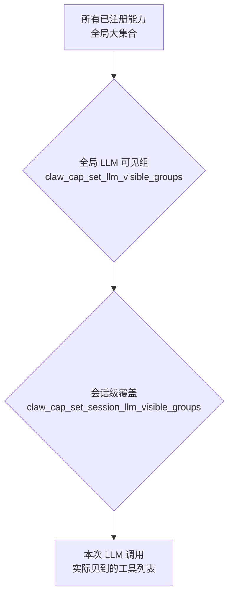
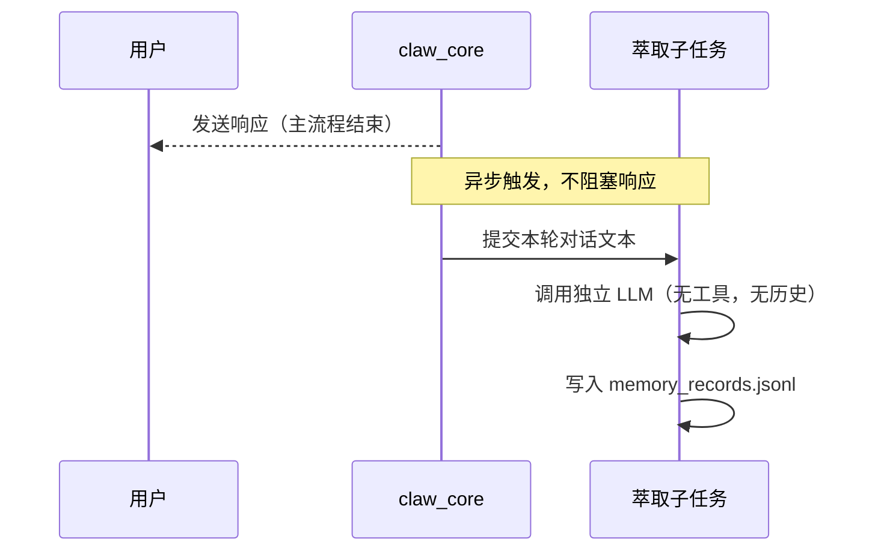
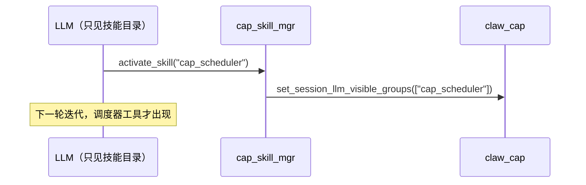

# 10 四维架构分析：LLM × 工具 × 记忆 × 控制流

## 10.1 分析框架

任何 Agent 系统的核心设计，本质上是在四个维度上的取舍：

```
                      LLM 能力
                         ↑
      控制流复杂度 ←──── × ────→ 工具丰富度
                         ↓
                      记忆深度
```

> **核心论点：四个维度不能同时最大化。强化任何一个，都会给其他三个带来压力。**

在 esp-claw 中，这四个维度的所有张力，最终都收敛到同一个稀缺资源：**上下文窗口 Token 预算**。理解这一点，是理解全部架构决策的钥匙。

---

## 10.2 约束来源：上下文窗口的分配账本

每次 LLM 调用，上下文窗口被以下内容瓜分：

```
┌─────────────────────────────────────────────────────────────┐
│                    上下文窗口 Token 预算                       │
├──────────────┬──────────────┬──────────────┬────────────────┤
│  系统提示词   │  工具定义列表  │  会话历史     │  当前轮消息     │
│  (控制流维度) │  (工具维度)   │  (记忆维度)   │  (LLM维度)     │
│  ~500–2000T  │  ~100–300T/条│  ~0–150KB    │  ~50–500T      │
└──────────────┴──────────────┴──────────────┴────────────────┘
```

每一列都在消耗同一个总量。扩大任意一列，必然挤压其他列的空间。  
这不是理论假设，而是代码中每一个设计决定的根本动因。

---

## 10.3 LLM 能力维度

### 实现策略

**LLM 承担的决策**（系统对 LLM 依赖较高的地方）：
- 决定调用哪些工具（包括 `memory_recall`、`activate_skill`）
- 从有限的记忆摘要标签中判断需要召回哪些详细记忆
- 解析非结构化用户输入，映射到结构化工具调用

**LLM 被刻意约束的地方**：

```c
// claw_core.c
#define CLAW_CORE_DEFAULT_TOOL_ITERATIONS 10  // 最大工具迭代轮数上限
```

每一轮迭代都会重新构建完整上下文，成本随轮数线性增长。10 轮上限既是安全护栏，也是经济考量。

**记忆萃取子任务中的 LLM 约束**（`claw_memory_extract.c`）：

```c
// 专用萃取 LLM 实例：不注入工具定义（tools_json = NULL）
// 不注入会话历史（无 context provider）
// 只完成单一任务：从对话中提取可记忆事实
err = claw_llm_runtime_chat(s_extract_runtime, &request, &response, &err_msg);
```

这是一个关键洞察：**系统并非让一个 LLM 实例全知全能，而是按任务隔离上下文**。萃取 LLM 只接收本轮对话文本，输出极简（NONE/FORGET/REPLACE/记录内容），消耗极少。

### 评估

| 项目 | 评分 | 说明 |
|------|------|------|
| 决策委托深度 | ★★★★☆ | LLM 主导工具调用、记忆召回决策 |
| 推理质量保障 | ★★★☆☆ | 上下文被过滤，非完整现实 |
| 子任务隔离 | ★★★★★ | 萃取/推理分实例，互不污染 |
| 迭代效率 | ★★★☆☆ | 每轮重建全量上下文，成本较高 |

**综合评分：中等偏高（3.5/5）**  
LLM 能力被有意"框住"在一个精心策划的认知舞台上，而不是暴露在混乱的完整信息中。

---

## 10.4 工具丰富度维度

### 实现策略

esp-claw 的工具可见性是**双层门控**结构：



**代码证据**（`claw_cap.c`）：

```c
// 构建工具 JSON 时，同时检查全局组和会话组
esp_err_t claw_cap_build_llm_tools_json(const char *session_id, char **out_json)
```

**工具增长的单位**：激活一个技能（`activate_skill`）→ 解锁对应的 `cap_groups` → 当前会话的工具列表增加 N 条。

**抑制工具爆炸的机制**：

| 机制 | 效果 |
|------|------|
| cap_groups 分组 | 相关工具成组出现，单次激活 |
| 默认不可见 | 未激活的技能的工具不占 Token |
| 技能目录取代工具目录 | 用一行描述代替数十条工具定义 |

**技能目录注入（`claw_skill_skills_list_provider`）**：

```
Available skills:
- cap_router_mgr: Manage router automation rules...
- cap_scheduler: Manage scheduler rules...
- memory_ops: Store, recall, update and forget...
```

三行文字代替了潜在数十条工具定义。这是**工具丰富度维度最关键的优化**：将"工具目录"变成"技能目录"，用两级索引替代一级全量暴露。

### 评估

| 项目 | 评分 | 说明 |
|------|------|------|
| 理论工具上限 | ★★★★★ | 无上限，按需注册 |
| 运行时可见控制 | ★★★★★ | 双层门控，会话级精确管理 |
| Token 效率 | ★★★★★ | 技能目录 → 工具定义，两级延迟加载 |
| 工具发现体验 | ★★★☆☆ | 依赖 LLM 自主激活，有漏激活风险 |

**综合评分：高但分层（4/5）**  
工具丰富度不是"所有工具一次注入"，而是"按需按会话动态展开"。这是esp-claw在四个维度中设计最精密的一维。

---

## 10.5 记忆深度维度

### 实现策略

记忆系统的核心设计原则：**不把完整记忆内容放进系统提示词**。

**代码证据**（`claw_memory.c`，`long_term_collect` 函数）：

```c
// 系统提示词中只注入摘要标签（≤8字符），不注入完整内容
// 每条记忆占用约 20-30 Token，而非 200-500 Token
append_prompt_section(system_prompt, "Long-term memory catalog", catalog_text);
// 同时注入 9 行行为指令，告知 LLM 如何使用 memory_recall 工具
```

**四文件存储架构的分层设计**：

```
memory_records.jsonl     ← 追加写，软删除，原始真相
memory_index.json        ← 摘要标签（8字符）+ 关键词索引，检索入口
MEMORY.md                ← 人类可读导出，不参与运行时
memory_digest.log        ← 审计日志，触发压缩
```

**关键常量揭示的设计取舍**（`claw_memory_internal.h`）：

```c
#define MAX_ACTIVE_ITEMS       128  // 活跃记忆上限：内存而非无限
#define MAX_LABEL_CHARS        8    // 摘要标签长度：极致压缩
#define COMPACT_CHANGE_THRESHOLD 5  // 5次写后压缩：防止 JSONL 无限增长
#define COMPACT_SIZE_THRESHOLD   (32 * 1024) // 32KB 体积阈值
#define SESSION_SIZE_LIMIT       (150 * 1024) // 会话历史上限：150KB
#define RECALL_DEFAULT_LIMIT     8  // 单次召回默认8条
```

**记忆访问的 Token 经济学**：

| 场景 | Token 成本 |
|------|-----------|
| 128 条摘要标签全部注入 | ~128 × 20 = 2560 Token |
| 128 条完整内容全部注入 | ~128 × 300 = 38400 Token（超出上下文窗口）|
| 按需召回 8 条完整内容 | ~8 × 300 = 2400 Token（一次性） |

标签方案将恒定成本从 38400 Token 降至 2560 Token，节省 93%。

**自动萃取的异步化**（`claw_memory_extract.c`）：



记忆写入不在关键路径上，用户感知的响应延迟不受影响。

### 评估

| 项目 | 评分 | 说明 |
|------|------|------|
| 存储容量 | ★★★☆☆ | 128 条上限，ESP32 flash 决定 |
| 召回质量 | ★★★★☆ | 关键词索引 + 摘要筛选，精度可接受 |
| Token 效率 | ★★★★★ | 8字符标签，按需召回，设计极致 |
| 写入延迟 | ★★★★★ | 异步萃取，零主流程开销 |
| 遗忘策略 | ★★★☆☆ | 软删除 + 压缩，无语义遗忘策略 |

**综合评分：创新但有上限（3.5/5）**  
8字符摘要标签是整个系统中最具创意的设计之一。但受 ESP32 硬件约束，记忆深度在"厚度"上是有上限的。

---

## 10.6 控制流复杂度维度

### 实现策略

esp-claw 的控制流设计哲学：**把复杂性赶出 LLM 上下文**。

**Agent 主循环：8 相态机（串行、可预期）**

```
IDLE → BEFORE_BUILD_ITERATION_CONTEXT → BUILDING_ITERATION_CONTEXT
     → BEFORE_LLM_HTTP → IN_LLM_HTTP → AFTER_LLM_BEFORE_TOOL
     → RUNNING_TOOL → FINALIZING → IDLE
```

没有分支，没有并发，没有状态回溯。串行状态机的可调试性远超任何并发设计。

**"用户中断"是唯一的非确定性逃生口**：

```c
// 4个检查点：仅在可安全切换的边界检查中断
handle_pending_user_interrupts(..., "before_build_iteration_context", ...);
handle_pending_user_interrupts(..., "before_llm_http", ...);
handle_pending_user_interrupts(..., "after_llm_before_tool", ...);
// 第4个: take_user_interrupt_http_abort（HTTP 进行中的原子中止）
```

**确定性路由被外化到事件路由器**：

```
┌──────────────────────────────────────┐
│           claw_event_router          │
│  规则 1: event_type=message → agent  │
│  规则 2: event_type=schedule → cap   │
│  规则 3: event_type=trigger → script │
│  ← 所有复杂分支逻辑在 JSON 文件中 →   │
└──────────────────────────────────────┘
         ↓ 匹配后提交
┌──────────────────────────────────────┐
│           claw_core (agent loop)     │
│  只看到当前 request，不知道路由规则   │
│  ← Agent 上下文保持干净 →            │
└──────────────────────────────────────┘
```

**规则外化的 Token 经济效益**：路由器规则 JSON 文件从不出现在 LLM 上下文中。一个有 20 条路由规则的系统，在 LLM 视角中完全不存在这 20 条规则。

**技能系统作为控制流的"延迟配置"机制**：



LLM 自主决定何时展开控制流复杂度（激活技能）。这是一种**延迟配置的控制流策略**：不预先注入全部可能性，而是让 LLM 按需解锁。

### 评估

| 项目 | 评分 | 说明 |
|------|------|------|
| 可预期性 | ★★★★★ | 8相串行状态机，无歧义 |
| 可调试性 | ★★★★★ | 每个阶段有明确边界 |
| 并发能力 | ★★☆☆☆ | 单线程串行，无并发 Agent |
| 复杂路由 | ★★★★☆ | 外化到 event_router，不污染上下文 |
| 中断响应 | ★★★★☆ | 4个检查点 + HTTP 原子中止 |

**综合评分：刻意简单（2.5/5）**  
控制流的低复杂度是设计选择，不是能力不足。串行执行在 ESP32 的单核约束下是必要的，在 PC 移植后可以扩展，但原架构并不支持并行 Agent。

---

## 10.7 维度间的张力矩阵

| 维度对 | 张力描述 | esp-claw 的解法 | 解法评分 |
|--------|---------|----------------|---------|
| **LLM × 记忆** | 记忆越多 → 上下文越大 → LLM 可用 Token 越少 | 8字符摘要标签 + 按需召回（lazy recall） | ★★★★★ |
| **LLM × 工具** | 工具越多 → 上下文越大 → 推理质量下降 | cap_groups 分组 + 技能门控（默认隐藏） | ★★★★★ |
| **LLM × 控制流** | 复杂路由放进 LLM → 不可靠 → 幻觉路由错误 | 规则外化到 event_router，LLM 只见干净任务 | ★★★★☆ |
| **记忆 × 工具** | 两者均消耗上下文预算 | 技能激活同时门控工具和记忆特权 | ★★★★☆ |
| **记忆 × 控制流** | 丰富历史 vs. 多轮迭代 | 150KB 会话上限 + 10 轮迭代上限 | ★★★☆☆ |
| **工具 × 控制流** | 工具越多 → 调用链越复杂 → 迭代轮数越多 | max_tool_iterations 硬上限 | ★★★☆☆ |

---

## 10.8 三大核心架构模式

### 模式一：两级索引（Two-Level Indexing）

```
第一级（始终在上下文中，极小）       第二级（按需加载，完整内容）
─────────────────────────────      ────────────────────────────
技能目录（一行描述）          →     SKILL.md（完整文档，含能力表）
记忆标签（8字符）             →     memory_records.jsonl（完整内容）
能力组名（字符串）            →     工具定义 JSON（结构化规范）
```

**适用场景**：凡是内容体积大、但不一定每次都需要的信息。  
**代价**：多一次 LLM-工具调用往返（1 轮迭代）换取 Token 节省。  
**合理性**：在绝大多数场景下，不是每条记忆都相关，不是每个技能每次都需要。

### 模式二：规则外化（Rule Externalization）

```
不这样做（规则在 LLM 上下文中）：
  系统提示词：
    - 如果是 Telegram 消息，调用 telegram_bot 能力
    - 如果是定时触发，调用 scheduler 能力
    - 如果文本以 /help 开头，返回帮助信息
    - ... (20条规则 × 100 Token = 2000 Token)

而是这样做（规则外化到 event_router）：
  系统提示词：[空，无路由逻辑]
  event_router/rules.json：[20条规则，LLM 永远不可见]
```

**效益**：路由规则 0 Token 成本，且执行绝对确定（无幻觉）。  
**代价**：需要维护两套配置（规则 JSON + LLM 技能文档）。

### 模式三：异步萃取（Async Extraction）

```
主流程（用户感知路径）          后台流程（不影响响应延迟）
──────────────────────        ─────────────────────────────
接收请求                       
→ 构建上下文                   
→ LLM 调用（同步）             
→ 工具调用（同步）             
→ 发送响应                     
                          →   异步触发: 提交本轮对话给萃取 LLM
                              → 萃取 LLM 调用（独立上下文）
                              → 写入 memory_records.jsonl
```

**效益**：记忆深度提升对响应延迟零影响。  
**代价**：记忆更新有一轮延迟（本次对话刚发生的事，下次才能进入记忆索引）。

---

## 10.9 未被解决的固有张力

即使有上述所有策略，以下张力在当前架构中仍然存在：

### 张力 1：召回决策的自举悖论

LLM 需要看到相关记忆，才能判断哪些记忆相关。  
但 LLM 只能看到 8 字符的摘要标签，可能无法判断需要召回哪条。

```
摘要标签: "家庭宠物"
用户问:  "帮我预约兽医"
LLM 可能无法从 "家庭宠物" 推断到需要知道宠物叫什么、几岁、什么品种
```

**未解决**：标签设计质量依赖记忆写入时的 LLM 决策，形成弱反馈环。

### 张力 2：技能激活的冷启动

技能目录帮助 LLM 知道有哪些技能，但激活技能需要额外一轮迭代（一次工具调用）。  
对于简单任务，这一轮额外成本（~1000-2000 Token + 网络 RTT）是浪费。

**未解决**：没有预激活机制（事件路由器只能触发 run_agent，不能预设活跃技能）。

### 张力 3：压缩的语义损失

`claw_memory_compact()` 在达到阈值后压缩 JSONL，合并记录。  
压缩过程本身会产生语义损失（细节信息被摘要化）。

**未解决**：压缩策略是基于大小阈值，而非语义重要性。不重要的记忆和重要的记忆会以相同概率被压缩。

### 张力 4：单线程的串行瓶颈

当前架构不支持并行 Agent 实例。  
一个长时间的 LLM 调用会阻塞同 session 的后续请求（仅能通过用户中断跳出）。

**未解决**：跨 session 并发（不同用户）可以用多个 claw_core 实例解决；同 session 并发无法支持。

---

## 10.10 整体架构评估

### 四维雷达图

```
              LLM 能力
                 ★★★★☆ (3.5)
                   ↑
                   |
控制流复杂度        |        工具丰富度
★★★☆☆ (2.5) ←────┼────→ ★★★★☆ (4.0)
                   |
                   ↓
              记忆深度
                 ★★★★☆ (3.5)
```

### 设计思想总结

| 维度 | esp-claw 的赌注 | 结果 |
|------|----------------|------|
| LLM 能力 | LLM 做决策，但给它精选的信息 | ✅ 减少幻觉，提升工具调用准确率 |
| 工具丰富度 | 两级索引，按需展开 | ✅ 工具集可无限扩展，上下文成本可控 |
| 记忆深度 | 标签化，懒加载 | ✅ Token 效率极高，但有上限 |
| 控制流 | 串行、确定性、规则外化 | ✅ 可靠可调试，但牺牲并发 |

### 核心洞察

> **esp-claw 的所有架构决策，都是在为"每个 Token 创造最大价值"这一目标服务。**

上下文窗口是Agent系统的稀缺资源，而该项目在 ESP32 的严苛约束下，发展出了一套极度精练的上下文管理哲学：

1. **只注入必要的最少信息**（标签、目录、分组）
2. **延迟加载完整信息**（按需召回、按需激活）
3. **把确定性逻辑移出 LLM**（事件路由器、工具系统）
4. **异步处理非关键路径**（记忆萃取、完成观察者）

这些策略不仅适用于 ESP32，也适用于任何 Token 成本敏感、响应延迟敏感的 Agent 系统。它们是通用的 Agent 架构模式，只不过在 ESP32 的极端约束下被逼迫出来、并因此被设计得格外纯粹。

### 移植到 PC 后的扩展方向

移植到 PC 环境后，以下维度可以独立提升：

| 维度 | PC 扩展方向 | 原因 |
|------|-----------|------|
| 记忆深度 | 增大 MAX_ACTIVE_ITEMS（128 → 10000+），接入向量数据库 | PC 内存/磁盘无 ESP32 限制 |
| 控制流 | 多 session 并发（多 claw_core 实例），子 Agent 支持 | 多核 CPU，无单任务限制 |
| 工具丰富度 | 接入外部工具注册表，动态加载 .so 插件 | 文件系统访问自由 |
| LLM 能力 | 支持 streaming 响应，多模态扩展 | libcurl + 更强网络栈 |

但无论在何种平台，四维张力的根本矛盾不会消失——因为它来自 LLM 自身的上下文窗口限制，而不是来自 ESP32 的硬件约束。两级索引、规则外化、懒加载，这些模式在任何平台上都值得保留。
