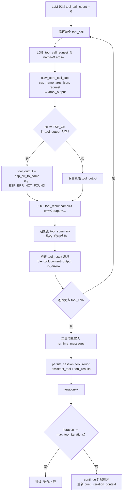
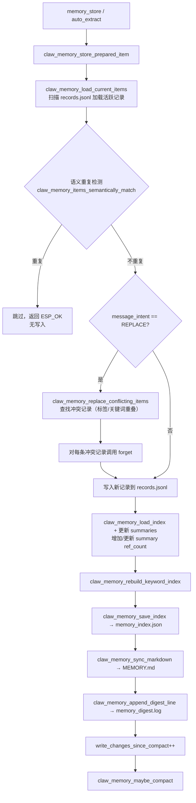
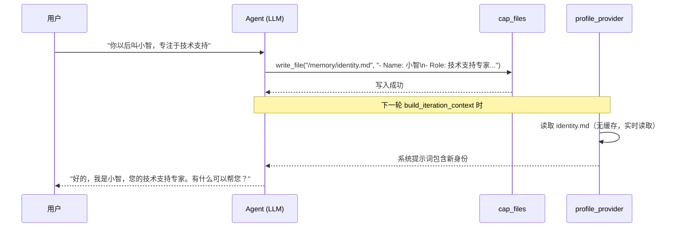

# 11 深度机制分析

本文对以下八个维度进行代码级精确分析，每个结论均追溯到具体实现。

---

## 11.1 LLM 会话架构

### 运行时模型

```
FreeRTOS Task: claw_core_task
│
├── request_queue (容量 4) ←── 外部提交 claw_core_submit()
│
├── 串行处理（同一时刻只处理一个 request）
│   ├── inflight_request_id
│   ├── inflight_session_id[128]
│   ├── inflight_abort (volatile bool)
│   └── inflight_lock (SemaphoreHandle_t)
│
├── insert_queue[4] ←── 用户中断注入（同 session，进行中可插入）
│
└── response_queue (容量 4) ──→ 异步回调给调用方
```

**关键常量**（`claw_core.c`）：
```c
#define CLAW_CORE_DEFAULT_REQUEST_Q       4   // 等待队列长度
#define CLAW_CORE_INSERT_QUEUE_LEN        4   // 中断注入队列长度
#define CLAW_CORE_DEFAULT_TOOL_ITERATIONS 10  // 最大工具迭代轮数
#define CLAW_CORE_INFLIGHT_SESSION_ID_SIZE 128 // 进行中 session id 缓冲区
#define CLAW_CORE_TOOL_SUMMARY_MAX_LEN    768 // 工具摘要缓冲区（用于失败痕迹）
```

### 会话持久化协议

每个完整对话轮次产生以下写入序列（按顺序触发）：

```
1. persist_session_user_messages()    ← 收到 request 后立即写入用户消息
2. persist_session_tool_round()       ← 每轮工具调用后（assistant_tool + tool_result）
   ... (可能多次)
3. persist_session_final()            ← 最终回复后（turn_completed = true）
   OR
   persist_session_failure_note()     ← 失败时，写入错误摘要作为 assistant 消息
```

会话记录类型枚举（`claw_core.h`）：
```c
typedef enum {
    CLAW_SESSION_RECORD_USER           = 1,
    CLAW_SESSION_RECORD_ASSISTANT_FINAL = 2,
    CLAW_SESSION_RECORD_ASSISTANT_TOOL  = 3,
    CLAW_SESSION_RECORD_TOOL_RESULT     = 4,
} claw_session_record_type_t;
```

会话数据在 `claw_memory_session.c` 中以**二进制索引 + 文本体**方式存储：

```c
// 每条记录的索引项（8字节，packed）
typedef struct {
    uint32_t offset;          // 在 .session 文件中的字节偏移
    uint32_t length;          // 记录字节长度
    uint8_t  record_type;     // USER / ASSISTANT_FINAL / etc.
    uint8_t  backend_format;  // OPENAI / ANTHROPIC（影响消息格式解析）
} claw_memory_session_index_entry_t;
```

`SESSION_SIZE_LIMIT = 150KB`：超出后最旧记录被丢弃（滚动窗口）。

### 请求标志位

```c
#define CLAW_CORE_REQUEST_FLAG_PUBLISH_OUT_MESSAGE  (1U << 0) // 完成后发布事件
#define CLAW_CORE_REQUEST_FLAG_SKIP_RESPONSE_QUEUE  (1U << 1) // 不入响应队列
#define CLAW_CORE_REQUEST_FLAG_USER_INTERRUPT       (1U << 2) // 中断当前进行中请求
```

---

## 11.2 提示词构建机制

### 构建函数调用链

```
build_iteration_context()
├── 1. system_prompt = dup_string(s_core->system_prompt)  ← 基础静态提示词
├── 2. messages = cJSON_CreateArray()
├── 3. tools = cJSON_CreateArray()
│
├── 4. 遍历 context_providers[]（按注册顺序）：
│   ├── 若 FLAG_REQUEST_START_ONLY：读 request_start_contexts 缓存
│   └── 否则：调用 provider->collect(request, &context)
│       ├── context.kind == SYSTEM_PROMPT → append_prompt_section()
│       ├── context.kind == MESSAGES      → append_message_array_json()
│       └── context.kind == TOOLS         → append_tool_array_json()
│
├── 5. turn_prompt = build_current_turn_prompt()
│       → append_prompt_section(system_prompt, "Core Request", turn_prompt)
│
├── 6. if inject_active_user：
│       → append_user_message(messages, request->user_text)
│
└── 7. if runtime_messages 非空：
        → append_message_array(messages, runtime_messages)
```

### 系统提示词拼接格式

每个 Context Provider 的内容以固定格式追加（`append_prompt_section`）：

```c
snprintf((*prompt) + current_len, ..., "\n\n## %s\n%s", section_name, content);
```

最终系统提示词结构示例：
```
<基础系统提示词>

## Editable Profile Memory
User Profile (/path/user.md):
# User
...
Agent Soul (/path/soul.md):
# Soul
...
Agent Identity Card (/path/identity.md):
# Identity Card
...

## Long-term Memory
The auto-injected long-term memory context only contains summary labels...
Summary label catalog:
- 家庭宠物
- 工作习惯
...

## Available Skills
- cap_scheduler: Manage scheduler rules...

## Core Request
- source_cap: cap_telegram
- source_channel: telegram
- source_chat_id: 1234567
- source_sender_id: user_abc
```

### inject_active_user 逻辑

```c
// 请求开始时默认 inject_active_user = true
// 但若：用户消息已持久化 AND 有消息类型的 context provider 返回了内容
// 则 inject_active_user = false（避免重复注入）
if (original_user_persisted &&
        cached_contexts_have_messages(request_start_contexts, ...)) {
    inject_active_user = false;
}
```

**含义**：会话历史 provider 已经把用户消息放进 messages 数组了，不需要再额外注入一次。

### REQUEST_START_ONLY 缓存机制

标记了此 flag 的 provider 在请求开始时调用一次，结果缓存到 `request_start_contexts[]` 数组：

- **用途**：会话历史 provider 需要读磁盘，代价高，不应每次迭代都重读
- **每次迭代**：直接从 `request_start_contexts[i].content` 读取缓存内容
- **内存**：`contexts[]` 数组按 `context_provider_count` 大小分配，未使用的槽位 `valid = false`

---

## 11.3 容错机制

### 分级容错策略

| 错误来源 | 容错行为 | 代码证据 |
|---------|---------|---------|
| Context Provider 返回 `ESP_ERR_NOT_FOUND` | **跳过，不报错**（provider 无内容可提供） | `if (err == ESP_ERR_NOT_FOUND) { continue; }` |
| Context Provider 返回其他错误 | **中止请求**，返回错误消息 | `goto cleanup` → `goto finish_request` |
| 工具调用 `err != ESP_OK` 且无输出 | **降级为错误字符串**，继续迭代 | `tool_output = dup_string(esp_err_to_name(err))` |
| 工具调用 `err != ESP_OK` 有输出 | **透传工具输出** + `is_error: true` 标记 | `cJSON_AddBoolToObject(tm, "is_error", err != ESP_OK)` |
| Session 持久化失败 | **仅记录日志**，不中止请求 | `log_session_persist_failure()` (no abort) |
| LLM HTTP 失败 + 用户中断标志 | **吸收 HTTP 错误**，处理中断 | `take_user_interrupt_http_abort()` |
| LLM HTTP 失败（无中断） | **中止请求**，返回 HTTP 错误 | `goto finish_request` |
| 迭代轮数达到上限 | **中止请求**，返回固定错误消息 | `"cap tool iteration limit reached"` |
| 请求被取消（cancel） | **替换错误消息**为用户友好文案 | `"request cancelled"` |
| 请求被 request_gate 拒绝（有消息） | **作为正常响应返回**（status=OK） | `response.view.status = OK` |

### 失败痕迹注入（Failure Trace Injection）

当请求失败时（有 session_id 且有 user_text），系统向会话历史写入一条"失败笔记"：

```c
static char *claw_core_build_session_failure_trace(
    const char *error_message, const char *tool_summary)
{
    // 格式：
    // "Session note: the previous request failed before producing a final answer.\n"
    // "Reason: {error_message}\n"
    // "{tool_summary}"   ← 包含已执行的工具调用清单
}
```

**作用**：下次对话时，LLM 能通过会话历史看到"上次发生了什么"，而不是静默地从空白状态重新开始。

### 工具输出的错误标记

```json
{
    "role": "tool",
    "tool_call_id": "call_abc123",
    "content": "ESP_ERR_NOT_FOUND",
    "is_error": true
}
```

`is_error: true` 是非标准字段，LLM 可据此判断工具失败，调整后续策略（如向用户报错而不是继续依赖错误结果）。

---

## 11.4 工具清单与设计原则

### 工具可见性判断链

```
claw_cap_is_llm_visible(slot, session_id)
│
├── 1. descriptor_is_available(slot)?    ← REGISTERED 或 STARTED 状态
├── 2. slot->descriptor.flags & CLAW_CAP_FLAG_CALLABLE_BY_LLM?
├── 3. slot 的所属 group 是否 LLM 可见?
│   ├── 检查 s_runtime.llm_visible_group_ids[]（全局可见组）
│   └── 检查 session_visibility_t（会话级覆盖）
└── 全部为 true → 此工具注入到 LLM 上下文
```

### 工具定义约束

| 约束项 | 值 | 位置 |
|-------|-----|------|
| 工具描述最大长度 | 256 字符 | `CLAW_CAP_TOOL_DESCRIPTION_MAX` |
| 工具输出缓冲区 | 32 KB | `CLAW_CAP_CORE_OUTPUT_SIZE` |
| 输出超出缓冲区 | 截断（非错误） | `calloc(1, output_size)` |

### 工具定义格式（OpenAI Function Calling）

```json
{
  "type": "function",
  "function": {
    "name": "memory_recall",
    "description": "Recall stored memories by summary label...",
    "parameters": {
      "type": "object",
      "properties": {
        "summary_labels": {
          "type": "array",
          "items": {"type": "string"}
        }
      },
      "required": ["summary_labels"]
    }
  }
}
```

### 内置工具分组（设计原则）

工具不是平铺的，而是按功能域分组（`cap_group`），激活技能等于解锁对应组：

| 功能域（示例） | cap_group | 默认可见 |
|--------------|-----------|---------|
| 基础记忆操作 | `memory` | 是（通常） |
| 定时器/调度 | `cap_scheduler` | 否，需激活技能 |
| 路由规则管理 | `cap_router_mgr` | 否，需激活技能 |
| 会话管理 | `cap_session_mgr` | 否，需激活技能 |
| Lua 脚本 | `cap_lua` | 否，需激活技能 |

**设计原则**：LLM 在任何给定时刻能看到的工具列表，应恰好够用，不应该多。"多余的工具"会消耗 Token，且可能引发工具选择的歧义。

---

## 11.5 工具调度机制

### 完整调度流程（`append_tool_results_messages`）



### 工具调用的上下文传递

```c
// claw_core.c: claw_core_call_cap_fn 的调用包装
claw_cap_call_context_t ctx = {
    .request_id = request->request_id,
    .session_id = request->session_id,
    .channel    = request->source_channel,
    .chat_id    = request->source_chat_id,
    .source_cap = request->source_cap,
    .caller     = CLAW_CAP_CALLER_AGENT,   // ← 标记为 LLM 发起的调用
};
```

工具实现通过 `ctx.caller == CLAW_CAP_CALLER_AGENT` 可区分"LLM 调用"与"事件路由器调用"，从而实现不同的权限或行为。

### 工具调用的串行性

**重要约束**：同一轮 LLM 响应中的多个工具调用，是**按顺序串行执行**的（for 循环），不是并行的。

```c
for (size_t tc = 0; tc < llm_response.tool_call_count; tc++) {
    err = claw_core_call_cap(response->tool_calls[tc].name, ...);
    // 等待上一个完成后才执行下一个
}
```

**含义**：如果 LLM 在同一轮返回了 3 个工具调用，总延迟 = Σ(每个工具调用延迟)。这是串行执行模型的固有代价。

### runtime_messages 的生长机制

```
初始状态: runtime_messages = []

第1轮 LLM → tool_calls:
  runtime_messages += [assistant_tool_message, tool_result_1, tool_result_2]

第2轮 LLM → tool_calls:
  runtime_messages += [assistant_tool_message_2, tool_result_3]

第N轮 LLM → no tool_calls:
  → 最终输出，不再追加到 runtime_messages
  → 整个 runtime_messages 在 build_iteration_context 中被追加到 messages 末尾
```

`runtime_messages` 是当前请求内的"会话内工具历史"，仅存在于内存中，在每次 `build_iteration_context` 时被完整注入。

---

## 11.6 记忆维度：架构、注入时机、更新协议、压缩策略

### 记忆存储架构全图

```
memory_root_dir/
├── memory_records.jsonl     ← 原始真相（追加写，含软删除标记）
│   每行格式: {"id":"...","content":"...","tags":"...","keywords":"...","deleted":0,...}
│
├── memory_index.json        ← 检索加速层
│   {
│     "version": 3,
│     "next_summary_id": 42,
│     "last_compact_digest_size": 8192,
│     "summaries": [
│       {"summary_id": 1, "label": "家庭宠物", "ref_count": 3},
│       {"summary_id": 2, "label": "工作习惯", "ref_count": 1}
│     ],
│     "keyword_index": {
│       "猫": [{"memory_id":"m_001", "summary_id": 1}],
│       "宠物": [...]
│     }
│   }
│
├── memory_digest.log        ← 操作审计日志（触发压缩判断）
│   每行: store/update/forget + memory_id + 时间戳
│
├── MEMORY.md                ← 人类可读导出（不参与运行时）
├── soul.md                  ← Agent 灵魂/价值观定义
├── identity.md              ← Agent 身份卡片
└── user.md                  ← 用户画像与偏好

session_root_dir/
├── <session_id_hash>.session       ← 二进制记录体（JSON text）
├── <session_id_hash>.session.idx   ← 二进制索引（每条 10 字节）
└── s_<sid>_<fnv32>.skills.json     ← 已激活技能列表
```

### 注入时机

| Provider | 注入阶段 | REQUEST_START_ONLY | 内容 |
|---------|---------|-------------------|------|
| `claw_memory_profile_provider` | 每次迭代调用 | 否（每轮刷新） | user.md + soul.md + identity.md |
| `claw_memory_long_term_provider` | 每次迭代调用 | 否（每轮刷新） | 9行行为指令 + 摘要标签目录 |
| 会话历史 provider | 仅请求开始调用 | **是** | 历史消息数组（MESSAGES类型） |

**为何 profile/long_term 不缓存**：这两个 provider 读取磁盘文件。运行时工具调用可能修改这些文件（如 `memory_store` 写新记忆后更新 index）。不缓存确保下一轮迭代能看到最新状态。

**为何会话历史缓存**：会话历史在一次请求内不会被外部修改，重复读磁盘无收益。

### 长期记忆注入内容（完整 9 行行为指令）

```
The auto-injected long-term memory context only contains summary labels, not full memory bodies.
Use exact summary labels with memory_recall when you need detailed long-term memory.
Summary labels must be copied verbatim from the catalog below. Do not invent new labels.
If the user asks what you remember about them, what they like or prefer, or asks you to verify a remembered fact,
  call memory_recall before answering when any relevant summary label is present.
If the user asks you to forget a remembered item, first inspect memory_id with memory_recall or memory_list,
  then call memory_forget with that exact memory_id.
If the user asks you to update a remembered item and any relevant summary label exists,
  first choose the most relevant summary labels from this catalog, call memory_recall to inspect original memory
  bodies and memory_id values, then call memory_update with the selected memory_id.
Do not rely on session history alone for those recall questions...
Do not treat /memory/MEMORY.md or raw memory files as the retrieval source of truth.
Do not mention internal memory policy, storage behavior, auto-extraction, or whether you will or will not remember
  something unless the user explicitly asks about memory behavior.
Summary label catalog:
- 家庭宠物
- 工作习惯
```

### 更新协议（写操作的全生命周期）



**语义匹配算法**（`claw_memory_items_semantically_match`）：
1. 将 content 规范化为小写+去标点的 key（max 160 chars）
2. 完全相同 → 匹配
3. 若两边 key 均 ≥ 12 字符，且一方包含另一方 → 也视为匹配（包含关系去重）

### 压缩策略（`claw_memory_maybe_compact`）

触发条件（任一满足）：
```c
write_changes_since_compact >= COMPACT_CHANGE_THRESHOLD  // 5次写入后
|| file_size_bytes(records_path) >= COMPACT_SIZE_THRESHOLD  // 32KB 文件体积
```

压缩操作：
1. 加载所有记录（含已删除）
2. 过滤掉 `deleted = 1` 的条目
3. 用活跃记录重写 `memory_records.jsonl`（消除历史删除墓碑）
4. 重建 `memory_index.json`
5. 同步 `MEMORY.md`
6. 重置 `write_changes_since_compact = 0`
7. 更新 `last_compact_digest_size`

**启动时压缩**：`claw_memory_init()` 结束时调用一次 `claw_memory_compact_internal(false)`，确保启动时文件处于干净状态。

### 自动萃取架构（`claw_memory_session.c`）

```c
// 异步萃取任务配置
#define CLAW_MEMORY_ASYNC_EXTRACT_QUEUE_LEN   4
#define CLAW_MEMORY_ASYNC_EXTRACT_STACK_SIZE  (6 * 1024)
#define CLAW_MEMORY_ASYNC_EXTRACT_PRIORITY    5
#define CLAW_MEMORY_ASYNC_EXTRACT_SWEEP_TICKS pdMS_TO_TICKS(60000) // 60秒清扫间隔
#define CLAW_MEMORY_AUTO_EXTRACT_MAX_ITEMS    3  // 每次萃取最多提取3条记忆
```

萃取 LLM 调用的约束：
- `tools_json = NULL`（禁止工具调用）
- 独立 LLM runtime 实例（与主 Agent 隔离）
- 仅接收本轮 user_text + llm_text
- 输出通过 `claw_memory_message_intent_t` 信号化：
  - `NONE`：正常存储提取的事实
  - `FORGET`：用户表达了遗忘意图（触发 memory_forget）
  - `REPLACE`：新信息替代旧信息（触发冲突替换）

---

## 11.7 控制流维度

### 8 相状态机的可中断点

```
IDLE ──────────────────────────────────────────── IDLE
  │                                                ↑
  ├── 接收 request                                 │
  │                                                │
  ↓ [BEFORE_BUILD_ITERATION_CONTEXT]               │
  │   ← 中断检查点 1：handle_pending_user_interrupts │
  ↓ [BUILDING_ITERATION_CONTEXT]                   │
  │   build_iteration_context()                    │
  ↓ [BEFORE_LLM_HTTP]                              │
  │   ← 中断检查点 2：handle_pending_user_interrupts │
  ↓ [IN_LLM_HTTP]                                  │
  │   claw_core_llm_chat_messages()                │
  │   ← 中断检查点 3：take_user_interrupt_http_abort │
  │   （HTTP 进行中，通过 volatile bool 原子中止）    │
  ↓ [AFTER_LLM_BEFORE_TOOL]                        │
  │   ← 中断检查点 4：handle_pending_user_interrupts │
  ↓ [RUNNING_TOOL]                                 │
  │   for each tool_call: claw_core_call_cap()     │
  ↓ → 工具完成，iteration++                        │
  │                                                │
  ├── 若 tool_call_count == 0 ──→ [FINALIZING] ───→┘
  └── 若 tool_call_count > 0 ──→ 回到顶部继续迭代
```

### 中断（drained）逻辑详解

当用户中断被触发时，`handle_pending_user_interrupts` 返回 `*out_drained = true`，外层循环执行 `continue`，意味着：

1. 清除 `inflight_abort` 标志（`clear_user_interrupt_abort()`）
2. 将插入队列中的文本合并到 `runtime_messages`
3. 丢弃当前迭代的 LLM 上下文构建结果
4. **重新从第一步开始**（BEFORE_BUILD_ITERATION_CONTEXT）
5. 新的迭代上下文将包含中断消息，LLM 会感知到"用户在中途补充说了..."

### request_gate（请求门控）

```c
// 配置时注册
claw_core_set_request_gate(gate_fn, user_ctx);

// gate_fn 决定是否放行
typedef esp_err_t (*claw_core_request_gate_fn)(
    const claw_core_request_t *request,
    char *reject_message,  // 若拒绝，填入拒绝理由
    size_t reject_message_size,
    void *user_ctx);
```

**两种拒绝方式**：
- 返回错误且填 `reject_message`：响应 status=OK，内容为 reject_message（友好提示）
- 返回错误且不填：响应 status=ERROR，无人性化提示

典型用途：频率限制、会话权限校验、维护模式。

### Completion Observer

```c
// 最多 4 个观察者
#define CLAW_CORE_MAX_COMPLETION_OBSERVERS 4

typedef void (*claw_core_completion_observer_fn)(
    const claw_core_completion_summary_t *summary,
    void *user_ctx);

typedef struct {
    uint32_t request_id;
    const char *session_id;
    const char *final_text;
    const char *context_providers_csv;  // "Long-term Memory,cap Tools,..."
    const char *tool_calls_csv;         // "memory_recall,cap_scheduler_add,..."
} claw_core_completion_summary_t;
```

`claw_memory` 通过注册 completion observer 来触发异步萃取任务：
收到 observer 通知 → 判断是否需要萃取 → 提交到 `s_async_extract.queue`。

---

## 11.8 Agent 角色身份与提示词

### 三文件身份体系

```
soul.md       ← 价值观、行为风格、存在哲学
identity.md   ← 具体身份信息（姓名、角色、性格、强项）
user.md       ← 用户画像（用户偏好、关系背景、特殊指引）
```

默认初始化内容（`claw_memory_profile.c`）：

```markdown
<!-- soul.md 默认内容 -->
# Soul

Describe who the agent is, what it values, and how it prefers to help.

<!-- identity.md 默认内容 -->
# Identity Card

- Name:
- Role:
- Personality:
- Strengths:

<!-- user.md 默认内容 -->
# User

Write down who the current user is, their preferences, and any standing guidance.
```

### 注入顺序与优先级

`claw_memory_profile_collect()` 中的注入顺序：

```c
const char *paths[3] = {
    s_memory.user_path,      // 1. 用户信息最先（优先级最高）
    s_memory.soul_path,      // 2. Agent 灵魂
    s_memory.identity_path,  // 3. Agent 身份卡片
};
```

在系统提示词中，这三个文件被合并为一个段落，以 `## Editable Profile Memory` 作为 section 名。

### 注入格式

```
Editable Profile Memory (/path/to/memory):
User Profile (/memory/user.md):
{user.md 全文}

Agent Soul (/memory/soul.md):
{soul.md 全文}

Agent Identity Card (/memory/identity.md):
{identity.md 全文}
```

路径信息（括号内的绝对路径）被一同注入，允许 LLM 在需要时通过 `cap_files` 工具直接读写这些文件。

### 身份层级与动态性

| 层级 | 内容 | 可变时机 | 生效时机 |
|------|------|---------|---------|
| 基础系统提示词 | 运营者配置的固定指令 | 代码/配置变更 | 重启后 |
| soul.md | Agent 价值观与风格 | 运行时可写（`cap_files`） | 下一次迭代（无缓存）|
| identity.md | Agent 具体身份 | 运行时可写（`cap_files`） | 下一次迭代 |
| user.md | 用户画像 | 运行时可写，或 LLM 自主更新 | 下一次迭代 |
| 长期记忆标签目录 | 具体记忆的摘要标签 | 每次 memory_store/forget 后自动更新 | 下一次迭代 |

**关键设计**：profile 文件不使用 REQUEST_START_ONLY 缓存，意味着在同一请求的多轮工具迭代中，若某个工具修改了 soul.md，下一轮迭代的系统提示词就会包含新内容。这使 Agent 可以"在对话中自我更新身份认知"。

### Agent 自我修改身份的完整流程



---

## 11.9 机制综合：一次完整请求的数据流

```mermaid
sequenceDiagram
    participant ER as 事件路由器
    participant Core as claw_core_task
    participant Memory as claw_memory
    participant Cap as claw_cap
    participant LLM as LLM API

    ER->>Core: claw_core_submit(request)
    Note over Core: 进入 request_queue

    Core->>Core: request_gate 检查（可选）
    Core->>Core: on_request_start 回调

    Core->>Memory: persist_session_user_messages
    Core->>Memory: collect_request_start_only_contexts\n（读会话历史）

    loop 每轮迭代 (max 10)
        Core->>Core: handle_pending_user_interrupts [检查点1]
        Core->>Memory: profile_provider.collect() → soul+identity+user
        Core->>Memory: long_term_provider.collect() → 摘要标签目录
        Core->>Cap: cap_tools_provider.collect() → 工具定义列表
        Core->>Core: build_current_turn_prompt() → source_cap/channel/chat_id/sender_id
        Core->>Core: handle_pending_user_interrupts [检查点2]

        Core->>LLM: POST /v1/chat/completions\n{system_prompt, messages, tools}
        Note over Core,LLM: 进行中可被 volatile abort_flag 中止
        Core->>Core: handle_pending_user_interrupts [检查点3/4]
        LLM-->>Core: {text} 或 {tool_calls[]}

        alt 无工具调用
            Core->>Core: FINALIZING
            Core->>Memory: persist_session_final
            break
        else 有工具调用
            Core->>Cap: claw_cap_call(tool_name, args)
            Cap-->>Core: tool_output
            Core->>Memory: persist_session_tool_round
        end
    end

    Core->>ER: 发布 agent_out_message 事件（若 PUBLISH_OUT_MESSAGE）
    Core->>Memory: 触发异步萃取（completion observer）
    Note over Memory: 独立任务，60s 内完成记忆写入
```