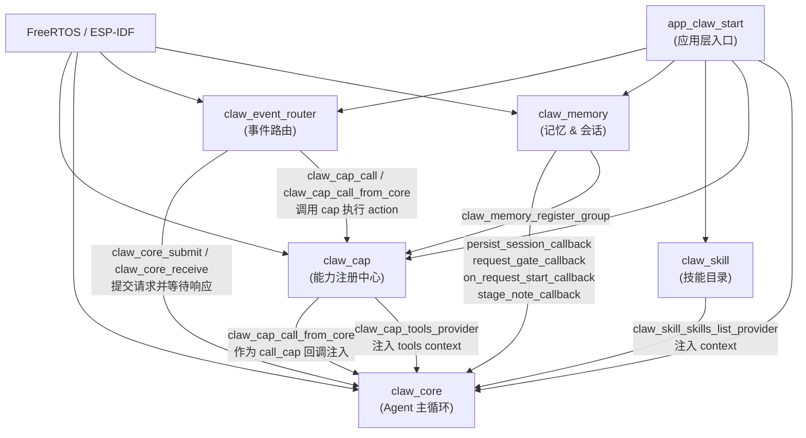
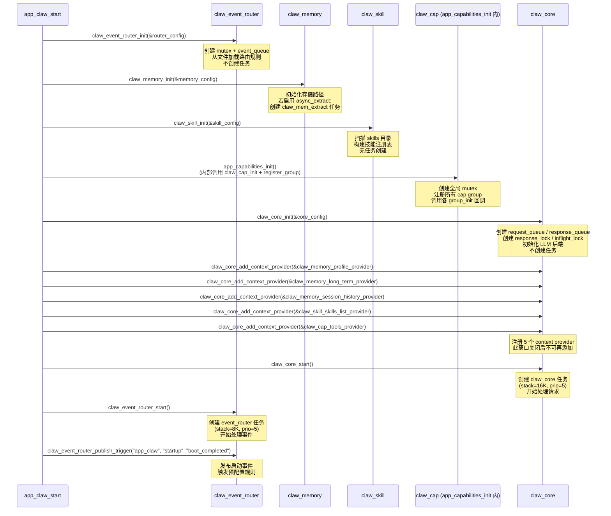

# 12 初始化顺序与依赖图

本文档描述 esp-claw 各核心模块的生命周期函数签名、模块间的初始化依赖关系，以及典型的 `app_claw_start` 初始化序列。

---

## 1. 各模块的生命周期函数签名

### 1.1 claw_cap（能力注册中心）

```c
// 头文件：components/claw_modules/claw_cap/include/claw_cap.h

esp_err_t claw_cap_init(void);
esp_err_t claw_cap_register(const claw_cap_descriptor_t *descriptor);
esp_err_t claw_cap_register_group(const claw_cap_group_t *group);
esp_err_t claw_cap_start_all(void);
esp_err_t claw_cap_stop_all(void);
esp_err_t claw_cap_enable_group(const char *group_id);
esp_err_t claw_cap_disable_group(const char *group_id);
esp_err_t claw_cap_unregister_group(const char *group_id, uint32_t timeout_ms);
```

- `claw_cap_init()`：创建全局 mutex，将 `s_runtime.initialized` 置为 true。不创建任何任务。
- `claw_cap_register_group()`：向运行时注册一组 cap descriptor，调用 `group_init` 回调（若有）。可在 `start_all` 之前或之后调用。
- `claw_cap_start_all()`：将所有已注册 group 转入 STARTED 状态，并依次调用 `group_start` / `descriptor.init` / `descriptor.start` 回调。
- `claw_cap_stop_all()`：将所有 STARTED group 转入 DISABLED 状态，调用 `descriptor.stop` / `group_stop` 回调（逆序）。

### 1.2 claw_core（Agent 主循环）

```c
// 头文件：components/claw_modules/claw_core/include/claw_core.h

esp_err_t claw_core_init(const claw_core_config_t *config);
esp_err_t claw_core_start(void);
esp_err_t claw_core_add_context_provider(const claw_core_context_provider_t *provider);
esp_err_t claw_core_add_completion_observer(claw_core_completion_observer_fn observer,
                                            void *user_ctx);
esp_err_t claw_core_submit(const claw_core_request_t *request, uint32_t timeout_ms);
esp_err_t claw_core_cancel_request(uint32_t request_id);
esp_err_t claw_core_receive(claw_core_response_t *response, uint32_t timeout_ms);
esp_err_t claw_core_receive_for(uint32_t request_id,
                                claw_core_response_t *response,
                                uint32_t timeout_ms);
void      claw_core_response_free(claw_core_response_t *response);
```

- `claw_core_init()`：分配状态结构体，创建 request_queue / response_queue / response_lock / inflight_lock，初始化 LLM 后端。**不**创建任务。
- `claw_core_add_context_provider()`：只能在 `init` 之后、`start` 之前调用（`started` 为 false 时检查）。
- `claw_core_start()`：创建名为 `claw_core` 的 FreeRTOS 任务，启动 Agent 主循环。调用后 `started` 置为 true；此后不能再添加 context provider。

关键配置常量（`claw_core.c`）：

```c
#define CLAW_CORE_DEFAULT_STACK_SIZE      (8 * 1024)   // 任务栈默认值
#define CLAW_CORE_DEFAULT_PRIORITY        5
#define CLAW_CORE_DEFAULT_CORE            tskNO_AFFINITY
#define CLAW_CORE_DEFAULT_REQUEST_Q       4
#define CLAW_CORE_DEFAULT_RESPONSE_Q      4
#define CLAW_CORE_DEFAULT_TOOL_ITERATIONS 10
#define CLAW_CORE_INSERT_QUEUE_LEN        4            // 用户中断插入队列长度
```

`app_claw_start` 实际使用：`task_stack_size = 16 * 1024`，`task_priority = 5`，`max_tool_iterations = 32`。

### 1.3 claw_memory（记忆与会话持久化）

```c
// 头文件：components/claw_modules/claw_memory/include/claw_memory.h

esp_err_t claw_memory_init(const claw_memory_config_t *config);
esp_err_t claw_memory_register_group(void);
```

- `claw_memory_init()`：初始化内存存储路径、LLM 配置；若 `enable_async_extract_stage_note` 为 true，还会创建 `claw_mem_extract` 任务（栈 `6 * 1024`，优先级 5）和对应的 queue / mutex。
- `claw_memory_register_group()`：向 claw_cap 注册内存相关的 cap group（memory_store、memory_recall 等）。
- 没有独立的 `stop` 函数；资源在 `claw_memory_async_extract_deinit()` 中释放（内部调用）。

关键常量（`claw_memory_session.c`）：

```c
#define CLAW_MEMORY_ASYNC_EXTRACT_QUEUE_LEN  4
#define CLAW_MEMORY_ASYNC_EXTRACT_STACK_SIZE (6 * 1024)
#define CLAW_MEMORY_ASYNC_EXTRACT_PRIORITY   5
#define CLAW_MEMORY_ASYNC_EXTRACT_SWEEP_TICKS pdMS_TO_TICKS(60000)  // 已完成 job 清理周期
```

### 1.4 claw_event_router（事件路由器）

```c
// 头文件：components/claw_modules/claw_event_router/include/claw_event_router.h

esp_err_t claw_event_router_init(const claw_event_router_config_t *config);
esp_err_t claw_event_router_start(void);
esp_err_t claw_event_router_stop(void);
esp_err_t claw_event_router_reload(void);
```

- `claw_event_router_init()`：分配运行时结构，创建 recursive mutex 和 event_queue（默认容量 6），从文件加载规则。**不**创建任务。
- `claw_event_router_start()`：创建名为 `event_router` 的 FreeRTOS 任务。
- `claw_event_router_stop()`：设置 `stop_requested = true`，等待任务退出（最长 5 秒）。

关键默认常量（`claw_event_router.c`）：

```c
#define CLAW_EVENT_ROUTER_DEFAULT_QUEUE_LEN    6
#define CLAW_EVENT_ROUTER_DEFAULT_STACK        8192
#define CLAW_EVENT_ROUTER_DEFAULT_PRIO         5
#define CLAW_EVENT_ROUTER_DEFAULT_SUBMIT       1000    // 向 core 提交超时 ms
#define CLAW_EVENT_ROUTER_DEFAULT_RECEIVE      130000  // 等待 core 响应超时 ms
#define CLAW_EVENT_ROUTER_PENDING_TABLE_SIZE   6
```

`app_claw_start` 实际使用：`task_stack_size = 8 * 1024`，`task_priority = 5`。

### 1.5 claw_skill（技能目录）

```c
// 头文件：components/claw_modules/claw_skill/include/claw_skill.h

esp_err_t claw_skill_init(const claw_skill_config_t *config);
```

- `claw_skill_init()`：仅读取 skills 目录、解析 YAML front-matter 构建内存注册表。**不**创建任务，**不**分配同步原语。是纯粹的只读状态初始化。
- 没有 start / stop 函数；运行时通过 `claw_skill_reload_registry()` 刷新。

---

## 2. 模块间依赖关系



**关键依赖约束：**

| 模块 | 依赖 | 原因 |
|------|------|------|
| `claw_core_init` | `claw_cap_init` 已完成 | `call_cap` 回调（`claw_cap_call_from_core`）在 core 运行时被调用；cap 必须先初始化 |
| `claw_core_init` | `claw_memory_init` 已完成 | `persist_session_callback`、`request_gate_callback` 等在 core 配置中直接引用；memory 函数必须可用 |
| `claw_core_add_context_provider` | `claw_core_init` 已完成且 `claw_core_start` 尚未调用 | 源码检查 `!s_core->initialized || s_core->started`，started 之后拒绝添加 |
| `claw_event_router_start` | `claw_core_start` 已完成 | router 任务会调用 `claw_core_submit` 和 `claw_core_receive_for`；core 任务必须先运行 |
| `claw_memory_register_group` | `claw_cap_init` 已完成 | 调用 `claw_cap_register_group`；cap runtime 必须已初始化 |
| `claw_skill_init` | 无强依赖 | 纯文件系统操作，无需其他模块；但建议在 core 注册 provider 之前完成 |

---

## 3. 典型初始化序列

以下序列来自 `components/common/app_claw/app_claw.c` 中的 `app_claw_start()`：



### 3.1 阶段说明

**阶段 1 — 基础设施（无任务）**

调用顺序：`claw_event_router_init` → `claw_memory_init` → `claw_skill_init` → `app_capabilities_init`（内含 `claw_cap_init`）

这些调用仅创建数据结构，除了可选的 `claw_mem_extract` 任务外，不启动任何 FreeRTOS 任务。

**阶段 2 — Core 初始化与 Context Provider 注册**

调用顺序：`claw_core_init` → 逐一 `claw_core_add_context_provider`（5 次）→ `claw_core_start`

Context provider 注册必须在 `claw_core_start` 之前全部完成；`start` 之后对 `add_context_provider` 的调用将返回 `ESP_ERR_INVALID_STATE`。

**阶段 3 — 任务启动**

调用顺序：`claw_core_start` → `claw_event_router_start`

`claw_core_start` 必须先于 `claw_event_router_start`，因为 router 任务会立即调用 `claw_core_submit` 来处理入队的事件。

**阶段 4 — 启动事件**

所有任务就绪后，发布 `startup/boot_completed` 事件，触发路由规则中的启动逻辑。

---

## 4. 反初始化顺序（关机）

关机时应以初始化的逆序执行：

1. `claw_event_router_stop()` — 停止 router 任务，等待最多 5 秒
2. `claw_cap_stop_all()` — 停止所有 cap group（逆序调用 stop 回调）
3. 任务清理（`claw_core` 任务没有显式 stop 接口；建议通过 `claw_core_cancel_request` 中止飞行请求后删除任务）

---

## 5. 关键约束汇总

| 约束 | 违反后果 |
|------|----------|
| `claw_cap_init` 必须在 `claw_core_init` 之前 | `claw_cap_call_from_core` 在 core 任务中调用，若 cap 未初始化则返回 `ESP_ERR_INVALID_STATE` |
| `claw_memory_init` 必须在 `claw_core_init` 之前 | `persist_session_callback` 等直接嵌入 `core_config`，若 memory 未初始化则在首次请求时崩溃 |
| `claw_core_add_context_provider` 必须在 `claw_core_start` 之前 | `start` 后调用返回 `ESP_ERR_INVALID_STATE`；源码：`if (!s_core->initialized || s_core->started)` |
| `claw_core_start` 必须在 `claw_event_router_start` 之前 | router 任务立即处理队列中的事件，调用 `claw_core_submit`；若 core 未启动则请求丢失 |
| `claw_cap_init` 只能调用一次 | 重复调用返回 `ESP_ERR_INVALID_STATE`；源码：`if (s_runtime.initialized)` |
| `claw_core_init` 只能调用一次 | 重复调用返回 `ESP_ERR_INVALID_STATE`；源码：`if (s_core && s_core->initialized)` |
