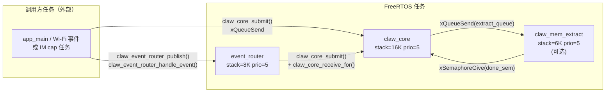
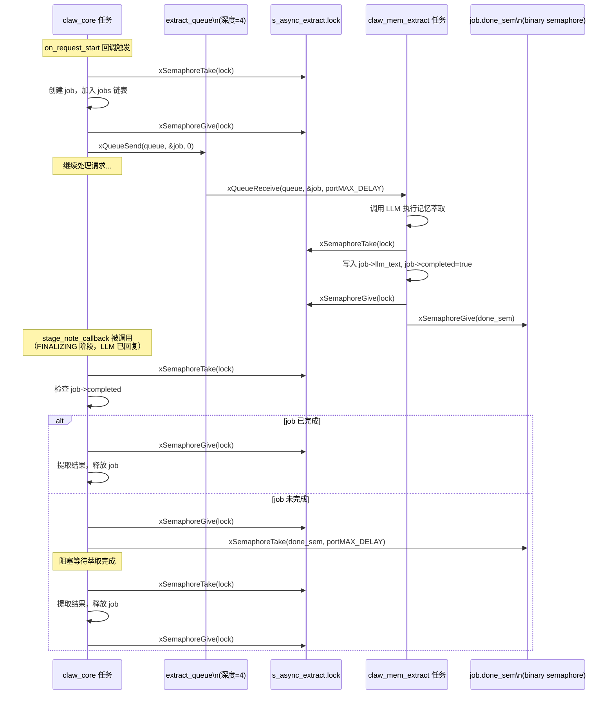
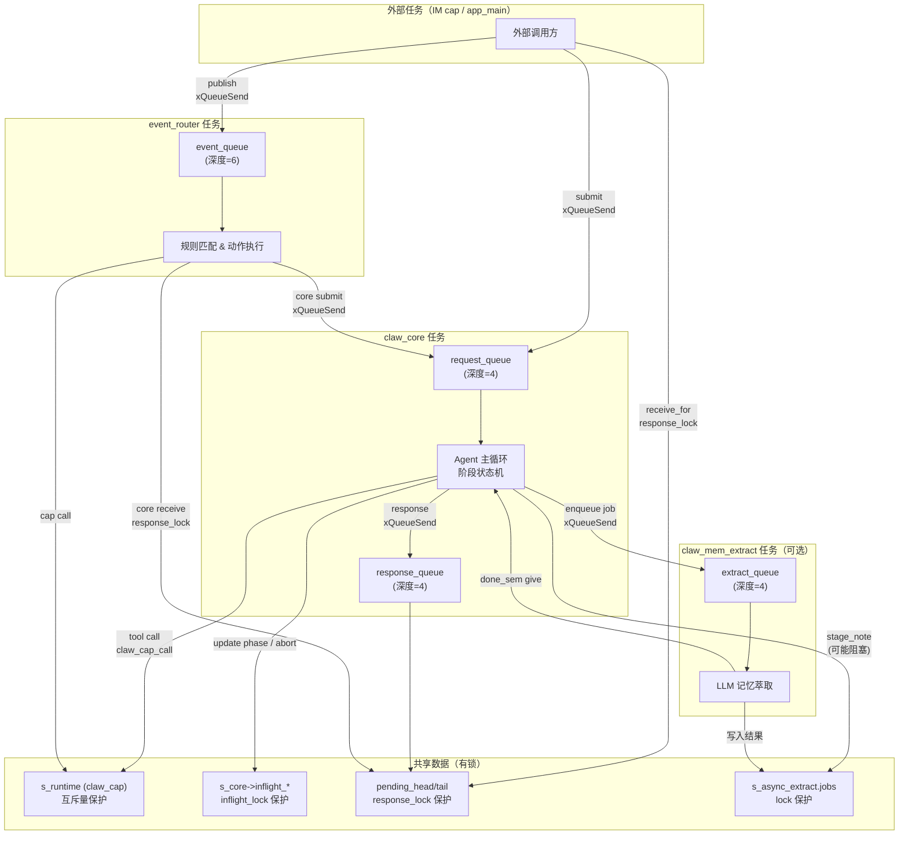

# 13 并发模型与线程安全

本文档描述 esp-claw 系统中的 FreeRTOS 任务构成、各模块使用的同步原语、API 的线程安全性，以及跨模块共享状态的保护策略。

---

## 1. 系统中的 FreeRTOS 任务

系统运行时最多存在以下任务（部分为可选）：

| 任务名 | 栈大小 | 优先级 | Core 亲和性 | 创建时机 | 说明 |
|--------|--------|--------|-------------|----------|------|
| `claw_core` | `16 * 1024` B（app 配置）<br>默认 `8 * 1024` B | 5 | `tskNO_AFFINITY` | `claw_core_start()` | Agent 主循环：出队请求、构建上下文、调用 LLM、执行工具调用 |
| `event_router` | `8 * 1024` B（app 配置）<br>默认 `8192` B | 5 | `tskNO_AFFINITY` | `claw_event_router_start()` | 从 event_queue 出队事件，匹配路由规则，调用 cap 或向 core 提交请求 |
| `claw_mem_extract` | `6 * 1024` B | 5 | `tskNO_AFFINITY` | `claw_memory_init()`（需 `enable_async_extract_stage_note=true`） | 异步记忆萃取：从队列接收 job，调用 LLM 分析用户输入，提取记忆摘要 |

> **注意：** 栈大小使用 `CLAW_TASK_STACK_PREFER_PSRAM` 策略分配，在有 PSRAM 的设备上优先使用 PSRAM，可节省内部 SRAM。



---

## 2. 各模块的同步原语

### 2.1 claw_cap — 能力注册中心

**全局状态：** `static claw_cap_runtime_t s_runtime`（单例）

**同步原语：**

```c
// claw_cap.c，s_runtime 结构体内
SemaphoreHandle_t mutex;   // 普通互斥量 (xSemaphoreCreateMutex)
```

**保护范围：**

`mutex` 保护 `s_runtime` 内的所有可变字段：
- `descriptor_slots[]` / `descriptor_capacity`：descriptor 槽位数组及其容量
- `group_slots[]` / `group_capacity`：group 槽位数组及其容量
- `descriptor_list_snapshot[]` / `group_list_snapshot[]`：用于 `claw_cap_list()` 的快照缓冲
- `llm_visible_group_ids[]` / `llm_visible_group_count`：全局 LLM 可见 group 列表
- `session_visibilities[]`：per-session LLM 可见 group 映射
- `descriptor_slot_t.active_calls`：各 cap 的飞行调用计数（在 `claw_cap_call` 入口/出口递增/递减）

**加锁模式：** 内部通过 `claw_cap_lock()` / `claw_cap_unlock()` 包装，所有访问 `s_runtime` 的操作均在锁内执行。`claw_cap_start_group_callbacks()` 和 `claw_cap_stop_group_callbacks()` 是例外：它们**在锁外**调用 cap 的 init/start/stop 回调，以避免持锁期间执行用户代码（防止死锁）。

```c
// claw_cap_call 的并发安全模式（claw_cap.c 第 1657 行起）
claw_cap_lock();
slot->active_calls++;          // 增加引用计数
execute = slot->descriptor.execute;
claw_cap_unlock();

err = execute(input_json, ctx, output, output_size);  // 锁外执行

claw_cap_lock();
slot->active_calls--;          // 减少引用计数
claw_cap_unlock();
```

### 2.2 claw_core — Agent 主循环

**全局状态：** `static claw_core_state_t *s_core`（堆分配单例）

**同步原语：**

```c
// claw_core.c，s_core 结构体内
QueueHandle_t request_queue;   // 请求入队（大小由 config.request_queue_len 决定，默认 4）
QueueHandle_t response_queue;  // 响应出队（大小由 config.response_queue_len 决定，默认 4）
SemaphoreHandle_t response_lock;   // 互斥量：保护 receive 路径和 pending_head/pending_tail 链表
SemaphoreHandle_t inflight_lock;   // 互斥量：保护飞行状态字段
```

**各原语保护的数据：**

| 原语 | 保护内容 |
|------|----------|
| `request_queue` | 请求项的生产者/消费者同步；`claw_core_submit` 写，`claw_core_task` 读 |
| `response_queue` | 响应项的生产者/消费者同步；`claw_core_task` 写，`claw_core_receive*` 读 |
| `response_lock` | `pending_head` / `pending_tail` 链表（多调用者等待同一 core 时的溢出缓冲）；`claw_core_receive_for` 持有此锁期间轮询 response_queue |
| `inflight_lock` | `inflight_request_id`、`inflight_session_id`、`agent_loop_phase`、`inflight_abort`、`inflight_abort_reason`、`insert_queue[]`（用户中断插入队列） |

**`inflight_lock` 的关键用途：**

```c
// claw_core_cancel_request — 外部任务调用（claw_core.c 第 2385 行起）
xSemaphoreTake(s_core->inflight_lock, pdMS_TO_TICKS(200));
s_core->inflight_abort = true;
s_core->inflight_abort_reason = CLAW_CORE_CONTROL_ABORT_REASON_CANCEL;
xSemaphoreGive(s_core->inflight_lock);

// claw_core_task 读取 inflight_abort（通过 claw_llm_http 的 volatile 指针机制）
claw_llm_http_arm_abort(&s_core->inflight_abort);
```

`inflight_abort` 字段是 `volatile bool`，通过 `claw_llm_http_arm_abort` 传递给 HTTP 传输层用作中断信号。

### 2.3 claw_memory — 记忆与会话持久化

**全局状态：**

```c
// claw_memory_session.c
static claw_memory_pending_summary_t *s_pending_summaries; // 无锁，仅 claw_core 任务访问
static claw_memory_async_extract_state_t s_async_extract;  // 有锁
static claw_memory_request_state_t *s_request_states;     // 无锁，仅 claw_core 任务访问
```

**同步原语（`claw_memory_async_extract_state_t` 内）：**

```c
QueueHandle_t queue;       // 大小 CLAW_MEMORY_ASYNC_EXTRACT_QUEUE_LEN = 4
SemaphoreHandle_t lock;    // 互斥量：保护 jobs 链表和 job 内部字段
```

**保护范围：**

- `s_async_extract.jobs`：待处理/已完成 job 链表；由 `claw_core` 任务（生产者，调用 `ensure_started`）和 `claw_mem_extract` 任务（消费者，写入结果）并发访问，全部通过 `s_async_extract.lock` 保护。

```c
// 生产者侧（claw_core 任务，on_request_start 回调）
xSemaphoreTake(s_async_extract.lock, portMAX_DELAY);
// ... 将 job 加入 jobs 链表 ...
xSemaphoreGive(s_async_extract.lock);
xQueueSend(s_async_extract.queue, &job, 0);  // 锁外发送

// 消费者侧（claw_mem_extract 任务）
xQueueReceive(s_async_extract.queue, &job, portMAX_DELAY);
// ... 执行 LLM 调用 ...
xSemaphoreTake(s_async_extract.lock, portMAX_DELAY);
job->llm_text = llm_text;
job->completed = true;
xSemaphoreGive(s_async_extract.lock);
xSemaphoreGive(job->done_sem);  // 通知等待方
```

**`done_sem` 的作用：** 每个 job 持有一个 binary semaphore。当 `claw_memory_stage_note_callback`（在 `claw_core` 任务中调用）需要等待异步萃取结果时，会在该 semaphore 上阻塞，直到 `claw_mem_extract` 任务完成。

`s_pending_summaries` 和 `s_request_states` 是**单线程数据结构**，只在 `claw_core` 任务执行的回调（`persist_session_callback`、`request_start_callback`、`stage_note_callback`）中访问，无需加锁。

### 2.4 claw_event_router — 事件路由器

**全局状态：** `static claw_event_router_runtime_t *s_runtime`（堆分配单例）

**同步原语：**

```c
// claw_event_router.c，s_runtime 结构体内
SemaphoreHandle_t mutex;    // 递归互斥量 (xSemaphoreCreateRecursiveMutex)
QueueHandle_t event_queue;  // 大小由 config.event_queue_len 决定，默认 6
```

**递归 mutex 的必要性：** 路由规则处理中可能出现嵌套加锁（例如规则处理回调再调用规则管理 API），使用递归 mutex 避免死锁。

**保护范围：**

- `rules[]` / `rule_count`：路由规则数组（读/写/重载）
- `bindings[]` / `binding_count`：出站通道绑定
- `pending[]`：正在处理中的事件追踪表（大小 `CLAW_EVENT_ROUTER_PENDING_TABLE_SIZE = 6`）
- `last_result`：上一次路由结果

```c
// claw_event_router_lock / unlock（claw_event_router.c 第 267 行）
static void claw_event_router_lock(void) {
    xSemaphoreTakeRecursive(s_runtime->mutex, portMAX_DELAY);
}
static void claw_event_router_unlock(void) {
    xSemaphoreGiveRecursive(s_runtime->mutex);
}
```

### 2.5 claw_skill — 技能目录

**全局状态：** `static claw_skill_state_t *s_skill`（堆分配单例）

**同步原语：** **无**。

`claw_skill` 在初始化后只执行只读操作（扫描目录、读取文件内容）。`claw_skill_reload_registry()` 会重建注册表，但设计上假设 reload 不与并发读取同时发生。所有 context provider 回调（如 `claw_skill_skills_list_provider`）在 `claw_core` 任务中串行调用，无需额外保护。

---

## 3. API 线程安全性

### 3.1 线程安全的 API（可从任意任务调用）

| API | 模块 | 保护机制 |
|-----|------|----------|
| `claw_cap_init()` | claw_cap | 幂等检查；实际上仅在 app_main 阶段调用 |
| `claw_cap_register_group()` | claw_cap | 持 `s_runtime.mutex` |
| `claw_cap_start_all()` / `claw_cap_stop_all()` | claw_cap | 持 `s_runtime.mutex`（部分路径） |
| `claw_cap_enable_group()` / `claw_cap_disable_group()` | claw_cap | 持 `s_runtime.mutex` |
| `claw_cap_call()` | claw_cap | 持 `s_runtime.mutex`（入口/出口），execute 函数在锁外调用 |
| `claw_cap_find()` | claw_cap | 持 `s_runtime.mutex` |
| `claw_cap_list()` / `claw_cap_list_groups()` | claw_cap | 持 `s_runtime.mutex`；返回快照指针（非深拷贝，使用前不应释放锁后继续访问） |
| `claw_cap_set_llm_visible_groups()` | claw_cap | 持 `s_runtime.mutex` |
| `claw_cap_set_session_llm_visible_groups()` | claw_cap | 持 `s_runtime.mutex` |
| `claw_core_submit()` | claw_core | `xQueueSend` 本身线程安全；USER_INTERRUPT 路径持 `inflight_lock` |
| `claw_core_cancel_request()` | claw_core | 持 `inflight_lock` |
| `claw_core_get_agent_loop_phase()` | claw_core | 持 `inflight_lock` |
| `claw_core_receive()` / `claw_core_receive_for()` | claw_core | 持 `response_lock` |
| `claw_event_router_handle_event()` | claw_event_router | 持 `mutex`（recursive）|
| `claw_event_router_add_rule()` / `update_rule()` / `delete_rule()` | claw_event_router | 持 `mutex` |
| `claw_event_router_list_rules()` | claw_event_router | 持 `mutex` |
| `claw_event_router_cancel_event()` | claw_event_router | 持 `mutex` |
| `claw_memory_store()` / `claw_memory_recall()` | claw_memory | 底层文件 I/O；无额外锁（调用方应串行化） |

### 3.2 非线程安全的 API（需在初始化阶段单线程调用）

| API | 模块 | 原因 |
|-----|------|------|
| `claw_core_add_context_provider()` | claw_core | 只允许在 `init` 后、`start` 前调用，检查 `s_core->started` 无锁 |
| `claw_core_add_completion_observer()` | claw_core | 操作 `completion_observers[]` 无锁；仅设计用于初始化阶段 |
| `claw_skill_init()` | claw_skill | 无同步原语，单线程初始化 |
| `claw_skill_reload_registry()` | claw_skill | 重建注册表无锁，与并发读取不安全 |
| `claw_memory_init()` | claw_memory | 无锁初始化，仅在 app_main 调用 |
| `s_pending_summaries` 相关操作 | claw_memory | 仅设计为在 `claw_core` 任务内部回调中访问 |

### 3.3 特殊注意：`claw_cap_list()` 的快照

`claw_cap_list()` 返回一个指向内部快照缓冲区的指针，**不是深拷贝**：

```c
// claw_cap.c 第 1599 行起
claw_cap_list_t claw_cap_list(void) {
    claw_cap_lock();
    // ... 填充 descriptor_list_snapshot ...
    claw_cap_unlock();

    list.items = s_runtime.descriptor_list_snapshot;  // 指向内部缓冲
    list.count = count;
    return list;
}
```

调用方在使用返回值期间，其他线程调用 `claw_cap_register_group` / `claw_cap_start_all` 可能导致快照被覆写。仅在单一上下文内使用此返回值，或立即复制所需数据。

---

## 4. 跨模块共享状态的保护

### 4.1 claw_cap 全局注册表

`s_runtime`（`claw_cap_runtime_t`）是系统中最多并发访问的共享状态：

- **写路径：** `claw_cap_register_group`（初始化阶段）、`claw_cap_enable_group` / `claw_cap_disable_group`（运行时）、`claw_cap_unregister_group`（运行时）
- **读路径：** `claw_cap_call`（`claw_core` 任务执行工具调用）、`claw_cap_build_llm_tools_json`（`claw_core` 任务构建上下文）、`claw_event_router` 任务（调用 cap 执行 action）

所有路径通过同一 `s_runtime.mutex` 序列化。`active_calls` 计数器用于 `claw_cap_unregister_group` 实现"排空等待"（drain-and-unload）语义：

```c
// claw_cap_unregister_group 排空循环（claw_cap.c 第 1453 行起）
while (true) {
    claw_cap_lock();
    active_calls = claw_cap_group_has_active_calls_locked(group_slot_index);
    if (!active_calls) { /* 转入 UNLOADING 状态并退出 */ }
    claw_cap_unlock();
    vTaskDelay(pdMS_TO_TICKS(CLAW_CAP_UNLOAD_POLL_MS));  // 20ms 轮询
}
```

### 4.2 claw_memory 全局状态

记忆模块的全局状态分为两层：

**层 1 — `s_memory`（由 `claw_memory.c` 维护）**：包含 LRU 缓存、文件路径前缀等；由 `claw_memory_internal.h` 声明，所有访问均在 `claw_core` 任务的串行回调中。

**层 2 — `s_async_extract`（由 `claw_memory_session.c` 维护）**：跨任务共享，通过 `s_async_extract.lock` 保护 `jobs` 链表。

两层的交互点：`claw_memory_async_extract_take_summary_list()` 在 `claw_core` 任务中被 `stage_note_callback` 调用，可能阻塞在 `done_sem` 上等待 `claw_mem_extract` 任务完成。这是**唯一**的任务间阻塞等待点。

### 4.3 claw_core 飞行状态

`s_core->inflight_*` 字段被多个任务并发读写：

| 字段 | 写方 | 读方 |
|------|------|------|
| `inflight_request_id` | `claw_core_task`（开始/结束请求时） | 外部任务（`cancel_request`、`try_queue_insert_request`） |
| `inflight_session_id` | `claw_core_task` | 外部任务（`try_queue_insert_request` 做 session 匹配） |
| `agent_loop_phase` | `claw_core_task`（各阶段切换时） | 外部任务（`claw_core_get_agent_loop_phase`）|
| `inflight_abort` | `claw_core_task`（清零）；外部任务（`cancel_request`、`try_queue_insert_request` 置位） | `claw_llm_http` 通过 volatile 指针轮询 |
| `insert_queue[]` | 外部任务（`try_queue_insert_request`） | `claw_core_task`（`dequeue_inserted_user_inputs`）|

所有并发访问通过 `inflight_lock` 序列化。

---

## 5. 异步萃取任务与主任务的交互

`claw_mem_extract` 任务与 `claw_core` 任务之间有以下明确交互点：



**关键设计决策：**

1. **队列满时丢弃：** `xQueueSend(queue, &job, 0)` 使用零超时。若队列已满（积压 4 个 job），新 job 从 jobs 链表中移除并释放，返回 `ESP_ERR_TIMEOUT`，记忆萃取被跳过。
2. **扫描清理：** 每次 `ensure_started` 调用时，`claw_memory_async_extract_sweep_locked` 会清理超过 60 秒未被消费的已完成 job，防止内存泄漏。
3. **`done_sem` 的生命周期：** semaphore 在 job 分配时创建，在 `claw_memory_async_extract_free_job` 中释放，确保不会在消费者 give 之后被提前销毁。

---

## 6. 并发架构总览



---

## 7. 潜在并发风险点

| 风险 | 位置 | 缓解措施 |
|------|------|----------|
| `claw_cap_list()` 快照在锁外被访问 | `claw_cap.c` `claw_cap_list()` | 调用方应在单一上下文内使用，不跨任务传递快照指针 |
| `event_router` 和 `claw_core` 同时调用同一 cap | `claw_cap_call` 并发路径 | `active_calls` 计数器 + mutex 确保安全；execute 回调本身需自行保证线程安全 |
| `claw_core_receive_for` 多任务竞争同一 request_id | `claw_core.c` `claw_core_receive_for` | `response_lock` 序列化所有接收方；不匹配的响应暂存 `pending_head` 链表 |
| `claw_mem_extract` 任务在 `claw_memory_async_extract_deinit` 时仍运行 | `claw_memory_session.c` | 先清空 `jobs` 链表，再调用 `claw_task_delete`；task_handle 置 NULL 防止双重删除 |
| `inflight_abort` volatile 字段被 HTTP 层轮询 | `claw_core.c` / `claw_llm_http_transport.c` | `volatile bool` + `inflight_lock` 双重保护；arm/disarm 严格匹配 |
