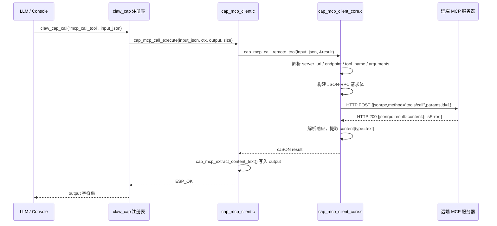
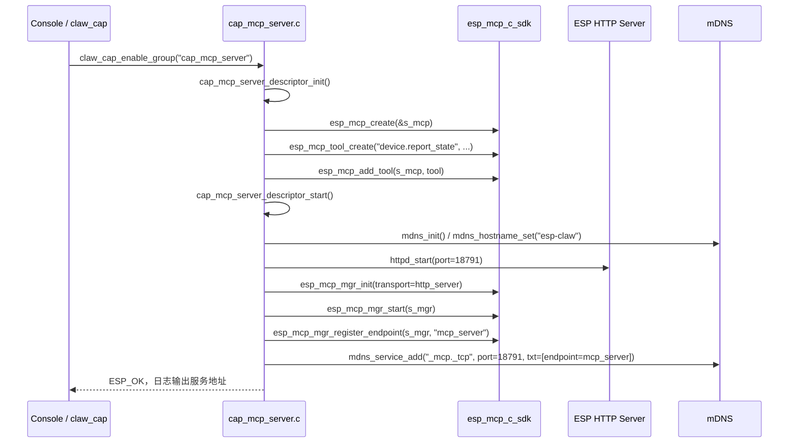
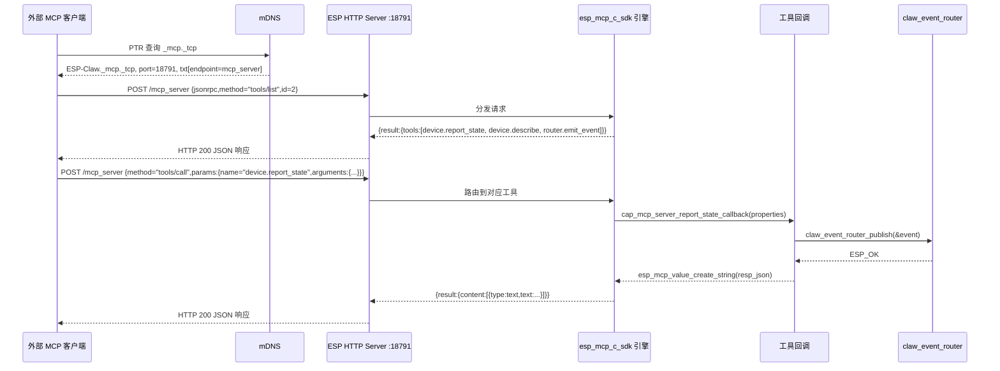
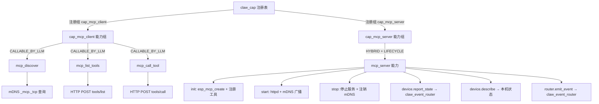

# 14 MCP 协议适配层

## 14.1 概述

esp-claw 实现了 MCP（Model Context Protocol）的双向适配层，使 ESP32 设备既可以作为 **MCP 客户端**连接外部 MCP 服务，也可以作为 **MCP 服务端**将自身能力暴露给局域网上的其他设备或 AI Agent。

两个组件位于：

- `components/claw_capabilities/cap_mcp_client/` — MCP 客户端能力组
- `components/claw_capabilities/cap_mcp_server/` — MCP 服务端能力组

两者均通过 `claw_cap` 注册表接入 esp-claw 的能力系统，可被 LLM 调用，也可通过控制台命令行管理。

---

## 14.2 传输层与协议格式

### 14.2.1 传输层：HTTP（非 WebSocket / stdio）

esp-claw 的 MCP 实现**仅使用 HTTP**作为传输层，与标准 MCP 规范中定义的多传输形式（stdio、SSE、HTTP）相比，做了约束性选择：

| 传输方式 | MCP 标准 | esp-claw 实现 |
|---------|---------|--------------|
| stdio   | 支持    | 不支持        |
| SSE     | 支持    | 不支持        |
| HTTP POST | 支持  | 使用（唯一方式）|
| WebSocket | 部分规范提及 | 不支持   |

客户端使用 ESP-IDF 的 `esp_http_client` 发起 HTTP POST，服务端使用 `esp_http_server` 接收请求。服务端默认端口 `18791`，控制端口 `18792`，端点路径默认为 `mcp_server`（可配置）。

完整请求 URL 示例：`http://esp-claw.local:18791/mcp_server`

### 14.2.2 消息格式：JSON-RPC 2.0 子集

所有 MCP 消息均使用 JSON-RPC 2.0 格式，但 esp-claw 仅实现了最小必要子集：

**请求消息结构：**
```json
{
  "jsonrpc": "2.0",
  "method": "tools/list",
  "params": { "cursor": "(可选分页游标)" },
  "id": 2
}
```

```json
{
  "jsonrpc": "2.0",
  "method": "tools/call",
  "params": {
    "name": "device.describe",
    "arguments": {}
  },
  "id": 1
}
```

**成功响应结构：**
```json
{
  "jsonrpc": "2.0",
  "result": {
    "tools": [ { "name": "...", "description": "..." } ],
    "nextCursor": "(可选)"
  },
  "id": 2
}
```

**错误响应结构：**
```json
{
  "jsonrpc": "2.0",
  "error": { "code": -32600, "message": "..." },
  "id": 2
}
```

`tools/call` 的结果中包含标准 MCP 内容数组：
```json
{
  "result": {
    "content": [ { "type": "text", "text": "..." } ],
    "isError": false
  }
}
```

客户端仅提取 `type == "text"` 的内容项，忽略图像等其他内容类型。

**与 MCP 标准的差异点：**
- 固定请求 ID：`tools/list` 固定 id=2，`tools/call` 固定 id=1，无动态 ID 生成。
- 未实现 `initialize` / `notifications/initialized` 握手流程。
- 不支持服务器向客户端推送通知（Notifications）。
- 响应缓冲区上限为 8 KB（`CAP_MCP_RESPONSE_BUF_SIZE`），超出部分被截断。
- HTTP 超时固定为 20 秒（`CAP_MCP_HTTP_TIMEOUT_MS`）。

---

## 14.3 cap_mcp_client：作为 MCP 客户端

### 14.3.1 架构与模块划分

```
cap_mcp_client/
  src/cap_mcp_client.c          — claw_cap 能力描述符注册，执行入口
  src/cap_mcp_client_core.c     — JSON-RPC HTTP 构造与收发
  src/cap_mcp_discover_core.c   — mDNS 服务发现
  src/cmd_cap_mcp_client.c      — ESP-IDF Console 命令注册
```

### 14.3.2 注册到 claw_cap 的三个能力

`cap_mcp_client` 向 `claw_cap` 注册三个 `CLAW_CAP_KIND_CALLABLE` 能力，均设置 `CLAW_CAP_FLAG_CALLABLE_BY_LLM`，可被 LLM 直接调用：

| 能力 ID | 功能 | 必填参数 |
|---------|------|---------|
| `mcp_list_tools` | 列出远端 MCP 服务器的所有工具 | `server_url` |
| `mcp_call_tool` | 调用远端 MCP 服务器的指定工具 | `server_url`, `tool_name` |
| `mcp_discover` | 通过 mDNS 发现局域网 MCP 服务器 | 无（可选 `timeout_ms`, `include_self`）|

三个能力均通过 `claw_cap_register_group()` 以组 `cap_mcp_client` 注册，组初始化时调用 `mdns_init()` 并设置 mDNS 主机名 `esp-claw`。

输入 Schema 定义：
```c
// mcp_list_tools
"{\"type\":\"object\",\"properties\":{\"server_url\":{\"type\":\"string\"},\"endpoint\":{\"type\":\"string\"},\"cursor\":{\"type\":\"string\"}},\"required\":[\"server_url\"]}"

// mcp_call_tool
"{\"type\":\"object\",\"properties\":{\"server_url\":{\"type\":\"string\"},\"endpoint\":{\"type\":\"string\"},\"tool_name\":{\"type\":\"string\"},\"arguments\":{\"type\":\"object\"}},\"required\":[\"server_url\",\"tool_name\"]}"

// mcp_discover
"{\"type\":\"object\",\"properties\":{\"timeout_ms\":{\"type\":\"integer\"},\"include_self\":{\"type\":\"boolean\"}}}"
```

### 14.3.3 工具发现机制（mDNS）

发现流程使用 mDNS PTR 查询，服务类型为 `_mcp._tcp`：

```c
mdns_query_ptr("_mcp", "_tcp", timeout_ms, 20, &results);
```

每个发现结果从 mDNS TXT 记录中提取 `endpoint` 键值，若无则使用默认端点 `mcp_server`。结果封装为设备列表 JSON：

```json
{
  "count": 1,
  "devices": [
    {
      "instance": "ESP-Claw",
      "hostname": "esp-claw",
      "ip": "192.168.1.100",
      "port": 18791,
      "endpoint": "mcp_server",
      "server_url": "http://192.168.1.100:18791",
      "url": "http://192.168.1.100:18791/mcp_server"
    }
  ]
}
```

若 `include_self=true`（默认），还会查询本地 `cap_mcp_server` 的运行状态并将自身追加到设备列表（去重）。

### 14.3.4 调用流程序列图



### 14.3.5 URL 构建规则

`cap_mcp_build_full_url()` 负责拼接完整 URL：

1. 去除 `server_url` 末尾斜线
2. 若 `endpoint` 非空，追加 `/endpoint`（自动处理 endpoint 前导斜线）
3. 结果上限 384 字节

### 14.3.6 HTTPS 支持

客户端创建 `esp_http_client` 时设置了 `crt_bundle_attach = esp_crt_bundle_attach`，因此支持向 `https://` 服务器发起请求（需 server_url 以 `https://` 开头）。

---

## 14.4 cap_mcp_server：作为 MCP 服务端

### 14.4.1 架构与依赖

`cap_mcp_server` 依赖 Espressif 官方组件 `espressif/mcp-c-sdk ^2.0.1`，通过其提供的 `esp_mcp_t`（MCP 引擎）、`esp_mcp_mgr`（HTTP 服务管理器）、`esp_mcp_tool_t` 等抽象进行工具注册和生命周期管理。

组件向 `claw_cap` 注册一个 `CLAW_CAP_KIND_HYBRID` 能力：

```c
{
  .id = "mcp_server",
  .kind = CLAW_CAP_KIND_HYBRID,
  .cap_flags = CLAW_CAP_FLAG_SUPPORTS_LIFECYCLE,
  .init  = cap_mcp_server_descriptor_init,
  .start = cap_mcp_server_descriptor_start,
  .stop  = cap_mcp_server_descriptor_stop,
}
```

能力组 `cap_mcp_server` 通过 `claw_cap_enable_group()` / `claw_cap_disable_group()` 控制服务器的启停。

### 14.4.2 默认配置参数

```c
#define CAP_MCP_SERVER_DEFAULT_HOSTNAME   "esp-claw"
#define CAP_MCP_SERVER_DEFAULT_INSTANCE   "ESP-Claw"
#define CAP_MCP_SERVER_DEFAULT_ENDPOINT   "mcp_server"
#define CAP_MCP_SERVER_DEFAULT_PORT       18791
#define CAP_MCP_SERVER_DEFAULT_CTRL_PORT  18792
```

配置通过 `cap_mcp_server_set_config()` 在启动前修改，运行时不可更改（返回 `ESP_ERR_INVALID_STATE`）。

### 14.4.3 暴露的 MCP 工具

服务端向 MCP 引擎注册三个工具，供外部 MCP 客户端发现和调用：

| 工具名 | 参数 | 功能 |
|--------|------|------|
| `device.report_state` | `device_id`, `state_name`, `value` | 接收设备状态上报，发布 `mcp_device_state_report` 事件到 claw_event_router |
| `device.describe` | 无 | 返回本机 MCP 服务配置信息（hostname、endpoint、port、started 状态）|
| `router.emit_event` | `event_type`, `text`, `target_channel`, `target_endpoint`, `payload_json` | 向 claw_event_router 发布任意类型事件 |

工具回调签名使用 `esp_mcp_c_sdk` 定义的接口：

```c
typedef esp_mcp_value_t (*callback)(const esp_mcp_property_list_t *properties);
```

参数通过 `esp_mcp_property_list_get_property_string(properties, "param_name")` 提取。返回值为 `esp_mcp_value_t`，通常封装为 JSON 字符串。

### 14.4.4 启动流程序列图



### 14.4.5 客户端发现与调用流程



### 14.4.6 与 claw_event_router 的集成

`device.report_state` 和 `router.emit_event` 两个工具通过 `claw_event_router_publish()` 将外部 MCP 调用转化为 esp-claw 内部事件。事件字段映射如下：

| 工具 | event_type | source_cap | source_channel | session_policy |
|------|-----------|-----------|---------------|----------------|
| `device.report_state` | `mcp_device_state_report` | `mcp_server` | `mcp` | `TRIGGER` |
| `router.emit_event` | 由参数 `event_type` 决定 | `mcp_server` | `mcp` | `TRIGGER` |

---

## 14.5 mDNS 服务发现机制

两个组件共享同一套 mDNS 服务类型约定：

```c
#define CAP_MCP_MDNS_SERVICE_TYPE   "_mcp"
#define CAP_MCP_MDNS_SERVICE_PROTO  "_tcp"
```

服务端注册广播时携带 TXT 记录：

```
endpoint = mcp_server
```

客户端发现时解析该 TXT 记录以确定端点路径。这是 esp-claw 的私有扩展约定，标准 MCP 协议规范中并未定义 mDNS 服务发现机制。

---

## 14.6 认证机制

**当前实现无任何认证机制。**

- 客户端发出的 HTTP 请求仅携带 `Content-Type: application/json` 和 `Accept: application/json` 两个头，无 Bearer Token、API Key 或其他认证头。
- 服务端通过 `esp_mcp_mgr` 暴露的 HTTP 端点对局域网内所有主机完全开放，无访问控制。

这与 MCP 标准规范的方向一致（MCP 协议本身不强制规定认证方式），但在部署环境中需要依赖网络层隔离（如 Wi-Fi 的 AP 隔离或 VLAN）来保证安全性。

---

## 14.7 与 claw_cap 注册表的集成点



集成关键点汇总：

1. **能力注册**：两个组件均调用 `claw_cap_register_group()`，在系统启动时由应用主程序触发 `cap_mcp_client_register_group()` / `cap_mcp_server_register_group()`。

2. **生命周期管理**：`cap_mcp_server` 使用 `CLAW_CAP_FLAG_SUPPORTS_LIFECYCLE`，服务器的 HTTP 服务由 `claw_cap_enable_group()` 触发启动，`claw_cap_disable_group()` 触发停止，符合 claw_cap 统一生命周期规范。

3. **LLM 可见性**：客户端三个工具均带 `CLAW_CAP_FLAG_CALLABLE_BY_LLM`，会被 `claw_cap_build_llm_tools_json()` 纳入工具列表，LLM 可直接调用这些工具完成跨设备工具链路。

4. **控制台可操作**：两个组件均向 ESP-IDF Console 注册命令（`mcp_client` / `mcp_server`），调试时可通过串口直接操作，无需重新编译。

5. **跨能力引用**：`cap_mcp_discover_core.c` 直接调用 `cap_mcp_server_get_config()` 查询本机服务端状态，实现"将自身追加到发现列表"的功能，形成两个能力组之间的内部耦合，`cap_mcp_client` 在 CMakeLists.txt 中显式 `REQUIRES cap_mcp_server`。

---

## 14.8 配置参数速查

| 参数 | 默认值 | 可配置 |
|------|-------|--------|
| MCP 端点路径 | `mcp_server` | 是（启动前） |
| HTTP 服务端口 | `18791` | 是（启动前） |
| HTTP 控制端口 | `18792` | 是（启动前） |
| mDNS 主机名 | `esp-claw` | 是（启动前） |
| mDNS 实例名 | `ESP-Claw` | 是（启动前） |
| mDNS 服务类型 | `_mcp._tcp` | 否（硬编码） |
| 发现超时 | `3000 ms` | 是（每次调用） |
| 响应缓冲区 | `8 KB` | 否（编译时常量）|
| HTTP 请求超时 | `20000 ms` | 否（编译时常量）|

---

## 14.9 控制台命令示例

```bash
# 发现局域网 MCP 服务
mcp_client --discover --timeout-ms 3000

# 列出远端服务器工具
mcp_client --list-tools --server-url http://192.168.1.100:18791 --endpoint mcp_server

# 调用远端工具
mcp_client --call-tool --server-url http://192.168.1.100:18791 --tool-name device.describe

# 配置本地 MCP 服务器
mcp_server --set-config --hostname my-device --endpoint mcp_server --server-port 18791

# 启动本地 MCP 服务器
mcp_server --enable

# 查看服务器状态
mcp_server --status

# 停止本地 MCP 服务器
mcp_server --disable
```
