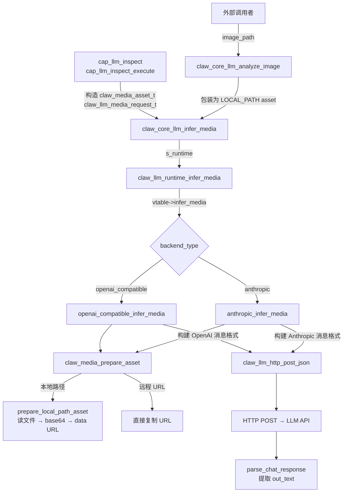
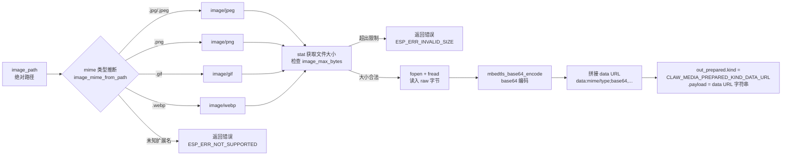

# 多模态视觉管道

本文档详细描述 esp-claw 的图像处理管道，覆盖从顶层 API 到 HTTP 请求构建的完整调用链，以及 OpenAI 和 Anthropic 两种消息格式的差异。

---

## 1. 顶层接口概览

视觉推理的公开入口位于 `claw_core_llm.h`，对外暴露两个函数：

```c
esp_err_t claw_core_llm_analyze_image(
    const char *system_prompt,
    const char *user_prompt,
    const char *image_path,
    char **out_text,
    char **out_error_message);

esp_err_t claw_core_llm_infer_media(
    const claw_llm_media_request_t *request,
    char **out_text,
    char **out_error_message);
```

`claw_core_llm_analyze_image` 是便捷包装：它在内部构造一个 `CLAW_MEDIA_ASSET_KIND_LOCAL_PATH` 类型的资源描述符，再将其封装到 `claw_llm_media_request_t` 中，然后转发给 `claw_core_llm_infer_media`。后者是真正的入口，接受任意媒体类型（本地路径 / 远程 URL）。

---

## 2. 完整调用链



调用链层次：

| 层次 | 函数 | 文件 |
|------|------|------|
| 能力层 | `cap_llm_inspect_execute` | `cap_llm_inspect.c` |
| 核心 API | `claw_core_llm_infer_media` | `claw_core_llm.c` |
| 运行时 | `claw_llm_runtime_infer_media` | `claw_llm_runtime.c` |
| 后端 vtable | `vtable->infer_media` | `claw_llm_backend_*.c` |
| 媒体管道 | `claw_media_prepare_asset` | `claw_media_pipeline.c` |
| HTTP 传输 | `claw_llm_http_post_json` | `claw_llm_http_transport.c` |

---

## 3. 图像处理流程：本地文件路径

`prepare_local_path_asset`（`claw_media_pipeline.c`）按以下步骤处理本地图像：



关键数据流：

1. **MIME 推断**：通过 `strrchr(path, '.')` 提取扩展名，使用 `strcasecmp` 大小写不敏感匹配，支持 `.jpg`、`.jpeg`、`.png`、`.gif`、`.webp`。也可在 `claw_media_asset_t.mime_type` 中显式指定，优先级高于推断。
2. **大小校验**：使用 `stat()` 获取 `st.st_size`，与 `image_max_bytes` 比较。
3. **base64 编码**：使用 mbedTLS 的 `mbedtls_base64_encode`，输出长度公式为 `((raw_size + 2) / 3) * 4`。
4. **data URL 构造**：格式为 `data:<mime>;base64,<base64_data>`，作为单个堆分配字符串传递给后端。

---

## 4. `image_remote_url_only` 模式

`claw_llm_model_profile_t` 中存在布尔标志 `image_remote_url_only`：

```c
typedef struct {
    const char *chat_path;
    const char *max_tokens_field;
    bool supports_tools;
    bool supports_vision;
    bool image_remote_url_only;  // 只允许远程 URL 模式
} claw_llm_model_profile_t;
```

`claw_media_prepare_asset` 的分发逻辑如下：

```c
if (asset->kind == CLAW_MEDIA_ASSET_KIND_REMOTE_URL) {
    // 直接复制 URL，无论 image_remote_url_only 是否为真
    out_prepared->kind = CLAW_MEDIA_PREPARED_KIND_REMOTE_URL;
    out_prepared->payload = strdup(asset->url);
    return ESP_OK;
}

// 本地路径模式
if (profile->image_remote_url_only) {
    // 拒绝本地文件，返回 ESP_ERR_NOT_SUPPORTED
    *out_error_message = dup_printf("Selected profile only supports remote image URLs");
    return ESP_ERR_NOT_SUPPORTED;
}

return prepare_local_path_asset(...);
```

**使用场景**：某些模型提供商（如部分 OpenAI 托管模型）支持直接传递图像 HTTP URL，无需上传原始字节。当模型 profile 设置 `image_remote_url_only = true` 时，如果调用方传入本地路径（`CLAW_MEDIA_ASSET_KIND_LOCAL_PATH`），管道会立即报错，避免将本地文件误发送。远程 URL 模式下 `prepared.payload` 直接存储 URL 字符串，`prepared.kind` 为 `CLAW_MEDIA_PREPARED_KIND_REMOTE_URL`。

---

## 5. OpenAI 视觉消息格式

`openai_compatible_infer_media`（`claw_llm_backend_openai_compatible.c`）构建的消息结构：

```json
{
  "model": "<model_id>",
  "max_tokens": 1024,
  "messages": [
    {
      "role": "system",
      "content": "<system_prompt>"
    },
    {
      "role": "user",
      "content": [
        {
          "type": "text",
          "text": "<user_prompt>"
        },
        {
          "type": "image_url",
          "image_url": {
            "url": "data:image/jpeg;base64,<base64>"
          }
        }
      ]
    }
  ]
}
```

关键点：
- 系统提示放在独立的 `system` 角色消息中（OpenAI 标准格式）。
- 图像放在 `image_url.url` 字段，值可以是 `data:` URI（本地文件）或 `https://` 链接（远程 URL）。
- `image_value` 对象仅包含 `url` 字段，后端不传递 `detail` 参数。

---

## 6. Anthropic 视觉消息格式

`anthropic_infer_media`（`claw_llm_backend_anthropic.c`）构建的消息结构：

```json
{
  "model": "<model_id>",
  "max_tokens": 1024,
  "system": "<system_prompt>",
  "messages": [
    {
      "role": "user",
      "content": [
        {
          "type": "text",
          "text": "<user_prompt>"
        },
        {
          "type": "image",
          "source": {
            "type": "base64",
            "media_type": "image/jpeg",
            "data": "<base64_data>"
          }
        }
      ]
    }
  ]
}
```

与 OpenAI 的核心差异：

| 维度 | OpenAI 兼容格式 | Anthropic 格式 |
|------|----------------|----------------|
| 系统提示位置 | `messages[0].role = "system"` | 顶层 `system` 字段 |
| 图像块类型 | `"type": "image_url"` | `"type": "image"` |
| 图像载体字段 | `image_url.url`（data URI 或 https） | `source.type = "base64"` + 拆分 mime/data |
| 远程 URL 支持 | 原生支持 | 不支持（代码检查 `prepared.kind != DATA_URL` 即报错） |
| 请求头鉴权 | `Authorization: Bearer <key>` | `x-api-key: <key>` + `anthropic-version: 2023-06-01` |

Anthropic 后端在构建消息前通过 `parse_data_url` 将 data URL 拆分为 `mime`（如 `image/jpeg`）和纯 base64 字符串，分别填入 `source.media_type` 和 `source.data`。因此 Anthropic 路径**不支持** `CLAW_MEDIA_PREPARED_KIND_REMOTE_URL`，若 `prepared.kind` 不是 `DATA_URL`，立即返回 `ESP_ERR_NOT_SUPPORTED`。

---

## 7. `cap_llm_inspect` 能力接口设计

`cap_llm_inspect` 注册了一个名为 `inspect_image` 的可调用能力（`CLAW_CAP_KIND_CALLABLE`）：

```c
static const claw_cap_descriptor_t s_llm_inspect_descriptors[] = {
    {
        .id          = "inspect_image",
        .name        = "inspect_image",
        .family      = "system",
        .description = "Analyze a local image from an absolute path. ...",
        .kind        = CLAW_CAP_KIND_CALLABLE,
        .cap_flags   = CLAW_CAP_FLAG_CALLABLE_BY_LLM,
        .input_schema_json =
            "{\"type\":\"object\","
            "\"properties\":{"
            "\"path\":{\"type\":\"string\"},"
            "\"prompt\":{\"type\":\"string\"}"
            "},\"required\":[\"path\",\"prompt\"]}",
        .execute = cap_llm_inspect_execute,
    },
};
```

调用约定：
- **输入**：JSON 对象，必须包含 `path`（绝对本地路径）和 `prompt`（分析指令）。
- **输出**：字符串，LLM 的图像描述文本；出错时以 `"Error: ..."` 开头。
- **执行**：`cap_llm_inspect_execute` 解析 JSON、构造 `CLAW_MEDIA_ASSET_KIND_LOCAL_PATH` 资源，调用 `claw_core_llm_infer_media`，将结果写入 `output` 缓冲区。

系统提示固定为：
> "You analyze local image files for the ESP32 claw. Describe visible content plainly and briefly. If the image is unclear, say what is uncertain instead of guessing."

该 capability 通过 `cap_llm_inspect_register_group` 注册到全局能力注册表，分组 ID 为 `"cap_llm_inspect"`，幂等注册（已存在则直接返回 `ESP_OK`）。

---

## 8. `image_max_bytes` 限制机制

`image_max_bytes` 定义在运行时配置 `claw_llm_runtime_config_t` 中，通过以下路径传递到实际校验点：

```
claw_core_llm_config_t.image_max_bytes
  → claw_llm_runtime_config_t.image_max_bytes
    → openai_compatible_backend_ctx_t.image_max_bytes
    → anthropic_backend_ctx_t.image_max_bytes
      → claw_media_prepare_asset(... image_max_bytes ...)
        → prepare_local_path_asset: stat().st_size > image_max_bytes → ESP_ERR_INVALID_SIZE
```

校验代码（`claw_media_pipeline.c` 第 111–116 行）：

```c
if ((size_t)st.st_size > image_max_bytes) {
    *out_error_message = dup_printf(
        "Media file is too large (%ld bytes > %u bytes)",
        (long)st.st_size,
        (unsigned)image_max_bytes);
    return ESP_ERR_INVALID_SIZE;
}
```

限制仅作用于**本地文件**路径。远程 URL 模式下跳过此校验，后端不知道目标资源的实际大小。`image_max_bytes = 0` 时不会自动关闭限制（0 表示无限制，因为任何正数大小均不大于 0 是 false），实际行为取决于 `size_t` 比较语义——配置时应始终显式设置非零值。

---

## 9. 数据结构速查

```c
// 输入描述：一个媒体资源
typedef struct {
    claw_media_asset_kind_t kind;   // LOCAL_PATH / REMOTE_URL / INLINE_BYTES
    const char *path;               // 本地绝对路径（LOCAL_PATH 时使用）
    const char *url;                // 远程 URL（REMOTE_URL 时使用）
    const uint8_t *bytes;           // 内联字节（INLINE_BYTES，当前后端未实现）
    size_t byte_count;
    const char *mime_type;          // 可选，覆盖自动推断
} claw_media_asset_t;

// 媒体推理请求
typedef struct {
    const char *system_prompt;
    const char *user_prompt;
    const claw_media_asset_t *media;
    size_t media_count;             // 当前后端仅处理 media[0]
} claw_llm_media_request_t;

// 管道内部中间表示
typedef struct {
    claw_media_prepared_kind_t kind;  // DATA_URL / REMOTE_URL
    char *payload;                    // data URL 字符串或远程 URL 字符串
    char mime_type[32];               // 如 "image/jpeg"
    size_t original_size;             // 原始文件字节数（远程 URL 时为 0）
} claw_media_prepared_t;
```
