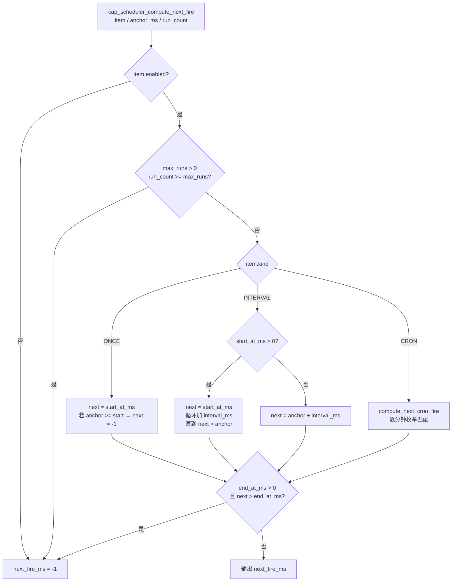
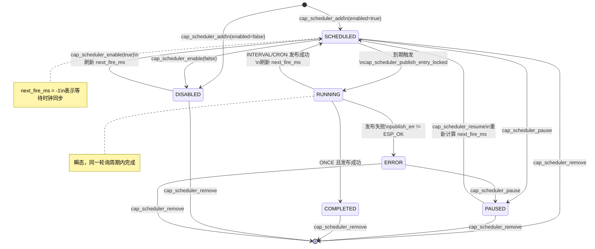
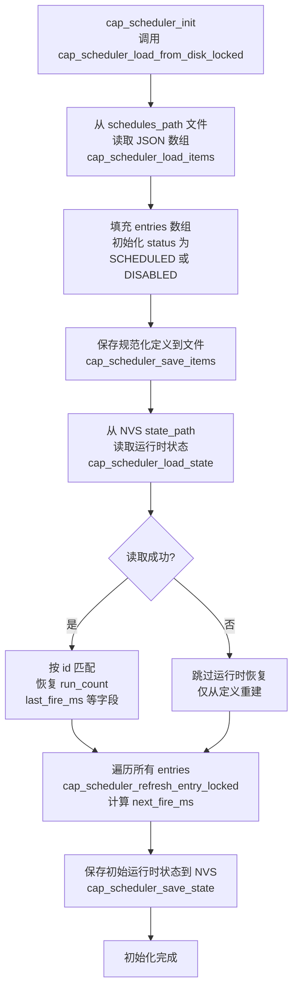
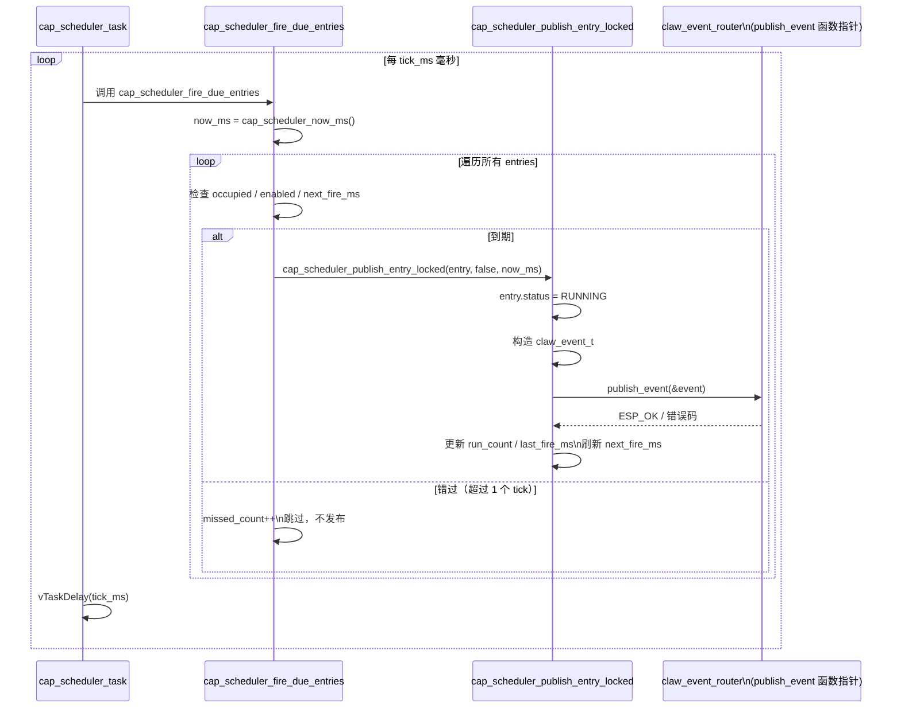

# 调度器实现

本文档详细描述 `cap_scheduler` 组件的内部实现，包括三种调度模式、cron 解析器、任务状态机、持久化机制以及与事件路由器的集成方式。

---

## 1. 架构概览

调度器采用**单一轮询任务**架构，而非 FreeRTOS 软件定时器：

- 在 `cap_scheduler_start` 中通过 `claw_task_create` 创建一个名为 `cap_scheduler` 的 FreeRTOS 任务。
- 该任务以固定周期（`tick_ms`，默认 `CAP_SCHEDULER_DEFAULT_TICK_MS = 1000ms`）循环调用 `cap_scheduler_fire_due_entries`。
- 每次轮询遍历全部 `entries` 数组，找出到期的条目并发布事件。

**设计优势**：避免每个条目独占一个 FreeRTOS 定时器对象，内存占用固定；所有条目的触发逻辑集中在同一个时钟周期内处理，易于串行加锁保护。

默认配置常量（`cap_scheduler_internal.h`）：

| 常量 | 值 | 说明 |
|------|-----|------|
| `CAP_SCHEDULER_DEFAULT_TICK_MS` | 1000 | 轮询间隔（毫秒） |
| `CAP_SCHEDULER_DEFAULT_MAX_ITEMS` | 32 | 最大任务条目数 |
| `CAP_SCHEDULER_DEFAULT_STACK` | 6144 | 调度器任务栈大小（字节） |
| `CAP_SCHEDULER_DEFAULT_PRIORITY` | 5 | FreeRTOS 任务优先级 |

---

## 2. 三种调度模式

### 2.1 枚举定义

```c
typedef enum {
    CAP_SCHEDULER_ITEM_ONCE     = 0,  // 单次触发
    CAP_SCHEDULER_ITEM_INTERVAL = 1,  // 固定间隔重复
    CAP_SCHEDULER_ITEM_CRON     = 2,  // cron 表达式
} cap_scheduler_item_kind_t;
```

### 2.2 ONCE 模式

- **必填字段**：`start_at_ms`（Unix 纪元毫秒时间戳），必须 > 0。
- **触发逻辑**：`next_fire_ms = start_at_ms`；若当前时间已过 `start_at_ms`，则 `next_fire_ms = -1`（视为已完成）。
- **触发后**：`next_fire_ms` 置为 -1，状态变为 `COMPLETED`，不再触发。
- **时间依赖**：需要有效的系统时钟（`time_valid = true`）。

### 2.3 INTERVAL 模式

- **必填字段**：`interval_ms`（间隔毫秒数），必须 > 0。
- **可选字段**：`start_at_ms`（起始基准），`end_at_ms`（截止时间）。
- **触发逻辑**：
  - 若设置了 `start_at_ms`：以 `start_at_ms` 为基准，逐步加 `interval_ms` 直到超过当前时间；
  - 若未设置 `start_at_ms`：`next_fire_ms = anchor_ms + interval_ms`（相对当前时刻）。
- **无时钟依赖特例**：若 `start_at_ms <= 0` 且 `end_at_ms <= 0`，`cap_scheduler_item_requires_valid_time` 返回 `false`，即使系统时钟未同步也可运行。这是三种模式中唯一支持无网络离线运行的配置。

### 2.4 CRON 模式

- **必填字段**：`cron_expr`（5 字段 cron 表达式），不能为空字符串。
- **触发逻辑**：调用 `cap_scheduler_compute_next_cron_fire`，从当前分钟的下一分钟开始，逐分钟枚举（最多枚举 525600 次，即一年），找到满足表达式的时间点。
- **时间依赖**：依赖有效的本地时钟和时区设置（通过 `localtime_r` 解析）。

### 2.5 `next_fire_ms` 计算流程



---

## 3. Cron 表达式解析器

### 3.1 5 字段格式

解析器仅支持标准 POSIX 5 字段 cron 格式，字段顺序如下：

```
分钟(0-59)  小时(0-23)  月中日(1-31)  月份(1-12)  星期(0-6, 0=周日)
```

示例：`0 8 * * *`（每天 08:00）、`*/5 * * * *`（每 5 分钟）。

不支持 6 字段（含秒）、7 字段格式，多余字段会导致 `index != 5` 校验失败。

### 3.2 支持的特殊字符

`cap_scheduler_parse_cron_field` 处理三种语法：

| 语法 | 示例 | 含义 |
|------|------|------|
| `*` | `*` | 该字段所有合法值均允许 |
| `*/N` | `*/5` | 从最小值起，每 N 步一个允许值 |
| 单一整数 | `8` | 仅允许该精确数值 |

**不支持**的语法（会返回解析失败）：
- 范围（`1-5`）
- 列表（`1,3,5`）
- 月份名称（`JAN`、`MON` 等）
- 特殊宏（`@daily`、`@hourly` 等）

### 3.3 解析数据结构

```c
typedef struct {
    bool minute[60];   // [0..59]
    bool hour[24];     // [0..23]
    bool mday[32];     // [1..31]，索引 0 未使用
    bool month[13];    // [1..12]，索引 0 未使用
    bool wday[7];      // [0..6]，0=周日
} cap_scheduler_cron_spec_t;
```

解析完成后，匹配时调用 `localtime_r` 将候选时间戳转为 `struct tm`，逐字段检查对应的 `bool` 数组。

### 3.4 枚举算法

```c
candidate_ms = (anchor_ms / 60000LL) * 60000LL + 60000LL;  // 下一整分钟
for (i = 0; i < 525600; i++) {  // 最多枚举一年
    localtime_r(&seconds, &tm_info);
    if (spec.minute[tm_info.tm_min] &&
        spec.hour[tm_info.tm_hour]  &&
        spec.mday[tm_info.tm_mday]  &&
        spec.month[tm_info.tm_mon + 1] &&
        spec.wday[tm_info.tm_wday]) {
        *out_next_fire_ms = candidate_ms;
        return true;
    }
    candidate_ms += 60000LL;
}
```

注意：`tm_info.tm_mon` 是 0-based（0=1月），解析器存储时用 `tm_mon + 1` 对齐到 `spec.month[1..12]`。

---

## 4. 任务状态机

### 4.1 状态枚举

```c
typedef enum {
    CAP_SCHEDULER_STATUS_SCHEDULED = 0,  // 等待下次触发
    CAP_SCHEDULER_STATUS_PAUSED    = 1,  // 手动暂停，不触发
    CAP_SCHEDULER_STATUS_RUNNING   = 2,  // 正在发布事件（短暂中间态）
    CAP_SCHEDULER_STATUS_COMPLETED = 3,  // 已完成（ONCE 触发后 / 达到 end_at_ms）
    CAP_SCHEDULER_STATUS_ERROR     = 4,  // 发布事件失败
    CAP_SCHEDULER_STATUS_DISABLED  = 5,  // item.enabled = false
} cap_scheduler_status_t;
```

### 4.2 状态转换图



### 4.3 关键状态转换说明

- **时钟未同步等待**：当 `time_valid = false` 且任务需要有效时钟时，`next_fire_ms = -1`，状态保持 `SCHEDULED`，轮询直接跳过（不会触发）。
- **错过触发**：若 `now_ms > next_fire_ms + tick_ms`，视为错过，`missed_count++`，刷新到下一个 `next_fire_ms`，不发布事件（避免补发积压）。
- **PAUSED 保护**：`PAUSED` 状态下，`cap_scheduler_fire_due_entries` 直接跳过，`cap_scheduler_refresh_entry_locked` 也不修改状态。

---

## 5. 持久化恢复机制

调度器使用**双文件策略**，分别存储定义文件和运行时状态文件：

### 5.1 定义文件（schedules_path）

- **存储介质**：POSIX 文件系统（SPIFFS / LittleFS 等），路径由调用方在 `cap_scheduler_config_t.schedules_path` 中指定。
- **内容**：JSON 数组，每个元素为一个 `cap_scheduler_item_t` 的完整配置（不含运行时字段）。
- **写入时机**：`cap_scheduler_add`、`cap_scheduler_update`、`cap_scheduler_remove`、`cap_scheduler_enable`、`cap_scheduler_reload` 时调用 `cap_scheduler_save_items`，通过 `fopen/fwrite` 写入文件系统。

### 5.2 运行时状态文件（state_path）

- **路径**：在 `schedules_path` 后附加后缀 `".state"`（`CAP_SCHEDULER_STATE_KEY_SUFFIX`），例如 `/data/schedules.json.state`。
- **存储介质**：**NVS（Non-Volatile Storage）**，命名空间为 `"cap_sched"`，键名由路径哈希生成（FNV-1a 变体，格式 `cs%013llx`）。
- **内容**：JSON 数组，每个元素仅包含运行时字段：`id`、`status`、`next_fire_ms`、`last_fire_ms`、`last_success_ms`、`run_count`、`missed_count`、`last_error_code`。
- **写入时机**：每次发布事件后（若 `persist_after_fire = true`）、暂停/恢复/触发操作后、时钟同步后。
- **校验**：写入后立即回读并用 `cJSON_Parse` 验证 JSON 有效性，验证失败时调用 `cap_scheduler_erase_state_blob` 清除损坏数据。

### 5.3 重启恢复流程



`last_fire_ms` 是恢复的关键字段：`cap_scheduler_refresh_entry_locked` 以 `last_fire_ms`（若 > 0）而非当前时间作为 anchor，确保 INTERVAL 任务在重启后从上次触发时间点正确推算下次触发时间，避免重启后立即重复触发。

---

## 6. 与 claw_event_router 的联动

调度器本身**不执行**任何业务逻辑，仅负责在到期时发布事件。

### 6.1 事件发布接口

`cap_scheduler_config_t.publish_event` 是一个函数指针（类型 `claw_event_publish_fn`），由调用方注入：

```c
typedef struct {
    const char *schedules_path;
    uint32_t tick_ms;
    uint32_t max_items;
    uint32_t task_stack_size;
    UBaseType_t task_priority;
    BaseType_t task_core;
    claw_event_publish_fn publish_event;  // 注入事件发布函数
    bool persist_after_fire;
} cap_scheduler_config_t;
```

### 6.2 事件结构

触发时 `cap_scheduler_publish_entry_locked` 构造 `claw_event_t`：

```c
snprintf(event.event_id, sizeof(event.event_id), "sch-%08" PRIx32, (uint32_t)(now_ms & 0xffffffff));
strlcpy(event.source_cap, "cap_scheduler", sizeof(event.source_cap));
strlcpy(event.event_type, entry->item.event_type, sizeof(event.event_type));
strlcpy(event.source_channel, entry->item.source_channel, sizeof(event.source_channel));
strlcpy(event.chat_id, entry->item.chat_id, sizeof(event.chat_id));
strlcpy(event.message_id, entry->item.event_key, sizeof(event.message_id));
snprintf(event.correlation_id, ..., "%s:%" PRId64, entry->item.id, planned_time_ms);
event.text = entry->item.text[0] ? entry->item.text : NULL;
event.payload_json = payload_json;  // 包含 schedule_id/planned_time_ms/fire_time_ms/kind/run_count/user_payload
```

`payload_json` 结构：

```json
{
  "schedule_id": "<id>",
  "planned_time_ms": 1735689600000,
  "fire_time_ms": 1735689600012,
  "kind": "cron",
  "run_count": 5,
  "user_payload": { }
}
```

### 6.3 联动流程



`session_policy` 字段控制事件路由器如何处理会话上下文，支持五种策略：`trigger`（默认）、`chat`、`global`、`ephemeral`、`nosave`。

---

## 7. 最大任务数量限制

最大并发任务数由 `cap_scheduler_config_t.max_items` 指定，默认值为 `CAP_SCHEDULER_DEFAULT_MAX_ITEMS = 32`。

实现为静态数组：

```c
s_cap_scheduler.entries = calloc(s_cap_scheduler.max_items, sizeof(cap_scheduler_entry_t));
```

每个 `cap_scheduler_entry_t` 包含：

```c
typedef struct {
    bool occupied;              // 槽位是否被占用
    cap_scheduler_item_t item;  // 任务定义（包含所有字段缓冲区）
    cap_scheduler_status_t status;
    int64_t next_fire_ms;
    int64_t last_fire_ms;
    int64_t last_success_ms;
    int run_count;
    int missed_count;
    esp_err_t last_error_code;
} cap_scheduler_entry_t;
```

当 `cap_scheduler_add` 调用 `cap_scheduler_find_free_index_locked` 找不到空闲槽时，返回 `ESP_ERR_NO_MEM`。槽位通过 `occupied` 标志管理，删除任务时 `memset` 清零该槽。

`cap_scheduler_item_t` 内所有字符串字段均为固定长度缓冲区，避免堆碎片：

| 字段 | 缓冲区长度常量 | 值 |
|------|--------------|-----|
| `id` | `CAP_SCHEDULER_ID_LEN` | 64 |
| `cron_expr` | `CAP_SCHEDULER_EXPR_LEN` | 64 |
| `event_type` | `CAP_SCHEDULER_EVENT_TYPE_LEN` | 32 |
| `event_key` | `CAP_SCHEDULER_EVENT_KEY_LEN` | 96 |
| `source_channel` | `CAP_SCHEDULER_CHANNEL_LEN` | 16 |
| `chat_id` | `CAP_SCHEDULER_CHAT_ID_LEN` | 96 |
| `text` | `CAP_SCHEDULER_TEXT_LEN` | 256 |
| `payload_json` | `CAP_SCHEDULER_PAYLOAD_LEN` | 512 |

---

## 8. 线程安全

全局运行时 `s_cap_scheduler` 通过递归互斥锁保护：

```c
s_cap_scheduler.mutex = xSemaphoreCreateRecursiveMutex();
```

所有读写操作（`cap_scheduler_add`、`cap_scheduler_remove`、`cap_scheduler_fire_due_entries` 等）均在 `cap_scheduler_lock()` / `cap_scheduler_unlock()` 之间执行。使用递归互斥锁允许同一任务重入（例如触发回调中调用 `trigger_now`）。
