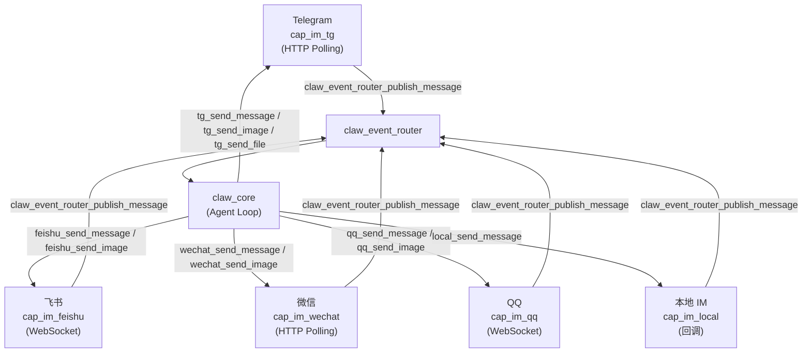
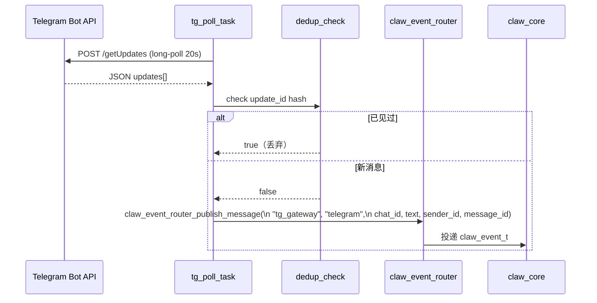

# 17 IM 平台适配层

## 概述

`cap_im_platform` 是 esp-claw 的 IM 平台适配层，通过统一的 capability 接口，将 Telegram、微信、飞书、QQ 等不同即时通讯平台的消息收发行为标准化。所有适配器最终都向 `claw_event_router` 投递 `claw_event_t` 事件，LLM 核心无需感知底层平台差异。

`cap_im_local` 是独立的本地 IM 组件，用于进程内测试或自定义 UI 接入，不依赖任何云端接口。

---

## 架构总览



---

## 统一注册机制

入口函数 `cap_im_platform_register_groups()` 通过条件编译将各平台适配器注册到 capability 系统：

```c
// cap_im_platform.c
esp_err_t cap_im_platform_register_groups(void)
{
#if CONFIG_APP_CLAW_CAP_IM_FEISHU
    cap_im_feishu_register_group();
#endif
#if CONFIG_APP_CLAW_CAP_IM_QQ
    cap_im_qq_register_group();
#endif
#if CONFIG_APP_CLAW_CAP_IM_TG
    cap_im_tg_register_group();
#endif
#if CONFIG_APP_CLAW_CAP_IM_WECHAT
    cap_im_wechat_register_group();
#endif
    return ESP_OK;
}
```

每个平台注册一组 `claw_cap_descriptor_t`，包含：

| 描述符 ID | kind | 用途 |
|---|---|---|
| `tg_gateway` | `CLAW_CAP_KIND_EVENT_SOURCE` | Telegram 轮询任务，接收消息并投递事件 |
| `tg_send_message` | `CLAW_CAP_KIND_CALLABLE` | LLM 调用：发送文字 |
| `tg_send_image` | `CLAW_CAP_KIND_CALLABLE` | LLM 调用：发送图片 |
| `tg_send_file` | `CLAW_CAP_KIND_CALLABLE` | LLM 调用：发送文件 |

飞书、微信、QQ 遵循同样的命名规则（`feishu_gateway` / `feishu_send_*` 等）。

---

## 接入模式：polling vs WebSocket

### HTTP Polling（Telegram、微信）

Telegram 和微信使用 HTTP 长轮询。以 Telegram 为例：

```c
// cap_im_tg.c
static void cap_im_tg_poll_task(void *arg)
{
    while (!s_tg.stop_requested) {
        if (cap_im_tg_poll_once() != ESP_OK) {
            vTaskDelay(pdMS_TO_TICKS(CAP_IM_TG_RETRY_DELAY_MS)); // 3000 ms
        }
    }
}
```

`cap_im_tg_poll_once()` 调用 Telegram Bot API 的 `getUpdates` 接口，超时参数 `CAP_IM_TG_POLL_TIMEOUT_S = 20` 秒（服务端 long-poll），`Content-Type: application/json`，HTTP 连接超时 = `(20 + 5) * 1000 = 25000 ms`。

轮询 task 名称：`tg_poll`，栈大小 6144 字节，优先级 5，支持 PSRAM 栈。

### WebSocket（飞书、QQ）

飞书通过 `esp_websocket_client` 连接 `https://open.feishu.cn/callback/ws/endpoint` 获取 WebSocket 推送地址后建立长连接。QQ 通过 `https://api.sgroup.qq.com/gateway` 获取 WebSocket URL，使用自定义 Identify/Heartbeat/Dispatch 协议（op 码：0=DISPATCH, 1=HEARTBEAT, 2=IDENTIFY, 7=RECONNECT, 9=INVALID_SESSION, 10=HELLO, 11=HEARTBEAT_ACK）。

---

## 消息 ID 去重机制

所有平台均采用 **FNV-1a 64 位哈希环形缓存**进行去重，防止因网络重试或 API 偶发重传导致重复处理。

以 Telegram 为例：

```c
#define CAP_IM_TG_DEDUP_CACHE_SIZE 64

typedef struct {
    // ...
    uint64_t seen_update_keys[CAP_IM_TG_DEDUP_CACHE_SIZE];
    size_t   seen_update_idx;
} cap_im_tg_state_t;

static uint64_t cap_im_tg_fnv1a64(const char *text) {
    uint64_t hash = 1469598103934665603ULL;
    while (*text) {
        hash ^= (unsigned char)(*text++);
        hash *= 1099511628211ULL;
    }
    return hash;
}

static bool cap_im_tg_dedup_check_and_record(const char *update_key) {
    uint64_t key = cap_im_tg_fnv1a64(update_key);
    for (size_t i = 0; i < CAP_IM_TG_DEDUP_CACHE_SIZE; i++) {
        if (s_tg.seen_update_keys[i] == key) return true; // 重复，丢弃
    }
    // 写入环形缓存
    s_tg.seen_update_keys[s_tg.seen_update_idx] = key;
    s_tg.seen_update_idx = (s_tg.seen_update_idx + 1) % CAP_IM_TG_DEDUP_CACHE_SIZE;
    return false;
}
```

- Telegram 以 `update_id` 字符串为 key，同时维护 `next_update_id` 推进 offset，双重防重。
- 飞书以消息的 `message_id` 字段（`im.message.receive_v1` 事件体中提取）为 key。
- 缓存大小统一为 64 条，环形覆写（不使用 LRU），适合资源受限的嵌入式场景。

---

## Inbound 路径：消息 → claw_event_t → event_router

以 Telegram 文本消息为例，完整 inbound 路径：



`claw_event_router_publish_message()` 内部填充 `claw_event_t` 的标准字段：

| 字段 | Telegram 填充值 |
|---|---|
| `source_cap` | `"tg_gateway"` |
| `source_channel` | `"telegram"` |
| `chat_id` | Telegram chat.id（字符串） |
| `sender_id` | Telegram from.id（字符串） |
| `message_id` | Telegram message_id（字符串） |
| `content_type` | `"text"`（文字）/ `"image"`（图片）/ `"file"`（文档） |
| `event_type` | `"attachment_saved"`（附件事件）|
| `session_policy` | `CLAW_EVENT_SESSION_POLICY_CHAT` |

---

## Outbound 路径：LLM → 平台发送

LLM 通过 tool call 调用 `tg_send_message` / `tg_send_image` / `tg_send_file`，capability 描述符中的 `.execute` 回调负责转发：

```c
// tg_send_message 的 input schema（JSON）
{
  "type": "object",
  "properties": {
    "chat_id": {"type": "string"},
    "message":  {"type": "string"}
  },
  "required": ["chat_id", "message"]
}
```

`chat_id` 优先取自 JSON 参数，若未提供则回退到 `claw_cap_call_context_t.chat_id`（由事件路由注入）。执行成功后返回固定字符串 `"reply already sent to user"`。

长文本自动分块：`cap_im_tg_send_text()` 按 `CAP_IM_TG_MAX_MSG_LEN = 4096` 字节切割，逐块发送，确保不超过 Telegram 单条消息上限。

图片和文件通过 multipart/form-data 流式上传：

```
Content-Type: multipart/form-data; boundary=----cap_im_tg_boundary
--chat_id part--
--caption part (可选)--
--photo/document part（流式写入文件内容）--
```

---

## 支持的消息类型

| 消息类型 | content_type | 说明 |
|---|---|---|
| 文字 | `text` | 所有平台均支持，分块发送 |
| 图片 | `image` | TG: sendPhoto，飞书: sendImage，微信/QQ: 上传后发送 |
| 文件 | `file` | TG: sendDocument，飞书: sendFile，QQ: file_type=4 |
| 语音 | — | 当前版本未实现 outbound 语音，inbound 部分平台透传 |

**附件下载（Inbound）** 通过独立的 `tg_attach` / `feishu_attach` FreeRTOS 任务异步处理，队列长度 8，栈大小 8192 字节。附件保存到本地文件系统后，投递 `event_type = "attachment_saved"` 事件，`payload_json` 携带元数据：

```json
{
  "platform": "telegram",
  "attachment_kind": "photo",
  "saved_path": "/sdcard/tg/chat123/msg456/photo.jpg",
  "saved_dir":  "/sdcard/tg/chat123/msg456",
  "saved_name": "photo.jpg",
  "original_filename": "photo.jpg",
  "mime": "image/jpeg",
  "caption": "...",
  "platform_file_id": "BQACAgIAA...",
  "size_bytes": 102400,
  "saved_at_ms": 1748290800000
}
```

---

## cap_im_local：本地 IM 与 cap_im_platform 的区别

`cap_im_local` 是专为**进程内测试、Web UI 接入、串口终端**等场景设计的轻量适配器，与 `cap_im_platform` 的主要区别：

| 特性 | cap_im_platform | cap_im_local |
|---|---|---|
| 连接方式 | HTTP / WebSocket（云端） | 进程内回调（无网络） |
| Outbound 发送 | 调用各平台 HTTP API | 调用 `cap_im_local_outbound_callback_t` |
| Inbound 注入 | 平台推送（polling/WS 接收） | 调用 `cap_im_local_emit_text()` 主动注入 |
| 附件处理 | 下载到本地文件系统 | 支持 link_url / link_label 透传 |
| 去重缓存 | FNV-1a 环形缓存 64 条 | 无（调用者保证幂等） |
| 消息 ID | 平台原生 ID | 自动生成 `local-{ms}` |
| 任务 | poll_task + attachment_task | 无后台任务（同步回调） |

关键 API：

```c
// 注入一条用户消息（模拟用户发言）
esp_err_t cap_im_local_emit_text(
    const char *channel,
    const char *chat_id,
    const char *sender_id,
    const char *message_id,
    const char *text);

// 注入带附件链接的消息
esp_err_t cap_im_local_emit_user_message(
    const char *channel,
    const char *chat_id,
    const char *sender_id,
    const char *message_id,
    const char *text,
    const char *const *link_urls,
    size_t link_count);

// 注册 outbound 回调（接收 LLM 回复）
esp_err_t cap_im_local_set_outbound_callback(
    cap_im_local_outbound_callback_t callback,
    void *user_ctx);
```

`cap_im_local_message_t` 的回调数据结构：

```c
typedef struct {
    const char *channel;      // 默认 "local"
    const char *chat_id;
    const char *sender_id;
    const char *message_id;
    const char *text;         // LLM 回复文本
    const char *link_url;     // 可选：文件下载链接
    const char *link_label;   // 可选：链接标签
    int64_t     timestamp_ms;
} cap_im_local_message_t;
```

---

## 配置示例（Telegram）

```c
cap_im_tg_set_token("12345678:ABCdef...");

cap_im_tg_set_attachment_config(&(cap_im_tg_attachment_config_t){
    .storage_root_dir         = "/sdcard/attachments",
    .max_inbound_file_bytes   = 2 * 1024 * 1024,  // 2 MB
    .enable_inbound_attachments = true,
});

cap_im_tg_start();
```

---

## 日志 TAG 汇总

| 模块 | TAG |
|---|---|
| 平台入口 | `cap_im_platform` |
| Telegram | `cap_im_tg` |
| 飞书 | `cap_im_feishu` |
| 微信 | `cap_im_wechat` |
| QQ | `cap_im_qq` |
| 本地 IM | `cap_im_local` |

典型日志行：

```
I cap_im_tg: Telegram inbound -123456789: 你好，今天天气如何？
I cap_im_tg: Saved Telegram photo to /sdcard/tg/.../photo.jpg (98304 bytes)
W cap_im_tg: Telegram polling failed, retrying
I cap_im_local: Outbound local IM channel=local chat=test_chat msg=local-out-... text=这是回复
```
