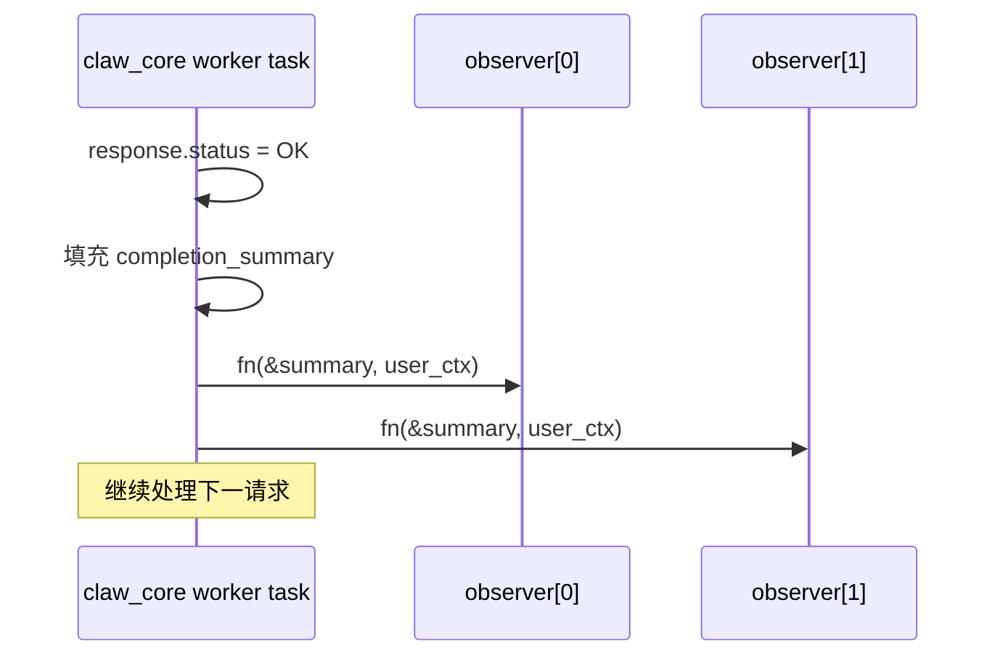
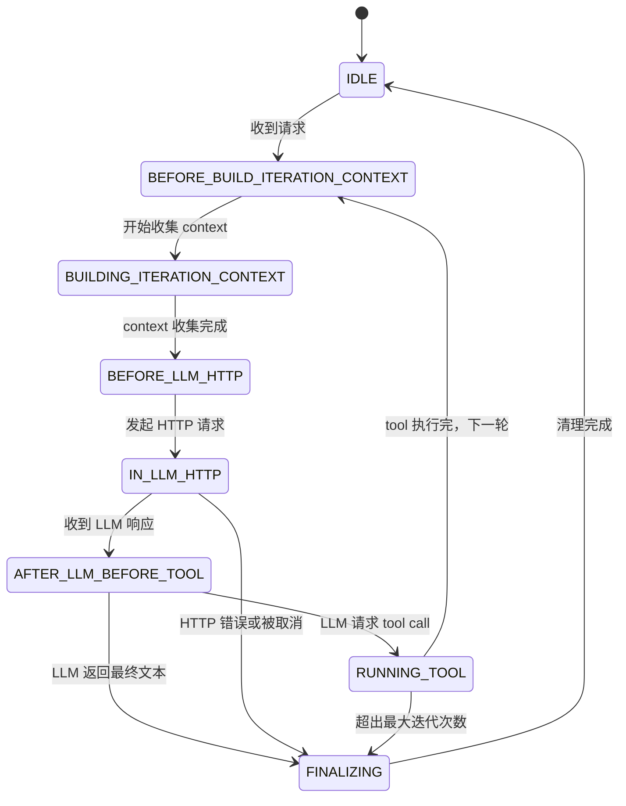
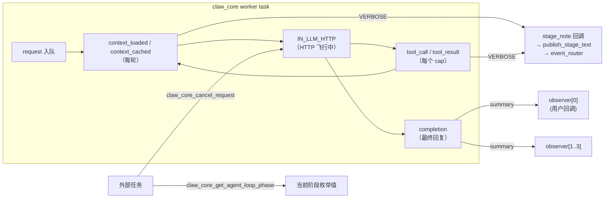

# 18 观测性与调试接口

## 概述

esp-claw 的 `claw_core` 模块提供一套轻量级观测接口，在不侵入 Agent 主循环的前提下，允许外部代码获取运行阶段、注入进度文本、订阅请求完成事件，以及通过 ESP-IDF 日志追踪关键行为。本文档描述所有相关机制的数据结构、API 及日志格式。

---

## 1. stage_note 机制

### 作用

`stage_note` 是一个用户可插拔的回调，在每个 Agent 工具调用轮次（round）开始前被调用，用于**向对话频道发送进度提示文本**（如"正在查询天气…"）。该文本通过 `claw_core_publish_stage_text()` 以 `agent_stage` 事件类型投递到事件路由，最终送达用户界面。

### 回调签名

```c
// claw_core.h
typedef esp_err_t (*claw_core_stage_note_fn)(
    const claw_core_request_t *request,  // 当前请求上下文（只读）
    char **out_note,                     // 回调须 malloc 分配文本，core 负责 free
    void *user_ctx);                     // 注册时传入的用户指针
```

回调必须在 `out_note` 中写入一个堆分配的字符串（`malloc`）；若无需发送提示，可写入 `NULL` 或返回 `ESP_OK` 并令 `*out_note` 为空字符串。

### 注册方式

在 `claw_core_config_t` 中配置：

```c
claw_core_config_t config = {
    // ...
    .collect_stage_note      = my_stage_note_fn,
    .collect_stage_note_user_ctx = my_ctx,
};
claw_core_init(&config);
```

### 触发时机

```
每个 Agent 工具调用轮次开始时（iteration > 0 且有 tool calls）
  └── publish_stage_note_for_round(request, round_index)
        ├── 调用 collect_stage_note 回调
        ├── 格式化: "🦞 [Round N] <note>"
        └── claw_core_publish_stage_text(request, buf)
              └── claw_event_router_publish(event_type="agent_stage")
```

**触发条件**：仅当配置了 `CONFIG_CLAW_CORE_STAGE_VERBOSITY_VERBOSE` 时，格式化后的提示文本才会发布到事件路由；否则回调仍会被调用但文本被静默丢弃（仍有副作用，如更新外部状态机）。

发布格式为：
```
🦞 [Round 1] <回调返回的文本>
🦞 [Round 2] <回调返回的文本>
```

### publish_stage_tool_calls

除 stage_note 外，每轮 tool call 触发时还会调用 `publish_stage_tool_calls()`，在 VERBOSE 模式下向前端发送形如：

```
🦞 [Round 1] Snap: get_weather({"city":"北京",...}), send_reply(...)
```

---

## 2. completion_summary 与 completion observer

### claw_core_completion_summary_t

请求成功完成时，`claw_core` 填充此结构并回调所有已注册的 observer：

```c
// claw_core.h
typedef struct {
    uint32_t    request_id;            // 请求编号（单调递增）
    const char *session_id;            // 会话 ID，可为 NULL
    const char *final_text;            // LLM 最终回复文本，可为 NULL 或空
    const char *context_providers_csv; // 本次请求中注入了非空内容的 provider 名称
    const char *tool_calls_csv;        // 本次请求中被调用的所有 cap 名称
} claw_core_completion_summary_t;
```

#### context_providers_csv 格式

逗号分隔的 context provider 名称列表，仅包含实际返回了非空内容的 provider：

```
"session_history,user_profile,tool_definitions"
```

- 缓冲区最大长度 `CLAW_CORE_OBS_CSV_MAX = 384` 字节
- 使用 `obs_csv_append(..., dedup=true)` 写入，同名 provider 不重复记录
- `CLAW_CORE_CONTEXT_PROVIDER_FLAG_REQUEST_START_ONLY` 标记的 provider 在请求开始时收集（`context_cached` 日志），其余 provider 每轮重新收集（`context_loaded` 日志）；两者都会追加到同一个 csv

#### tool_calls_csv 格式

逗号分隔的 capability 名称列表，**允许重复**（同一 cap 在同次请求中多次调用会记录多次）：

```
"get_weather,search_web,tg_send_message"
```

- 写入时 `dedup=false`，保留调用顺序和次数信息
- 缓冲区同样限 384 字节，超出后截断

### observer 注册

```c
// claw_core.h
typedef void (*claw_core_completion_observer_fn)(
    const claw_core_completion_summary_t *summary,
    void *user_ctx);

esp_err_t claw_core_add_completion_observer(
    claw_core_completion_observer_fn observer,
    void *user_ctx);
```

- 最多注册 **4 个** observer（`CLAW_CORE_MAX_COMPLETION_OBSERVERS = 4`）
- 超出时返回 `ESP_ERR_NO_MEM`
- observer 在 claw_core 的 worker task 上同步调用，**不可阻塞**
- 仅在请求**成功完成**（`status = CLAW_CORE_RESPONSE_STATUS_OK`）时触发；请求失败或被取消不触发



---

## 3. Agent Loop 阶段查询

### claw_core_agent_loop_phase_t 枚举

```c
typedef enum {
    CLAW_CORE_AGENT_LOOP_PHASE_IDLE = 0,                    // 无请求处理中
    CLAW_CORE_AGENT_LOOP_PHASE_BEFORE_BUILD_ITERATION_CONTEXT, // 即将收集 context
    CLAW_CORE_AGENT_LOOP_PHASE_BUILDING_ITERATION_CONTEXT,     // 正在调用各 context provider
    CLAW_CORE_AGENT_LOOP_PHASE_BEFORE_LLM_HTTP,                // context 就绪，即将发 HTTP
    CLAW_CORE_AGENT_LOOP_PHASE_IN_LLM_HTTP,                    // HTTP 请求飞行中
    CLAW_CORE_AGENT_LOOP_PHASE_AFTER_LLM_BEFORE_TOOL,          // 收到 LLM 响应，解析工具调用
    CLAW_CORE_AGENT_LOOP_PHASE_RUNNING_TOOL,                   // 正在执行 tool call
    CLAW_CORE_AGENT_LOOP_PHASE_FINALIZING,                     // 完成或错误收尾
} claw_core_agent_loop_phase_t;
```

### 阶段流转



### 查询接口

```c
// claw_core.h
claw_core_agent_loop_phase_t claw_core_get_agent_loop_phase(void);
```

内部通过 `inflight_lock`（FreeRTOS mutex）保护，等待超时 200 ms，超时时返回 `CLAW_CORE_AGENT_LOOP_PHASE_IDLE`。可从任意任务上下文安全调用。

---

## 4. inflight_request_id 与 inflight_session_id 查询

这两个字段存储在核心状态机 `claw_core_state_t` 中，均受 `inflight_lock` mutex 保护：

```c
// claw_core.c（内部结构）
uint32_t inflight_request_id;                                    // 当前处理中的请求 ID；0 表示空闲
char     inflight_session_id[128]; // CLAW_CORE_INFLIGHT_SESSION_ID_SIZE
```

**没有直接的公开读取 API**，但可通过以下方式间接观测：

1. **通过 `claw_core_get_agent_loop_phase()`**：若返回非 `IDLE`，说明有请求在飞。
2. **通过 `claw_core_cancel_request(request_id)`**：内部读取 `inflight_request_id` 做匹配，若 `request_id = 0` 则取消当前任何飞行中请求。
3. **通过 completion observer**：`summary.request_id` 和 `summary.session_id` 即为刚完成请求的值。
4. **通过 ESP 日志**（见第 5 节）：`request=<id>` 出现在所有关键日志行中。

生命周期：

```
请求入队 → inflight_request_id = request.request_id
            inflight_session_id = request.session_id (或空)
请求完成 → inflight_request_id = 0
            inflight_session_id = ""
```

---

## 5. ESP 日志格式

模块 TAG：`claw_core`

所有关键日志均输出到 ESP-IDF 日志系统，格式如下。日志级别列中，I=INFO，W=WARN，E=ERROR，D=DEBUG。

### 初始化与启动

| 级别 | 关键字 | 格式 |
|---|---|---|
| I | Initialized | `Initialized` |
| I | Started worker task | `Started worker task` |
| W | Timezone warning | `Timezone is not configured; time-related responses may use an unexpected timezone` |

### Context Provider

```
I claw_core: context_loaded request=<id> provider=<name> context_kind=<system_prompt|messages|tools> context_len=<N>
I claw_core: context_cached request=<id> provider=<name> context_kind=<kind> context_len=<N>
W claw_core: context provider collect failed request=<id> provider=<name> err=<err>
W claw_core: context provider returned empty content request=<id> provider=<name>
```

- `context_loaded`：每轮迭代中动态 provider 成功注入内容时
- `context_cached`：`REQUEST_START_ONLY` 标记的 provider 在请求开始时收集后的确认日志

### LLM 完成

```
I claw_core: completion request=<id> status=done raw=<前96字符>...
```

`raw` 字段最多输出 `CLAW_CORE_LOG_SNIPPET_LEN = 96` 个字符，超出时追加 `...`。

### Tool Call / Tool Result

```
I claw_core: tool_call request=<id> name=<cap_name> args=<前96字符>...
I claw_core: tool_result request=<id> name=<cap_name> err=<ESP_OK|ESP_FAIL|...> output=<前96字符>...
W claw_core: tool summary truncated for request=<id>
```

`args` 和 `output` 同样截断至 96 字符。`tool summary` 内部缓冲区上限 `CLAW_CORE_TOOL_SUMMARY_MAX_LEN = 768` 字节，超出时产生 WARN。

### 请求控制

```
I claw_core: Cancel armed for in-flight request=<id>
I claw_core: inserted user input request=<id> into inflight_request=<id> session=<sid> depth=<N>
I claw_core: user_interrupt_triggered request=<id> timing=<point> count=<N> persisted=<true|false>
E claw_core: request=<id> failed: <error_message>
E claw_core: Failed to enqueue response for request_id=<id>
```

### Session 持久化

```
W claw_core: persist_session_failure skipped for failed request=<id>: no memory
```

### LLM 初始化失败

```
E claw_core: LLM init failed: <err_or_message>
```

### Tool Call 名称列表（DEBUG）

```
D claw_core: llm_tool_calls request=<id> count=<N> names=<name1,name2,...>...
```

---

## 6. 完整观测流程示例

以下示例演示如何同时使用 stage_note、completion observer 和阶段查询：

```c
// stage_note 回调：在每轮工具调用前发送进度提示
static esp_err_t my_stage_note(const claw_core_request_t *req, char **out_note, void *ctx) {
    *out_note = strdup("正在处理，请稍候…");
    return ESP_OK;
}

// completion observer：记录每次请求的 tool 调用摘要
static void my_completion_obs(const claw_core_completion_summary_t *s, void *ctx) {
    ESP_LOGI("APP", "Request %" PRIu32 " done. providers=%s tools=%s",
             s->request_id,
             s->context_providers_csv ? s->context_providers_csv : "",
             s->tool_calls_csv        ? s->tool_calls_csv        : "");
}

// 初始化
claw_core_config_t cfg = {
    .collect_stage_note      = my_stage_note,
    .collect_stage_note_user_ctx = NULL,
    // ...
};
claw_core_init(&cfg);
claw_core_add_completion_observer(my_completion_obs, NULL);
claw_core_start();

// 运行时查询阶段
claw_core_agent_loop_phase_t phase = claw_core_get_agent_loop_phase();
if (phase == CLAW_CORE_AGENT_LOOP_PHASE_IN_LLM_HTTP) {
    ESP_LOGI("APP", "LLM HTTP 请求飞行中...");
}
```

---

## 7. 各观测接口汇总

| 接口 | 说明 | 线程安全 |
|---|---|---|
| `claw_core_config_t.collect_stage_note` | 每轮 tool call 前的进度回调 | 在 worker task 调用 |
| `claw_core_add_completion_observer()` | 注册完成通知，最多 4 个 | 需在 start 前注册 |
| `claw_core_get_agent_loop_phase()` | 获取当前 8 阶段之一 | 是（mutex，200ms 超时） |
| `claw_core_cancel_request(id)` | 取消飞行中请求（间接读 inflight_id） | 是（mutex，200ms 超时） |
| `claw_core_publish_stage_text()` | 手动发布 stage 文本到事件路由 | 是 |
| ESP 日志 `claw_core` TAG | context_loaded / tool_call / completion 等 | 只读观测 |

---

## 8. 数据流关系图


