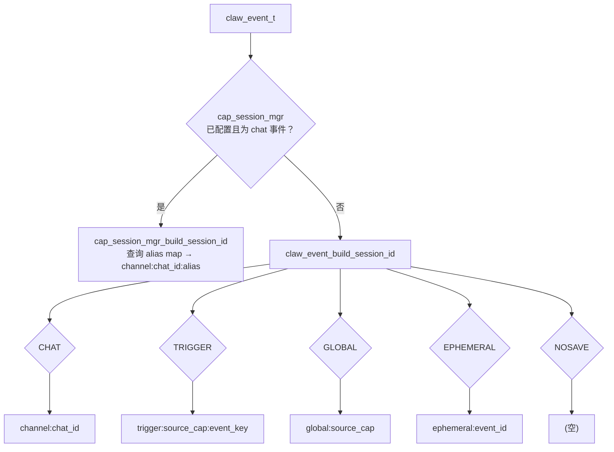

# 19 会话策略深度分析

## 概述

会话策略（Session Policy）是 esp-claw 中控制 **"哪条上下文历史被复用"** 的核心机制。每个进入事件路由器的 `claw_event_t` 都携带一个 `session_policy` 字段，路由器根据该字段构建 `session_id`，最终将此 ID 传入 `claw_core`，决定使用哪条记忆/历史线。

---

## 1. 五种策略的完整语义

枚举定义位于 `claw_modules/claw_event_router/include/claw_event.h`：

```c
typedef enum {
    CLAW_EVENT_SESSION_POLICY_CHAT      = 0,  // 默认
    CLAW_EVENT_SESSION_POLICY_TRIGGER   = 1,
    CLAW_EVENT_SESSION_POLICY_GLOBAL    = 2,
    CLAW_EVENT_SESSION_POLICY_EPHEMERAL = 3,
    CLAW_EVENT_SESSION_POLICY_NOSAVE    = 4,
} claw_event_session_policy_t;
```

| 枚举值 | 字符串 | 语义 | 持久化 |
|--------|--------|------|--------|
| `CHAT` | `"chat"` | 按聊天频道+会话别名隔离，跨消息复用同一上下文历史 | 是 |
| `TRIGGER` | `"trigger"` | 按触发事件的 `source_cap` + `message_id/event_id` 创建独立上下文 | 是 |
| `GLOBAL` | `"global"` | 按 `source_cap` 创建一个全局共享上下文，所有触发共享同一历史 | 是 |
| `EPHEMERAL` | `"ephemeral"` | 基于 `event_id` 的一次性会话，每次事件产生独立历史 | 是（历史写入磁盘，但通常不再复用）|
| `NOSAVE` | `"nosave"` | 不构建 session_id（返回空字符串），完全无历史 | **否** |

---

## 2. Session ID 的构建规则

构建逻辑位于 `claw_modules/claw_event_router/src/claw_event.c` 的 `claw_event_build_session_id()`：

```c
switch (event->session_policy) {
case CLAW_EVENT_SESSION_POLICY_CHAT:
    snprintf(buf, buf_size, "%s:%s", event->source_channel, event->chat_id);
    break;
case CLAW_EVENT_SESSION_POLICY_TRIGGER:
    snprintf(buf, buf_size, "trigger:%s:%s",
             event->source_cap[0] ? event->source_cap : "system",
             claw_event_event_key(event));   // message_id 优先，否则 event_id
    break;
case CLAW_EVENT_SESSION_POLICY_GLOBAL:
    snprintf(buf, buf_size, "global:%s",
             event->source_cap[0] ? event->source_cap : "router");
    break;
case CLAW_EVENT_SESSION_POLICY_EPHEMERAL:
    snprintf(buf, buf_size, "ephemeral:%s", event->event_id);
    break;
case CLAW_EVENT_SESSION_POLICY_NOSAVE:
    buf[0] = '\0';  // 返回 0，不传递 session_id
    return 0;
}
```

### 格式汇总

| 策略 | Session ID 格式 | 示例 |
|------|----------------|------|
| CHAT | `<channel>:<chat_id>` | `telegram:123456` |
| TRIGGER | `trigger:<source_cap>:<event_key>` | `trigger:cap_sensor:msg-001` |
| GLOBAL | `global:<source_cap>` | `global:cap_monitor` |
| EPHEMERAL | `ephemeral:<event_id>` | `ephemeral:evt-abc123` |
| NOSAVE | _(空)_ | — |

---

## 3. 与记忆系统的交互

### NOSAVE 策略

当 `NOSAVE` 时，`claw_event_build_session_id()` 返回 0 且 buf 为空。路由器不向 `claw_core_request_t.session_id` 填写任何值。

记忆模块（`claw_memory_session.c`）中的每个操作都以如下代码防卫：

```c
if (!session_id || !session_id[0] || !s_memory.initialized) {
    return false;  // 或 ESP_OK（跳过）
}
```

因此 **NOSAVE 完全阻断持久化**：
- `claw_memory_persist_session_fn` 不被调用（session_id 为 NULL）
- 异步萃取（`claw_memory_async_extract_ensure_started`）检查 `request->session_id`，若为空则跳过（`claw_memory_stage_note_callback` 在 session_id 为空时立即返回 `ESP_OK`，不触发任何萃取任务入队）
- `request_gate` 的会话阻塞检查也被跳过

**结论：NOSAVE 完全不触发异步记忆萃取。**

### EPHEMERAL 策略

EPHEMERAL 会生成一个唯一的 session_id（`ephemeral:<event_id>`），每次事件得到不同的 ID。记忆系统将会：
- 为该 session_id 创建历史文件（持久化到磁盘）
- 因 ID 唯一，后续事件不会复用
- **异步萃取正常执行**——EPHEMERAL 会话的历史仍会触发长期记忆萃取

若希望避免 EPHEMERAL 产生碎片文件，需要由应用层定期清理或使用 `cap_session_mgr_set_delete_session_handler` 注册清理回调。

---

## 4. 与 claw_event_router 的关联

### 事件的 session_policy 字段如何设置

事件路由器在分发事件时，从以下来源读取策略：

1. **内部消息事件**（`_handle_message_action`）：固定设置为 `CLAW_EVENT_SESSION_POLICY_CHAT`
2. **触发事件**（`_handle_trigger_action`）：固定设置为 `CLAW_EVENT_SESSION_POLICY_TRIGGER`
3. **RUN_AGENT 动作的自定义策略**：从动作的 `input_json` 中读取 `"session_policy"` 字段，通过 `claw_event_router_parse_session_policy()` 解析
4. **EMIT_EVENT 动作**：同样从 `input_json` 的 `"session_policy"` 字段读取，默认为 `TRIGGER`

```c
// EMIT_EVENT 动作的默认值
if (!claw_event_router_parse_session_policy(value, &event.session_policy)) {
    event.session_policy = CLAW_EVENT_SESSION_POLICY_TRIGGER;
}
```

### Mermaid 流程图：Session ID 构建路径



---

## 5. cap_session_mgr 的 LLM 可调用接口

`cap_session_mgr` 实现了一个供 LLM 调用的工具 `session_command`，注册为：

```c
{
    .id = "session_command",
    .name = "session_command",
    .family = "system",
    .description = "Handle consolidated /session chat commands.",
    .kind = CLAW_CAP_KIND_CALLABLE,
    .cap_flags = CLAW_CAP_FLAG_RESTRICTED,  // 仅限系统/管理调用
    .input_schema_json = "{\"type\":\"object\",\"properties\":{\"command\":{\"type\":\"string\"}}}",
    .execute = cap_session_mgr_session_execute,
}
```

> **注意**：`CLAW_CAP_FLAG_RESTRICTED` 表示该工具**不带** `CLAW_CAP_FLAG_CALLABLE_BY_LLM`，因此 LLM 工具列表中不会出现此能力，只能通过 `/session` 聊天命令触发。

### 支持的子命令

| 命令格式 | 说明 |
|---------|------|
| `/session new [name]` | 创建新会话并切换，name 可选（默认 `default_01`、`default_02` 等）|
| `/session list` | 列出当前 chat 下的所有会话 |
| `/session switch <name>` | 切换到指定会话 |
| `/session delete <name>` | 删除非当前会话（会调用 delete_session 回调清理历史）|

### 别名规则

- 别名长度：1–32 字符
- 允许字符：`A-Z`、`a-z`、`0-9`、`_`、`-`
- 每个 chat_key 最多 `CAP_SESSION_MGR_MAX_SESSIONS = 32` 个会话

### 会话映射文件

别名到 session_id 的映射持久化为：

```
<session_root_dir>/chat_map/chat_<sanitized_key>_<hash8hex>.json
```

JSON 结构：
```json
{
  "chat_key": "telegram:123456",
  "current_alias": "project-a",
  "sessions": ["default_01", "project-a"]
}
```

实际 session_id = `<chat_key>:<current_alias>`，例如 `telegram:123456:project-a`。

---

## 6. 关键常量

| 常量 | 值 | 位置 |
|------|-----|------|
| `CAP_SESSION_MGR_ALIAS_MAX` | 32 | `cap_session_mgr.c` |
| `CAP_SESSION_MGR_MAX_SESSIONS` | 32 | `cap_session_mgr.c` |
| `CAP_SESSION_MGR_ID_SIZE` | 128 | `cap_session_mgr.c` |
| `CAP_SESSION_MGR_KEY_SIZE` | 128 | `cap_session_mgr.c` |
| `CAP_SESSION_MGR_DEFAULT_BASE` | `"default_"` | `cap_session_mgr.c` |
