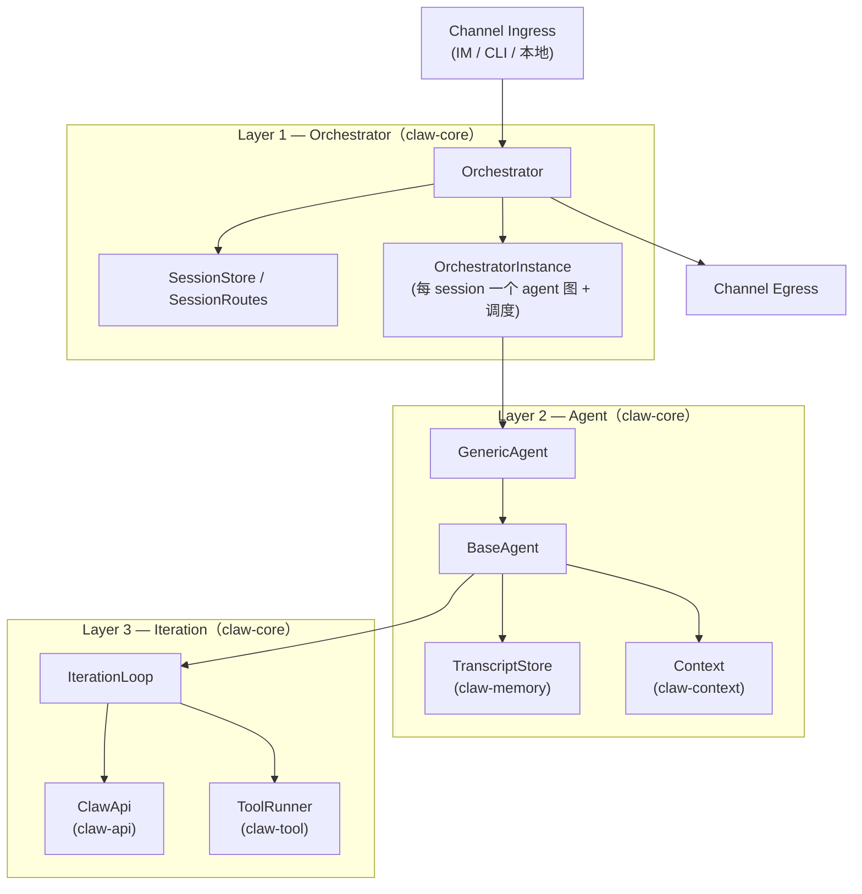
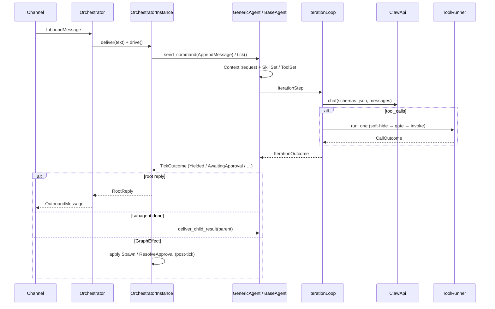
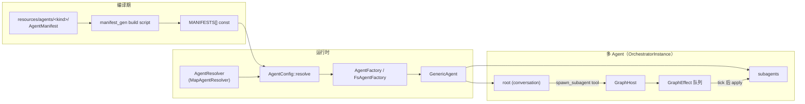
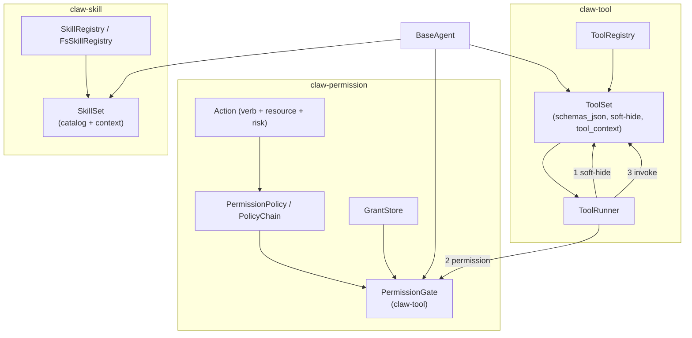
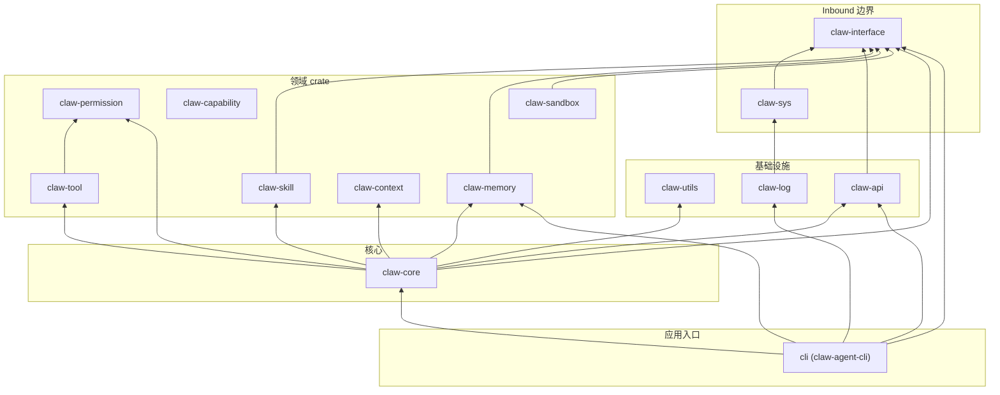
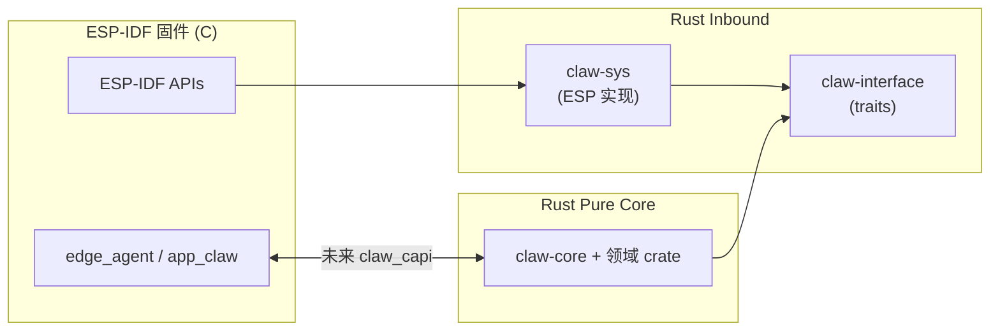

# Rust Agent 架构图与 Crate 引用关系

`framework/runtime/` 工作区中各 crate 的分层、运行时数据流，以及 **Cargo 依赖** / **逻辑引用** 关系速查。

---

## 1. 三层运行时架构



| 层 | 核心类型 | 职责 |
|---|---|---|
| Layer 1 | `Orchestrator`, `OrchestratorInstance` | Session 路由、ingress/egress、agent 图、调度、GraphEffect apply |
| Layer 2 | `BaseAgent`, `GenericAgent` | `AgentCommand` in / `TickOutcome` out；memory、context、permission |
| Layer 3 | `IterationLoop` | 单次 `IterationId`：LLM 一轮 + tool 执行；无 session/graph 概念 |

---

## 2. 用户消息数据流



---

## 3. Agent 配置与多 Agent 图



---

## 4. Tool / Skill / Permission 管线



---

## 5. Crate 依赖图（Cargo `[dependencies]`）

箭头：**A → B** 表示 A 的 `Cargo.toml` 依赖 B（运行时依赖，不含 dev/build-only）。



> **独立 leaf crate**（图中未连出箭头）：`claw-permission`、`claw-context`、`claw-capability`、`claw-utils` 仅被上层引用，自身不依赖其他 workspace crate（除 `claw-permission` ← `claw-tool`）。

---

## 6. Crate 速查

| Crate | 角色 |
|---|---|
| `claw-interface` | DI traits：`ClawFs`, `ClawHttp`, `ClawThread`；host 测试 doubles（`MemFs`, `RealHttp`, …） |
| `claw-sys` | ESP-IDF 侧 shim：`ESP_LOGx` log sink、`esp_http_client` 的 `ClawHttp` 驱动 |
| `claw-utils` | 共享工具：prefixed id 宏（`IterationId`, `AgentId`, …）、日志安全截断 |
| `claw-api` | LLM HTTP client：`ClawApi`、chat 类型、retry |
| `claw-log` | `log` facade 后端 + flat-tree `tracing` subscriber → `claw-sys` sink；编译期 level 上限 |
| `claw-core` | **Agent 运行时核心**：Orchestrator、GenericAgent/BaseAgent、IterationLoop、channels、session |
| `claw-tool` | Tool 框架：define / `ToolRegistry` / `ToolSet` / `ToolRunner` / soft-hide / `PermissionGate` / build-time `bake` |
| `claw-skill` | Skill 目录扫描、`SkillRegistry`、`SkillSet`、prompt catalog/context |
| `claw-permission` | `Action` / `PermissionPolicy` / `GrantStore`；Allow / Ask / Deny 策略 |
| `claw-memory` | `TranscriptStore`（纯 append-only verbatim 存储 + 持久化）、`Compactor` seam、long-term memory；compaction 策略由 `claw-core` 的 rolling-summary adapter 拥有 |
| `claw-context` | Prompt `Block` / `BlockKind` 组装与缓存；`RequestContext` |
| `claw-capability` | C `claw_cap` 的 Rust registry（迁移中，**当前不在 `claw-core` 运行时依赖链**） |
| `claw-sandbox` | 沙箱 FS：限制 agent 文件访问虚拟根（`/sandbox`, `/shared`, `/system`） |
| `cli` | Host CLI：`base-agent-chat` / `generic-agent-chat` / `orchestrator-chat` |

---

## 7. 引用关系矩阵

**读法**：行 crate **使用** 列 crate 的公共 API（Cargo 依赖和/或 `claw-core` re-export）。

|  | interface | sys | utils | api | log | memory | context | permission | tool | skill | capability | sandbox | core |
|---|:---:|:---:|:---:|:---:|:---:|:---:|:---:|:---:|:---:|:---:|:---:|:---:|:---:|
| **claw-sys** | ● | | | | | | | | | | | | |
| **claw-log** | | ● | | | | | | | | | | | |
| **claw-api** | ● | | | | | | | | | | | | |
| **claw-memory** | ● | | | | | | | | | | | | |
| **claw-context** | | | | | | | | | | | | | |
| **claw-permission** | | | | | | | | | | | | | |
| **claw-tool** | | | | | | | | ● | | | | | |
| **claw-skill** | ● | | | | | | | | | | | | |
| **claw-capability** | | | | | | | | | | | | | |
| **claw-sandbox** | ● | | | | | | | | | | | | |
| **claw-core** | ● | | ● | ● | | ● | ● | ● | ● | ● | | | |
| **cli** | ● | | | ● | ● | ● | | | (via core) | (via core) | | | ● |

● = 直接 Cargo 依赖（运行时）  
(via core) = 通过 `claw-core` re-export 使用，无直接依赖

### 7.1 `claw-core` 对各 crate 的使用方式

| 依赖 crate | 在 claw-core 中的用途 |
|---|---|
| `claw-interface` | `ClawFs` 注入 memory / skill registry / factory |
| `claw-utils` | `AgentId`, `IterationId`, `SessionId` 等 newtype |
| `claw-api` | `ClawApi` LLM 客户端；`LlmCompactor` 在 `memory/` |
| `claw-memory` | `BaseAgent` / `GenericAgent` 的 `TranscriptStore`；`Compactor` seam 由 rolling-summary adapter 驱动 |
| `claw-context` | system prompt block 组装（Global / Session / Agent 层） |
| `claw-skill` | manifest skill id → `SkillSet`；skill 类型的 owner crate |
| `claw-tool` | manifest capability → `ToolSet`；iteration 调 `ToolRunner`；tool 类型的 owner crate |
| `claw-permission` | `BaseAgent` 装 `PermissionGate` + policy；permission 类型的 owner crate |

### 7.2 Public API ownership

`claw-core` 不再把 tool / skill / permission 类型 re-export 到 crate root。
这些类型从 owner crate 引用；需要单一入口的上层使用 `claw-agent` facade。

```text
claw_skill::SkillRegistry, SkillSet, SkillId, …
claw_tool::Tool, ToolSet, ToolRunner, ToolGate, …
claw_permission::Action, PermissionPolicy, PolicyChain, …
```

### 7.3 仅 dev / build 的依赖（不在设备镜像依赖链）

| 消费方 | 依赖 | 用途 |
|---|---|---|
| `claw-core` build | `claw-tool` (`bake`) | 校验 `resources/tools/` 布局 |
| `claw-core` build | `manifest_gen` | 编译期解析 `resources/agents/` → `AgentManifest` |
| `claw-core` tests | `claw-capability` | 能力 registry 单测 / 迁移验证 |
| `cli` | `claw-interface` features | host：`diskfs`, `realhttp`, `stdthread` |
| `claw-log` (host) | `env_logger` | 非 `espidf` target 的控制台输出 |

---

## 8. FFI / 平台边界（概念）



| 边界 | Crate | 方向 |
|---|---|---|
| C / OS → Rust traits | `claw-interface` | Inbound：平台能力抽象 |
| ESP-IDF 具体实现 | `claw-sys` | Inbound：`ClawHttp`、log sink |
| Rust → C ABI | `claw_capi`（规划中） | Outbound：opaque handle、init/deinit |
| 纯逻辑 | `claw-core` 及领域 crate | 只依赖 traits，host 可测 |

---

## 9. 相关文档

| 路径 | 内容 |
|---|---|
| [`claw-core/src/lib.rs`](claw-core/src/lib.rs) | Layer 1/3 模块索引 |
| [`claw-core/src/agent/mod.rs`](claw-core/src/agent/mod.rs) | Agent trait、GenericAgent、GraphHost |
| [`claw-core/src/agent/base_agent.rs`](claw-core/src/agent/base_agent.rs) | Layer 2：Command / TickOutcome |
| [`claw-core/src/iteration_loop.rs`](claw-core/src/iteration_loop.rs) | Layer 3：IterationId、preemption |
| [`claw-tool/README.md`](claw-tool/README.md) | Tool 框架与 soft-hide |
| [`claw-skill/README.md`](claw-skill/README.md) | Skill registry / SkillSet |
| [`claw-permission/README.md`](claw-permission/README.md) | Permission 策略与 grant |
