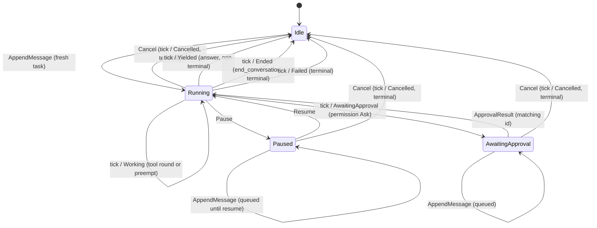

# BaseAgent — caller-side FSM

How a driver sees `BaseAgent`: **command in, outcome out**. The caller drives the
agent with [`AgentCommand`]s (via `send_command` or its wrappers) and pumps it
with `tick()`, which returns exactly one `TickOutcome` per call.

There are two kinds of transition, and they are validated/observed at different
moments:

- **Command transitions** (solid intent below). A command is validated
  *synchronously* by `send_command` against the agent's **projected** state — the
  state it will be in once every command already on the inbox is applied. A legal
  command is queued; an illegal one is rejected with an [`AgentCommandError`],
  the agent is left unchanged, and nothing is enqueued. Validation is projected
  (not the committed state) so a batch sent between two ticks is checked in order.
- **Tick transitions** (labeled `tick / …` below). These happen *inside* `tick()`
  when an iteration runs, and are reported as the returned `TickOutcome`.

`run` / `append_message` are infallible (an append is legal in every state);
`cancel` / `pause` / `resume` / `resolve_approval` / `send_command` return
`Result<(), AgentCommandError>`.

## Command validity per state

Cell = resulting next state, or the `AgentCommandError` variant the caller gets
back. `AppendMessage` covers `run` / `append_message`; `ApprovalResult` covers
`resolve_approval`.

| State              | AppendMessage             | Cancel               | Pause          | Resume          | ApprovalResult                                    |
| ------------------ | ------------------------- | -------------------- | -------------- | --------------- | ------------------------------------------------- |
| `Idle`             | → `Running` (fresh task)  | `NothingToCancel`    | `CannotPause`  | `CannotResume`  | `NotAwaitingApproval`                             |
| `Running`          | → `Running` (join)        | → `Idle` (Cancelled) | → `Paused`     | `CannotResume`  | `NotAwaitingApproval`                             |
| `Paused`           | → `Paused` (queued)       | → `Idle` (Cancelled) | `CannotPause`  | → `Running`     | `NotAwaitingApproval`                             |
| `AwaitingApproval` | → `AwaitingApproval` (queued) | → `Idle` (Cancelled) | `CannotPause`  | `CannotResume`  | match → `Running`; other id → `ApprovalMismatch` |

`Cancel` is a *command*, but the `TickOutcome::Cancelled` it produces is reported
on the next `tick` that drains it (it sets the state to `Idle` immediately at
validation/queue time).

### Cancel and memory

The non-disruptive commands leave no special trace: `Pause`/`Resume` only toggle
state, `AppendMessage` adds normal user content, and `ApprovalResult` records the
human's decision as ordinary conversation content. `Cancel` is the one
**disruptive** action — it ends a task abruptly with no closing message — so it
**records an interruption marker** in memory, keyed on the `CancelReason`
(`cancelled by the user` / `superseded by a new task` / `the agent is shutting
down`). The abandoned but still-open turn is **not lost**: it is committed
together with the marker as one group, so the next task sees an explained gap
rather than a half-finished exchange.

## What `tick()` does per state

| State              | `tick()` behavior                                                                                                                                                                                 |
| ------------------ | ------------------------------------------------------------------------------------------------------------------------------------------------------------------------------------------------- |
| `Idle`             | No iteration. Returns `Idle` (or `Cancelled` if a `Cancel` was just drained).                                                                                                                      |
| `Running`          | Runs one iteration and returns one of: `Working` (tool round or a preempt — stays `Running`), `Yielded` (plain answer → `Idle`, **non-terminal**), `Ended`/`Failed` (→ `Idle`, **terminal**), or `AwaitingApproval` (→ `AwaitingApproval`). |
| `Paused`           | No iteration while paused. Returns `Idle`.                                                                                                                                                         |
| `AwaitingApproval` | No iteration while awaiting. Returns `Idle`.                                                                                                                                                       |

## Terminal vs reusable

`Ended`, `Cancelled`, and `Failed` are **terminal for the task** but leave the
agent **`Idle` and reusable** — the next `AppendMessage` starts a fresh task over
the same memory and identity. `Yielded` is **non-terminal**: the agent answers
and goes `Idle` awaiting the next message.

[`AgentCommand`]: ../src/agent/base_agent.rs
[`AgentCommandError`]: ../src/agent/base_agent.rs
