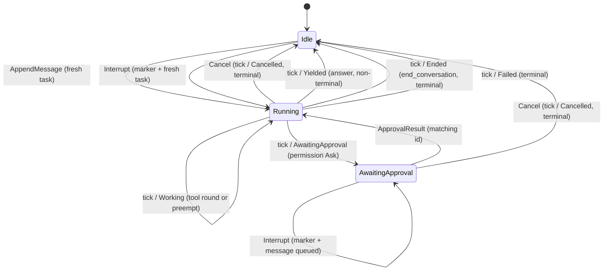

# BaseAgent — caller-side FSM

How a driver sees `BaseAgent`: **command in, outcome out**. The caller drives the
agent with [`AgentCommand`]s via `send_command` and pumps it with `tick()`, which
returns exactly one `TickOutcome` per call.

There are two kinds of transition, and they are validated/observed at different
moments:

- **Command transitions** (solid intent below). A command is validated
  *synchronously* by `send_command` against the agent's **projected** state — the
  state it will be in once every command already on the inbox is applied. A legal
  command is queued; an illegal one is rejected with an [`AgentCommandError`],
  the agent is left unchanged, and nothing is enqueued. Validation is projected
  (not the committed state) so a batch sent between two ticks is checked in order.
- **Tick transitions** (labeled `tick / …` below). These happen *inside* `tick()`
  when an iteration runs, and are reported as the returned `TickOutcome`.

`AppendMessage` is accepted only at an idle boundary and starts a fresh task.
`Interrupt` is accepted in every state: it records an interruption marker plus
the newer user message, but keeps the task alive. `Cancel` and `ApprovalResult`
are stateful and may return `AgentCommandError`.

## Command validity per state

Cell = resulting next state, or the `AgentCommandError` variant the caller gets
back.

| State              | AppendMessage                 | Interrupt                         | Cancel               | ApprovalResult                                    |
| ------------------ | ----------------------------- | --------------------------------- | -------------------- | ------------------------------------------------- |
| `Idle`             | → `Running` (fresh task)      | → `Running` (marker + fresh task) | `NothingToCancel`    | `NotAwaitingApproval`                             |
| `Running`          | `CannotAppend`                | → `Running` (marker + message)    | → `Idle` (Cancelled) | `NotAwaitingApproval`                             |
| `AwaitingApproval` | `CannotAppend`                | → `AwaitingApproval` (queued)     | → `Idle` (Cancelled) | match → `Running`; other id → `ApprovalMismatch` |

`Cancel` is a *command*, but the `TickOutcome::Cancelled` it produces is reported
on the next `tick` that drains it. `send_command` moves the projected state to
`Idle` synchronously so the rest of the batch validates correctly; the committed
lifecycle, open-turn discard, and outcome are applied by `tick()`.

When a caller batches `Cancel` followed by `AppendMessage` or `Interrupt`, the
same drain first discards the old open turn, then starts the replacement task.
In that supersede path the cancellation outcome is cleared by the fresh task; a
bare `Cancel` still reports `Cancelled`.

### Cancel and memory

`AppendMessage` opens a fresh task from idle. The non-disruptive active-task
commands keep the task alive: `Interrupt` records a synthetic interruption marker
followed by the newer user message, and `ApprovalResult` records the human's
decision as ordinary conversation content. Internal graph events (such as
subagent results) enter through a crate-private task-input path, not through the
external append command. `Cancel` is the one **disruptive** action: it ends a
task abruptly, discards the abandoned open turn, and writes no cancellation
marker.
Already committed turns remain; uncommitted partial user/assistant/tool messages
from the cancelled task do not leak into later model context.

## What `tick()` does per state

| State              | `tick()` behavior                                                                                                                                                                                                                       |
| ------------------ | --------------------------------------------------------------------------------------------------------------------------------------------------------------------------------------------------------------------------------------- |
| `Idle`             | No iteration. Returns `Idle`.                                                                                                                                                                                                           |
| `Running`          | Drains commands first. A bare queued `Cancel` returns `Cancelled` without running another iteration; `Cancel` followed by replacement content discards the old open turn and runs the new task. Otherwise runs one iteration and returns one of: `Working` (tool round or a preempt — stays `Running`), `Yielded` (plain answer → `Idle`, **non-terminal**), `Ended`/`Failed` (→ `Idle`, **terminal**), or `AwaitingApproval` (→ `AwaitingApproval`). |
| `AwaitingApproval` | Drains commands first. A matching `ApprovalResult` continues iteration in the same tick; otherwise no iteration while awaiting and returns `Idle`.                                                                                       |

## Terminal vs reusable

`Ended`, `Cancelled`, and `Failed` are **terminal for the task** but leave the
agent **`Idle` and reusable** — the next `AppendMessage` starts a fresh task over
the same memory and identity. `Yielded` is **non-terminal**: the agent answers
and goes `Idle` awaiting the next message.

[`AgentCommand`]: ../src/agent/base_agent.rs
[`AgentCommandError`]: ../src/agent/base_agent.rs
